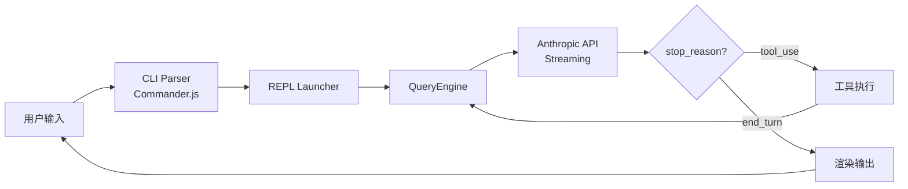
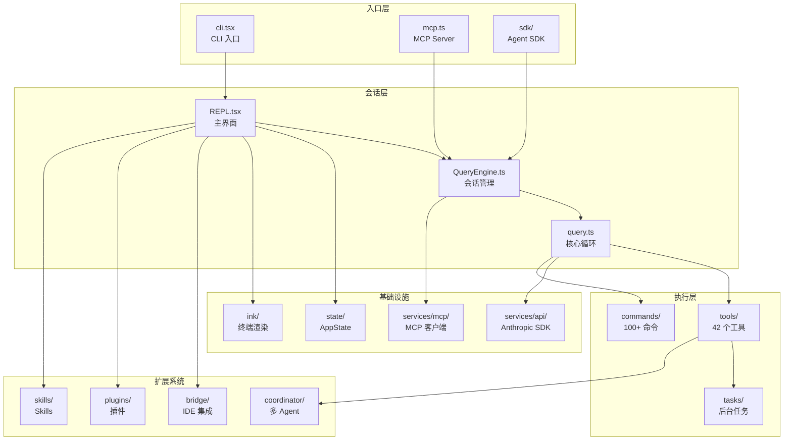

# Claude Code 架构总览

> 从高层视角理解 Claude Code 的整体设计。

## 这是什么

Claude Code 是 Anthropic 官方的终端 AI 编程助手。它是一个 **React + Ink** 驱动的终端应用，运行在 **Bun** runtime 上，使用 TypeScript 编写。

核心特点：
- **终端原生** — 不是 web app，是直接在终端里跑的 React 应用
- **单进程** — 一个 Node/Bun 进程处理所有事情（UI、API 调用、工具执行）
- **Agent 循环** — LLM 可以调用工具，工具结果反馈给 LLM，形成闭环
- **多 Agent 协调** — 支持 coordinator 模式，一个主 agent 调度多个 worker agent 并行工作

## 核心管道



整个系统是一个 **streaming tool-use loop**：
1. 用户输入 → 组装 system prompt + messages → 调用 API
2. API 返回 streaming response → 如果包含 tool_use → 执行工具
3. 工具结果作为 user message 反馈给 API → 继续循环
4. 直到 API 返回 `end_turn` → 展示结果给用户

## 目录结构

```
src/
├── main.tsx                 # CLI 入口，Commander.js 解析参数
├── replLauncher.tsx         # 启动 React/Ink REPL
├── QueryEngine.ts           # 核心引擎（session 管理、消息处理）
├── query.ts                 # 核心循环（streaming、tool execution、context 管理）
├── Tool.ts                  # 工具类型定义和 buildTool 工厂
├── tools.ts                 # 工具注册表
├── commands.ts              # 命令注册表
├── context.ts               # 系统上下文组装（git、claude.md）
├── cost-tracker.ts          # Token 和费用追踪
│
├── entrypoints/             # 多种启动模式
│   ├── cli.tsx              # CLI 主入口（快速路由分发）
│   ├── init.ts              # 初始化链（OAuth、telemetry、MCP）
│   ├── mcp.ts               # MCP Server 模式
│   └── sdk/                 # Agent SDK（编程式 API）
│
├── screens/                 # 全屏 UI
│   ├── REPL.tsx             # 主 REPL 界面（874KB，核心编排层）
│   ├── Doctor.tsx           # 环境诊断
│   └── ResumeConversation.tsx
│
├── components/              # ~111 个 React 组件
│   ├── Messages.tsx         # 消息列表（虚拟滚动）
│   ├── PromptInput/         # 输入框
│   ├── permissions/         # 权限对话框
│   ├── tasks/               # 任务面板
│   ├── teams/               # 团队视图
│   └── design-system/       # 基础 UI 组件
│
├── tools/                   # ~42 个工具实现
│   ├── BashTool/            # Shell 执行（160KB + 安全校验）
│   ├── FileReadTool/        # 文件读取（PDF、图片、notebook）
│   ├── FileEditTool/        # 文件编辑（diff 追踪）
│   ├── AgentTool/           # 子 Agent 生成
│   ├── SendMessageTool/     # Agent 间通信
│   ├── TeamCreateTool/      # 创建 Agent 团队
│   └── ...                  # 更多工具
│
├── commands/                # ~100+ 个 slash 命令
├── hooks/                   # ~104 个 React hooks
├── state/                   # 状态管理（AppState + Store）
├── context/                 # React Context Providers
├── ink/                     # Ink 渲染器封装（Yoga 布局）
├── tasks/                   # 任务系统（后台执行）
├── coordinator/             # 多 Agent 协调器
├── services/                # 服务层（API、MCP、OAuth、分析）
├── bridge/                  # IDE 集成（VS Code、JetBrains）
├── memdir/                  # 持久化记忆系统
├── plugins/                 # 插件系统
├── skills/                  # Skill 系统
├── schemas/                 # Zod 配置 schema
├── remote/                  # 远程执行（CCR session）
├── voice/                   # 语音输入/输出
└── utils/                   # 工具函数
```

## 核心模块关系



## 关键设计模式

### 1. Feature Flag 死代码消除

```typescript
import { feature } from 'bun:bundle'

// 构建时被完全消除（不只是不执行，是代码本身被删掉）
if (feature('VOICE_MODE')) {
  const voiceCommand = require('./commands/voice/index.js').default
}
```

重要的 feature flags：
- `COORDINATOR_MODE` — 多 Agent 协调
- `VOICE_MODE` — 语音输入
- `BRIDGE_MODE` — IDE 集成
- `KAIROS` — 后台 Agent 模式
- `HISTORY_SNIP` — 消息历史裁剪

### 2. Lazy Dynamic Import

重型模块按需加载：

```typescript
// OpenTelemetry (~400KB) 只在需要时加载
const { OpenTelemetry } = await import('./heavy-module.js')
```

### 3. buildTool 工厂模式

每个工具通过统一工厂函数创建：

```typescript
export const MyTool = buildTool({
  name: 'MyTool',
  inputSchema: z.object({ /* ... */ }),
  async call(args, context) { /* ... */ },
  async checkPermissions(input, context) { /* ... */ },
  isReadOnly: () => true,
  isConcurrencySafe: () => true,
})
```

### 4. React + Ink 终端 UI

和 web React 一模一样的模式，只是渲染到终端：
- 函数式组件 + Hooks
- `Box`, `Text` 代替 `div`, `span`
- Yoga 布局引擎（flexbox）
- Chalk 做终端颜色

### 5. Fail-Closed 安全默认

工具默认设置倾向于安全：
- `isConcurrencySafe` 默认 `false`（不允许并行）
- `isReadOnly` 默认 `false`（假设会写入）
- `checkPermissions` 默认需要用户确认

## 阅读顺序建议

1. **[核心管道](01-core-pipeline.md)** — QueryEngine、query loop、API 调用流程
2. **[工具系统](02-tool-system.md)** — 工具如何定义、注册、执行、权限控制
3. **[命令系统](03-command-system.md)** — Slash 命令的类型和实现
4. **[UI 和状态管理](04-ui-and-state.md)** — React/Ink UI、AppState、Hooks
5. **[任务系统](05-task-system.md)** — 后台任务、Shell 任务、Agent 任务
6. **[Sub-agent 系统](06a-subagent.md)** — 单 Agent 派生、Fork、工具过滤
7. **[Agent Team 系统](06b-agent-team.md)** — 多 Agent 协调、三种后端、消息协议（重点）
8. **[服务层和基础设施](07-services-and-infra.md)** — API、MCP、OAuth、插件、记忆
9. **[其他 Feature 汇总](08-other-features.md)** — 27 个未 deep dive 的 feature + 87 个 feature flags
