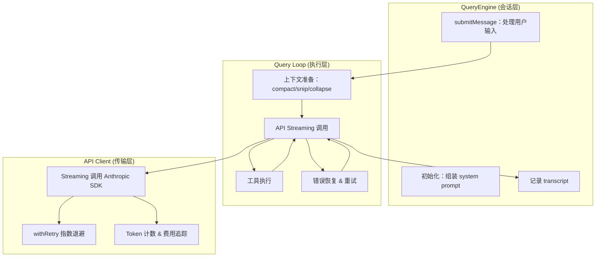
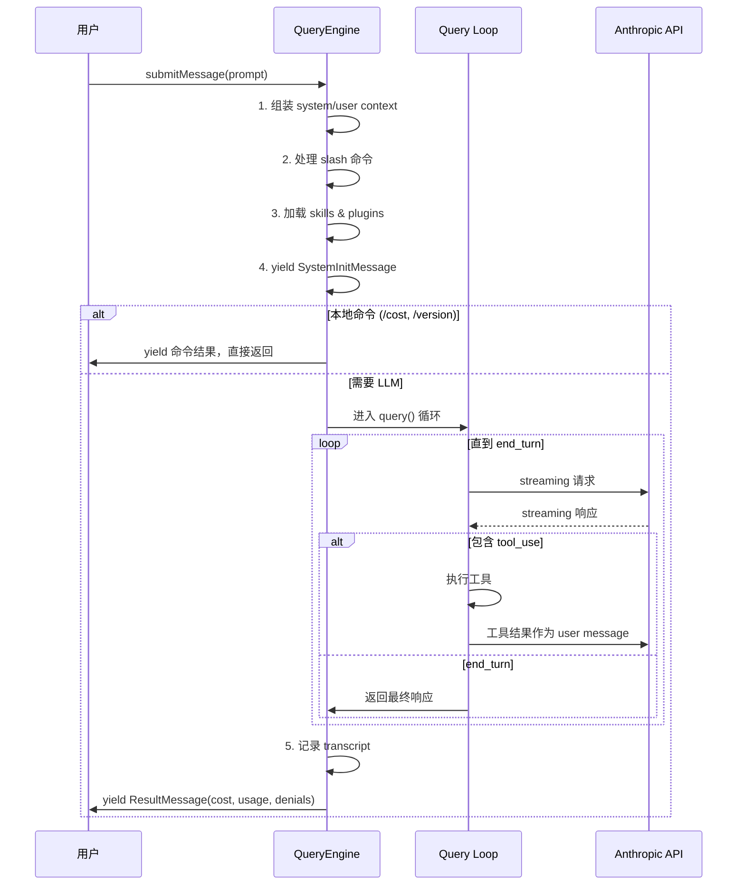
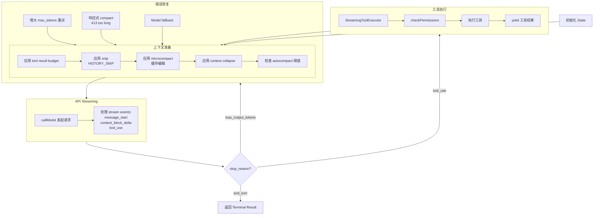
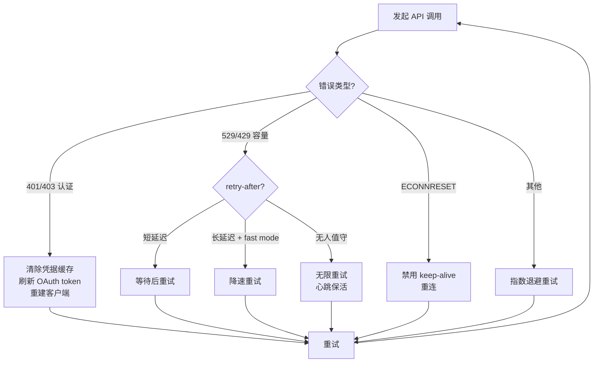
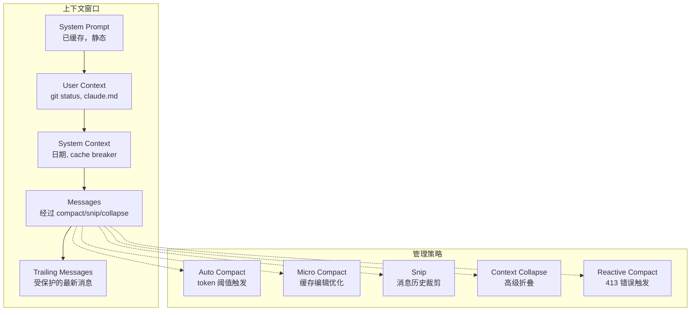

# 核心管道 — QueryEngine & Query Loop

> Claude Code 的心脏：从用户输入到 API 响应到工具执行的完整流程。

## 概览

核心管道由三层组成：



## QueryEngine (`src/QueryEngine.ts`)

**职责**：管理一个完整的对话 session。一个 QueryEngine 对应一个对话，多次 `submitMessage()` 共享同一个 engine。

### 核心数据结构

```typescript
class QueryEngine {
  private config: QueryEngineConfig
  private mutableMessages: Message[]          // 对话历史
  private abortController: AbortController    // 取消控制
  private permissionDenials: SDKPermissionDenial[]  // 权限拒绝记录
  private totalUsage: NonNullableUsage        // 累计 token 使用
  private discoveredSkillNames: Set<string>   // 已发现的 skills
  private loadedNestedMemoryPaths: Set<string> // 已加载的记忆文件
}
```

### QueryEngineConfig — 配置一切

```typescript
type QueryEngineConfig = {
  cwd: string                    // 工作目录
  tools: Tools                   // 可用工具
  commands: Command[]            // 可用命令
  mcpClients: MCPServerConnection[]  // MCP 连接
  agents: AgentDefinition[]      // Agent 定义
  canUseTool: CanUseToolFn       // 权限检查函数
  getAppState: () => AppState    // 读取全局状态
  setAppState: (f) => void       // 修改全局状态
  initialMessages?: Message[]    // 初始消息（恢复 session）
  readFileCache: FileStateCache  // 文件读取缓存
  customSystemPrompt?: string    // 自定义 system prompt
  maxTurns?: number              // 最大轮次
  maxBudgetUsd?: number          // 预算上限（USD）
  thinkingConfig?: ThinkingConfig // thinking 模式配置
  // ... 更多配置
}
```

### submitMessage 流程



详细步骤：
1. **Wrap canUseTool** — 包装权限函数以追踪拒绝记录
2. **确定模型和 thinking 配置** — 根据用户设置和 feature flags
3. **获取 system/user context** — git status、claude.md 内容、当前日期
4. **处理用户输入** — 解析 slash 命令、附件、工具限制
5. **Push messages** — 添加到 mutableMessages，持久化到存储
6. **加载 skills 和 plugins** — 缓存模式（headless）或完整加载
7. **yield SystemInitMessage** — 告诉 SDK 调用者有哪些 tools/commands
8. **进入 query() 循环** — 核心 streaming + tool execution
9. **yield ResultMessage** — 最终结果，包含费用、使用量、权限拒绝

## Query Loop (`src/query.ts`)

**职责**：核心 while(true) 循环，负责 API 调用、工具执行、上下文管理、错误恢复。

### 循环状态

```typescript
type State = {
  messages: Message[]                // 当前消息列表
  toolUseContext: ToolUseContext      // 工具执行上下文
  autoCompactTracking: AutoCompactTrackingState  // 自动压缩追踪
  maxOutputTokensRecoveryCount: number    // max_tokens 恢复次数
  hasAttemptedReactiveCompact: boolean    // 是否已尝试响应式压缩
  maxOutputTokensOverride: number         // token 上限覆盖
  turnCount: number                       // 当前轮次
  transition: Continue | undefined         // 上一轮为什么继续
}
```

### 主循环流程



### 循环继续的原因（Continue Sites）

| 原因 | 触发条件 | 处理方式 |
|------|---------|---------|
| `tool_use` | API 返回 tool_use block | 执行工具后继续 |
| `max_output_tokens` | 输出超长 | 增大 limit 重试 |
| 响应式 compact | 收到 413 错误 | compact 后重试 |
| Model fallback | 特定错误 | 换模型重试 |
| Stop hook | hook 返回 Continue | 重新进入循环 |

### 循环终止条件

| 条件 | 说明 |
|------|------|
| `end_turn` | API 正常结束 |
| `tool_limit` | 工具调用次数超限 |
| `max_turns` | 达到最大轮次 |
| `blocking_limit` | 上下文窗口达到阻塞限制 |
| `budget_exceeded` | 超出 token/USD 预算 |
| `abort` | 用户取消 |

## API Client (`src/services/api/claude.ts`)

### 核心 Streaming 调用

```typescript
const stream = await anthropic.beta.messages.stream({
  model: normalizeModelStringForAPI(model),
  max_tokens: Math.min(capped, modelMaxTokens),
  messages: normalizeMessagesForAPI(messages),
  system: renderSystemPrompt(systemPrompt),
  temperature: 1,
  tools: toolToAPISchema(tools),
  thinking: { type: thinkingType, budget_tokens: maxThinkingTokens },
  betas: getMergedBetas(model),
  metadata: getAPIMetadata(),
})

for await (const event of stream) {
  // stream events: message_start, content_block_start,
  // content_block_delta, message_delta, message_stop
}
```

### Prompt Caching

Claude Code 使用 prompt caching 来减少重复 token 的计算成本：
- **System prompt** — 静态部分被缓存（大量 token）
- **Scope 控制** — global vs ephemeral cache
- **1h TTL** — 部分查询源可享受 1 小时缓存

### Token & 费用追踪

```typescript
type NonNullableUsage = {
  input_tokens: number
  output_tokens: number
  cache_creation_input_tokens: number  // 缓存创建
  cache_read_input_tokens: number       // 缓存命中
}
```

每次 API 调用后累加 usage，最终通过 `/cost` 命令展示。

## 重试逻辑 (`src/services/api/withRetry.ts`)



关键策略：
- **认证错误** (401/403)：清除缓存 → 刷新 token → 重建客户端
- **容量限制** (529/429)：检查 retry-after header，fast mode 下短延迟，无人值守模式无限重试
- **连接错误** (ECONNRESET)：禁用连接池 → 重连
- **最大重试次数**：529 错误最多 3 次，之后 fallback 到非 streaming
- **Model fallback**：特定错误可以切换到备用模型

## 上下文窗口管理



**Auto Compact 常量**：
- `AUTOCOMPACT_BUFFER_TOKENS = 13,000`
- `WARNING_THRESHOLD_BUFFER_TOKENS = 20,000`
- `MAX_CONSECUTIVE_AUTOCOMPACT_FAILURES = 3`（熔断器）

## SDK 消息类型

QueryEngine 通过 AsyncGenerator 向调用者 yield 消息：

| 类型 | 说明 |
|------|------|
| `SDKSystemInitMessage` | Tool/command/model 概要 |
| `SDKUserMessageReplay` | 用户消息回显 |
| `SDKAssistantMessage` | 模型响应 |
| `SDKCompactBoundaryMessage` | 上下文压缩标记 |
| `SDKLocalCommandOutputMessage` | Slash 命令输出 |
| `SDKProgressMessage` | 工具执行进度 |
| `SDKErrorMessage` | API/执行错误 |
| `SDKResultMessage` | 最终结果（费用、使用量、权限拒绝） |

最终的 `SDKResultMessage` 包含：
```typescript
{
  type: 'result',
  duration_ms: number,         // 总耗时
  num_turns: number,           // 循环轮次
  total_cost_usd: number,      // 总费用
  usage: NonNullableUsage,     // Token 使用
  permission_denials: [...],   // 被拒绝的权限
  stop_reason: string,         // 终止原因
}
```

## 关键洞察

1. **Generator 模式** — 整个 pipeline 是 `AsyncGenerator`，允许调用者逐条接收消息，实现 streaming UI
2. **不变性 + 可变状态** — State 对象在循环内可变，但 messages 数组通过引用传递，避免大量拷贝
3. **多层错误恢复** — 认证刷新 → 退避重试 → 模型降级，确保尽可能完成任务
4. **渐进式上下文管理** — 从 micro compact 到 auto compact 到 reactive compact，根据紧急程度选择策略
5. **Prompt caching** — 静态 system prompt 被缓存，大幅减少重复 token 的成本
