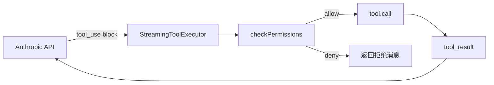
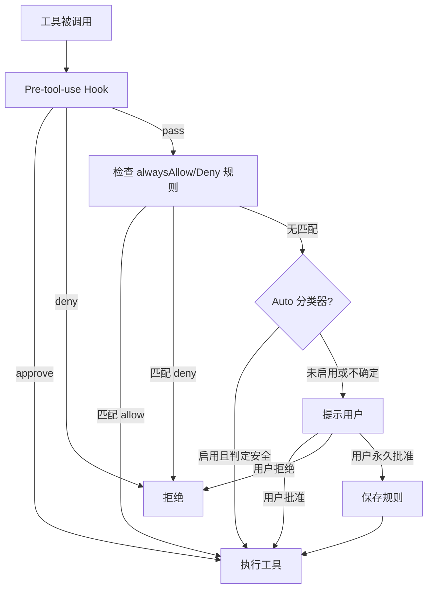

# 工具系统 — Tool System

> 每个 Claude 可以调用的能力都是一个 Tool。

## 概览

Claude Code 的工具系统是它与 LLM 之间的桥梁。LLM 通过 `tool_use` block 请求执行工具，系统执行后将结果反馈给 LLM。



## 工具定义 (`src/Tool.ts`)

每个工具通过 `buildTool()` 工厂函数创建。核心接口：

```typescript
type Tool<Input, Output> = {
  // === 核心 ===
  name: string
  description: string
  inputSchema: ZodSchema          // Zod v4 校验
  call(args, context): Promise<ToolResult>  // 实际执行

  // === 权限 ===
  checkPermissions(input, context): Promise<PermissionResult>
  isReadOnly(input): boolean      // 是否只读操作
  isDestructive?(input): boolean  // 是否破坏性操作

  // === 并发 ===
  isConcurrencySafe(input): boolean  // 是否可以并行执行

  // === UI 渲染 ===
  renderToolUseMessage(input): ReactNode     // 工具调用展示
  renderToolResultMessage(output): ReactNode // 工具结果展示
  renderToolUseProgressMessage(): ReactNode  // 进度展示

  // === 元数据 ===
  userFacingName(input?): string
  maxResultSizeChars: number      // 结果最大字符数
  alwaysLoad?: boolean            // 是否始终加载
  shouldDefer?: boolean           // 是否延迟加载
}
```

### 权限返回值

```typescript
type PermissionResult =
  | { behavior: 'allow'; updatedInput?: Record }  // 允许执行
  | { behavior: 'ask'; message?: string }          // 需要用户确认
  | { behavior: 'deny'; message?: string }         // 直接拒绝
```

### Fail-Closed 默认值

`buildTool()` 为所有未显式设置的字段应用安全默认：
- `isConcurrencySafe` → `false`（不允许并行）
- `isReadOnly` → `false`（假设会写入）
- `isDestructive` → `false`
- `checkPermissions` → `{ behavior: 'allow' }`（交给权限系统处理）

## 工具注册 (`src/tools.ts`)

```typescript
// 获取所有基础工具
export function getAllBaseTools(): Tools

// 根据权限上下文过滤工具
export function getTools(permissionContext): Tools

// 合并内置工具 + MCP 工具
export function assembleToolPool(permissionContext, mcpTools): Tools
```

## 工具分类

### 核心文件操作 (6 个)

| 工具 | 目录 | 功能 |
|------|------|------|
| `FileReadTool` | `FileReadTool/` | 读取文件（支持 PDF、图片、Notebook、文本） |
| `FileEditTool` | `FileEditTool/` | 编辑文件（diff 追踪、git 集成） |
| `FileWriteTool` | `FileWriteTool/` | 创建或覆盖文件 |
| `GlobTool` | `GlobTool/` | 按 glob 模式搜索文件 |
| `GrepTool` | `GrepTool/` | 按正则搜索文件内容（ripgrep） |
| `WebFetchTool` | `WebFetchTool/` | HTTP 请求 |

### Shell 执行 (2 个)

| 工具 | 目录 | 功能 |
|------|------|------|
| `BashTool` | `BashTool/` | Shell 命令执行（160KB，含安全校验） |
| `PowerShellTool` | `PowerShellTool/` | Windows PowerShell |

### Agent & 协调 (5 个)

| 工具 | 目录 | 功能 |
|------|------|------|
| `AgentTool` | `AgentTool/` | 生成子 Agent |
| `SendMessageTool` | `SendMessageTool/` | Agent 间消息传递 |
| `TeamCreateTool` | `TeamCreateTool/` | 创建 Agent 团队 |
| `TeamDeleteTool` | `TeamDeleteTool/` | 删除 Agent 团队 |
| `SkillTool` | `SkillTool/` | 调用 Skill |

### 任务管理 (6 个)

| 工具 | 目录 | 功能 |
|------|------|------|
| `TaskCreateTool` | `TaskCreateTool/` | 创建后台任务 |
| `TaskGetTool` | `TaskGetTool/` | 获取任务详情 |
| `TaskListTool` | `TaskListTool/` | 列出所有任务 |
| `TaskUpdateTool` | `TaskUpdateTool/` | 更新任务状态 |
| `TaskStopTool` | `TaskStopTool/` | 停止任务 |
| `TaskOutputTool` | `TaskOutputTool/` | 获取任务输出 |

### 状态 & 配置 (6 个)

| 工具 | 目录 | 功能 |
|------|------|------|
| `EnterPlanModeTool` | `EnterPlanModeTool/` | 进入计划模式 |
| `ExitPlanModeTool` | `ExitPlanModeTool/` | 退出计划模式 |
| `EnterWorktreeTool` | `EnterWorktreeTool/` | 进入 git worktree |
| `ExitWorktreeTool` | `ExitWorktreeTool/` | 退出 git worktree |
| `ConfigTool` | `ConfigTool/` | 管理配置 |
| `AskUserQuestionTool` | `AskUserQuestionTool/` | 向用户提问 |

### MCP 集成 (4 个)

| 工具 | 目录 | 功能 |
|------|------|------|
| `MCPTool` | `MCPTool/` | 调用 MCP server 工具 |
| `ListMcpResourcesTool` | `ListMcpResourcesTool/` | 列出 MCP 资源 |
| `ReadMcpResourceTool` | `ReadMcpResourceTool/` | 读取 MCP 资源 |
| `ToolSearchTool` | `ToolSearchTool/` | 搜索延迟加载的工具 |

### 其他

| 工具 | 功能 |
|------|------|
| `LSPTool` | Language Server Protocol 操作 |
| `NotebookEditTool` | Jupyter Notebook 编辑 |
| `WebSearchTool` | Web 搜索 |
| `SleepTool` | 延迟执行 |
| `SyntheticOutputTool` | 生成合成输出 |
| `RemoteTriggerTool` | 远程执行触发 |
| `ScheduleCronTool` | 定时任务 |

## 工具目录结构

每个工具是一个独立目录：

```
src/tools/BashTool/
├── BashTool.ts          # 核心执行逻辑
├── bashPermissions.ts   # 权限检查（98KB）
├── UI.tsx               # 终端渲染
├── prompt.ts            # System prompt 贡献
├── index.ts             # 导出
└── ...                  # 辅助文件
```

## 深入看几个代表性工具

### BashTool — 最复杂的工具

**大小**：160KB 主文件 + 98KB 权限文件

**核心能力**：
- 命令解析：`splitCommandWithOperators()` AST 解析
- 命令分类：search / read / write
- 安全校验：破坏性命令检测、sed 命令解析
- 只读验证：环境变量检查
- 权限模式：通配符匹配（`git *` 匹配所有 git 子命令）
- Sandbox 支持：不可信命令的沙箱执行
- 后台任务管理

### FileReadTool — 多格式支持

支持的格式：
- **文本文件** — 带行号格式化
- **PDF** — 页面范围提取
- **图片** — 缩放/降采样 + token 估算
- **Jupyter Notebook** — cell 映射
- **二进制** — `hasBinaryExtension` 检测

安全限制：
- 文件大小上限 1 GiB
- 屏蔽设备路径 (`/dev/zero`, `/dev/random`)

### MCPTool — 透传模式

```typescript
// MCPTool 的 schema 是完全透传的
inputSchema: z.object({}).passthrough()

// 实际的 name, description, call, permissions 由 mcpClient.ts 在运行时覆盖
```

这意味着 MCP 工具的行为完全由 MCP server 定义，Claude Code 只是一个中介。

### LSPTool — 9 种操作的联合类型

```typescript
inputSchema: z.discriminatedUnion('operation', [
  z.object({ operation: z.literal('goToDefinition'), file_path, line, character }),
  z.object({ operation: z.literal('findReferences'), file_path, line, character }),
  z.object({ operation: z.literal('hover'), file_path, line, character }),
  z.object({ operation: z.literal('documentSymbol'), file_path }),
  z.object({ operation: z.literal('workspaceSymbol'), query }),
  z.object({ operation: z.literal('callHierarchy'), ... }),
  // ...
])
```

## 权限系统 (`src/hooks/toolPermission/`)

### 权限模式

| 模式 | 行为 |
|------|------|
| `default` | 每个破坏性操作都提示用户 |
| `plan` | 展示执行计划，一次性批准 |
| `bypassPermissions` | 自动批准所有操作（危险） |
| `auto` | ML 分类器自动决定（实验性） |

### 权限决策流



### 权限规则通配符

```
Bash(git *)           # 允许所有 git 命令
Bash(npm test)        # 只允许 npm test
FileEdit(/src/*)      # 允许编辑 src/ 下的文件
FileRead(*)           # 允许读取任何文件
```

### 三种 Handler

| Handler | 场景 | 行为 |
|---------|------|------|
| `interactiveHandler` | REPL 交互环境 | 显示权限对话框 |
| `coordinatorHandler` | Coordinator worker | 等待自动检查后提示 |
| `swarmWorkerHandler` | Swarm 子 agent | 通过 sidechain 异步请求权限 |

## 工具执行上下文 (ToolUseContext)

每次工具执行都有一个上下文对象，包含它需要的一切：

```typescript
type ToolUseContext = {
  options: {
    commands: Command[]
    tools: Tools
    mainLoopModel: string
    mcpClients: MCPServerConnection[]
    agentDefinitions: AgentDefinitionsResult
    thinkingConfig: ThinkingConfig
    // ...
  }
  abortController: AbortController    // 取消控制
  readFileState: FileStateCache       // 文件缓存
  getAppState(): AppState             // 全局状态
  setAppState(f): void                // 修改状态
  messages: Message[]                 // 对话历史
  agentId?: AgentId                   // 当前 agent ID
  agentType?: string                  // 当前 agent 类型
  toolUseId?: string                  // 本次调用 ID
  // ...20+ 其他字段
}
```

## 关键洞察

1. **工具即能力边界** — LLM 只能做工具允许它做的事情，权限系统是核心安全层
2. **自描述** — 每个工具包含 schema、prompt 贡献、UI 渲染，是完全自包含的单元
3. **分层安全** — validateInput → checkPermissions → Hook → Classifier → User Prompt，多层过滤
4. **并发声明** — 工具主动声明 `isConcurrencySafe`，系统据此决定是否并行执行
5. **MCP 扩展** — 通过 MCPTool 透传，任何 MCP server 的工具都可以无缝集成
6. **大结果处理** — 超过 100KB 的工具结果持久化到磁盘，只展示预览
