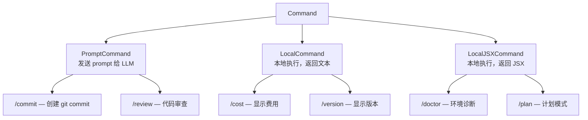
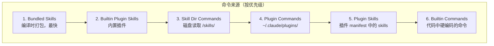
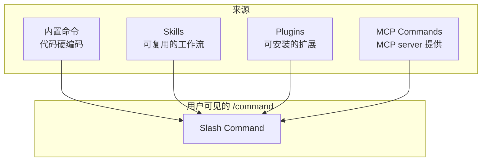

# 命令系统 — Command System

> 用户通过 `/command` 触发的各种操作。

## 概览

命令是用户在 REPL 中输入 `/xxx` 触发的功能。和工具不同，命令是**用户驱动**的，而不是 LLM 驱动的。

## 命令类型



### PromptCommand

最常见的类型。将格式化的 prompt 发送给 LLM，可以限制可用工具：

```typescript
const commitCommand = {
  type: 'prompt',
  name: 'commit',
  description: 'Create a git commit',
  allowedTools: ['Bash(git add:*)', 'Bash(git status:*)', 'Bash(git commit:*)'],
  progressMessage: 'creating commit',
  source: 'builtin',
  async getPromptForCommand(_args, context) {
    const promptContent = getPromptContent()
    return [{ type: 'text', text: promptContent }]
  },
}
```

### LocalCommand

在本地执行，不调用 LLM，返回纯文本：

```typescript
const costCommand = {
  type: 'local',
  name: 'cost',
  description: 'Show token usage and cost',
  supportsNonInteractive: true,
  load: () => import('./cost.js'),
}
```

### LocalJSXCommand

在本地执行，返回 React JSX 组件（用于交互式 UI）：

```typescript
const planCommand = {
  type: 'local-jsx',
  name: 'plan',
  description: 'Enable plan mode',
  argumentHint: '[open|<description>]',
  load: () => import('./plan.js'),
}
```

## 命令基础结构

```typescript
type CommandBase = {
  name: string
  description: string
  aliases?: string[]           // 别名（如 /c → /commit）
  isEnabled?(): boolean        // 是否启用（feature flag 控制）
  isHidden?: boolean           // 是否隐藏
  argumentHint?: string        // 参数提示
  whenToUse?: string           // 何时使用的说明
  userInvocable?: boolean      // 用户是否可以直接调用
  loadedFrom?: 'skills' | 'plugin' | 'bundled' | 'mcp'  // 来源
  immediate?: boolean          // 是否立即执行（不等待 LLM）
  isSensitive?: boolean        // 是否包含敏感操作
}
```

## 命令注册和加载

命令从多个来源加载，有优先级：



`src/commands.ts` 中的注册使用了 memoization：

```typescript
// getAllCommands() 按 cwd memoize，避免重复磁盘 I/O
export function getAllCommands(cwd: string): Command[]
```

## 命令分类

### 会话管理

| 命令 | 功能 |
|------|------|
| `/session` | 管理会话 |
| `/resume` | 恢复之前的会话 |
| `/cost` | 显示 token 使用和费用 |
| `/usage` | 使用量统计 |
| `/compact` | 压缩对话上下文 |
| `/clear` | 清除对话 |
| `/summary` | 会话摘要 |

### 开发工作流

| 命令 | 功能 |
|------|------|
| `/commit` | 创建 git commit |
| `/review` | 代码审查 |
| `/diff` | 查看 diff |
| `/plan` | 计划模式 |
| `/tasks` | 任务管理 |

### 配置

| 命令 | 功能 |
|------|------|
| `/config` | 管理配置 |
| `/keybindings` | 键盘快捷键 |
| `/hooks` | Hook 管理 |
| `/permissions` | 权限规则 |
| `/theme` | 主题设置 |

### 集成

| 命令 | 功能 |
|------|------|
| `/mcp` | MCP server 管理 |
| `/plugin` | 插件管理 |
| `/agents` | Agent 定义管理 |
| `/skills` | Skill 管理 |

### 认证

| 命令 | 功能 |
|------|------|
| `/login` | 登录 |
| `/logout` | 登出 |
| `/oauth-refresh` | 刷新 OAuth token |

## 命令过滤

不是所有命令在所有环境都可用：

| 过滤器 | 说明 |
|--------|------|
| `meetsAvailabilityRequirement()` | 认证/provider 门控 |
| `isCommandEnabled()` | Feature flag 和环境变量 |
| `REMOTE_SAFE_COMMANDS` | 移动端/远程环境安全命令 |
| `BRIDGE_SAFE_COMMANDS` | Remote Control bridge 安全命令 |
| `INTERNAL_ONLY_COMMANDS` | 仅 Anthropic 内部可用 |

## 命令 vs Skill vs Plugin

三者的关系：



- **内置命令**：核心功能，代码中直接定义
- **Skills**：可复用的工作流模板，可以用户自定义
- **Plugins**：可安装的扩展包，可以贡献工具、命令和 prompts
- **MCP Commands**：MCP server 暴露的命令

## 关键洞察

1. **三种类型满足三种需求** — PromptCommand 用于需要 LLM 的任务，LocalCommand 用于纯本地操作，LocalJSXCommand 用于交互式 UI
2. **Lazy Loading** — 命令通过 `load()` 延迟加载，只在使用时才 import
3. **多来源合并** — 内置、skills、plugins、MCP 的命令被合并到统一注册表
4. **环境感知** — 命令根据运行环境（本地、远程、bridge）自动过滤
5. **100+ 命令** — 覆盖了开发工作流的方方面面
