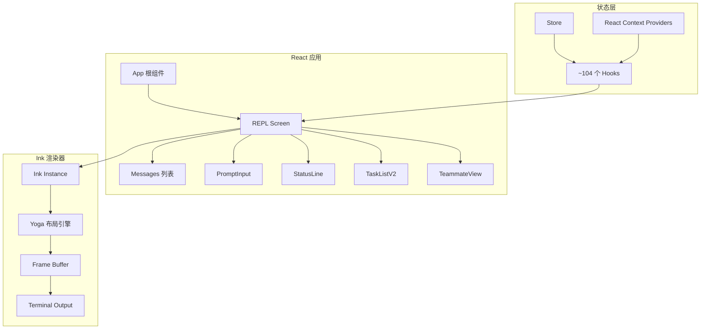
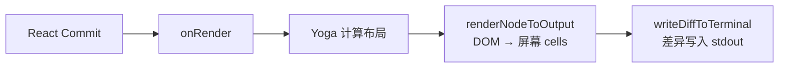
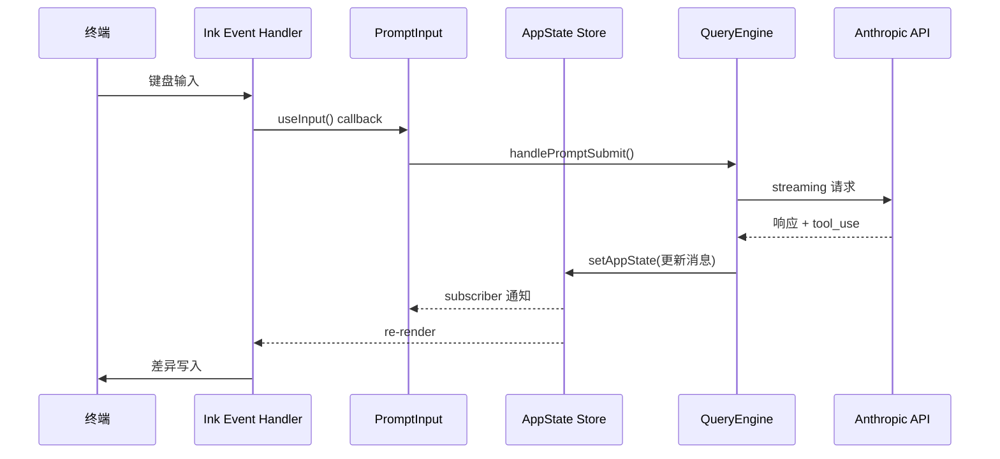

# UI 和状态管理

> React + Ink 终端 UI 和全局状态管理系统。

## 概览

Claude Code 的 UI 层是一个完整的 **React 应用**，只是渲染目标是终端而不是浏览器。使用 [Ink](https://github.com/vadimdemedes/ink) 作为终端 React 渲染器。



## Screens — 全屏模式

| Screen | 文件 | 功能 |
|--------|------|------|
| REPL | `src/screens/REPL.tsx` | 主交互界面（874KB，核心编排层） |
| Doctor | `src/screens/Doctor.tsx` | 环境诊断 |
| ResumeConversation | `src/screens/ResumeConversation.tsx` | 会话恢复 |

### REPL.tsx — 核心编排

这是整个应用最大的文件（874KB），负责：
- 导入 ~260 个模块
- 管理整个 session 生命周期
- 协调 task queues、后台 sessions、teammate
- 集成所有子系统：MCP、plugins、skills、IDE bridge、voice、tasks、teams
- 通过 `feature()` 条件加载做死代码消除

## Components — 111 个组件

### 分类

**REPL 核心：**
- `Messages.tsx` — 虚拟消息列表渲染
- `PromptInput/PromptInput.tsx` — 主输入组件
- `Spinner.tsx` — 加载状态
- `StatusLine.tsx` — 底部状态栏

**对话框/模态：**
- `CostThresholdDialog.tsx` — 费用阈值确认
- `MCPServerApprovalDialog.tsx` — MCP server 审批
- `TrustDialog` — 信任确认

**子目录组件：**

| 目录 | 功能 |
|------|------|
| `messages/` | 用户/助手消息渲染 |
| `permissions/` | 权限请求、工具确认 |
| `PromptInput/` | 输入模式、队列命令、Footer |
| `mcp/` | MCP 对话框、server 管理 |
| `tasks/` | TaskListV2、CoordinatorTaskPanel |
| `teams/` | TeammateViewHeader、团队消息 |
| `diff/` | Git diff 渲染 |
| `design-system/` | 基础 UI 原语 |
| `skills/`, `agents/` | Skill 和 Agent UI |

## State Management — AppState

### Store 模式

使用极简的 generic store：

```typescript
type Store<T> = {
  getState: () => T
  setState: (updater: (prev: T) => T) => void
  subscribe: (listener: Listener) => () => void  // 返回 unsubscribe
}
```

### AppState — 统一全局状态

`src/state/AppStateStore.ts`（570 行）定义了巨大的全局状态对象：

```typescript
type AppState = {
  // === 设置 ===
  settings: SettingsJson
  mainLoopModel: ModelSetting

  // === 会话 UI ===
  statusLineText?: string
  expandedView: 'none' | 'tasks' | 'teammates'
  footerSelection: FooterItem | null  // 'tasks' | 'tmux' | 'teams' | 'bridge' | ...

  // === 任务管理 ===
  tasks: { [taskId: string]: TaskState }  // 可变（包含函数引用）
  foregroundedTaskId?: string

  // === 团队/Agent ===
  viewingAgentTaskId?: string
  selectedIPAgentIndex: number
  coordinatorTaskIndex: number
  viewSelectionMode: 'none' | 'selecting-agent' | 'viewing-agent'
  teamContext?: {
    teamName: string
    leadAgentId: string
    isLeader?: boolean
    teammates: { [id: string]: TeammateInfo }
  }

  // === MCP & 插件 ===
  mcp: {
    clients: MCPServerConnection[]
    tools: Tool[]
    commands: Command[]
    resources: Record<string, ServerResource[]>
  }
  plugins: {
    enabled: LoadedPlugin[]
    disabled: LoadedPlugin[]
    errors: PluginError[]
    installationStatus: { ... }
  }

  // === 权限 ===
  toolPermissionContext: ToolPermissionContext
  workerSandboxPermissions: { queue: [...], selectedIndex: number }

  // === 通知 ===
  notifications: { current: Notification | null, queue: Notification[] }
  elicitation: { queue: ElicitationRequestEvent[] }
  activeOverlays: ReadonlySet<string>

  // === 推测执行 ===
  speculation: SpeculationState
  promptSuggestion: { text: string | null, ... }

  // === Bridge ===
  replBridgeEnabled: boolean
  replBridgeConnected: boolean
  replBridgeSessionActive: boolean
  replBridgeUrl?: string

  // === 记忆 ===
  fileHistory: FileHistoryState
  todos: { [agentId: string]: TodoList }
  inbox: { messages: InboxMessage[] }

  // ... 更多字段
}
```

### 状态更新模式

```typescript
// 同步更新
setAppState(prev => ({
  ...prev,
  statusLineText: 'Processing...'
}))

// 嵌套更新
setAppState(prev => ({
  ...prev,
  mcp: { ...prev.mcp, tools: newTools }
}))
```

### Selectors

纯函数从 AppState 中提取派生数据：

```typescript
// src/state/selectors.ts
export function getViewedTeammateTask(state: AppState): TeammateTask | undefined
export function getActiveTaskCount(state: AppState): number
// ...
```

### Change Observers

AppState 变化时的副作用：

```typescript
// src/state/onChangeAppState.ts
// 当某些状态改变时自动执行副作用（如通知、日志）
```

## React Context Providers

| Provider | 文件 | 功能 |
|----------|------|------|
| `NotificationsProvider` | `notifications.tsx` | 队列式通知系统 |
| `ModalContext` | `modalContext.tsx` | 模态框尺寸/滚动 |
| `MailboxContext` | `mailbox.tsx` | Agent 间消息队列 |
| `OverlayContext` | `overlayContext.tsx` | 活跃的 overlay 追踪 |
| `VoiceContext` | `voice.tsx` | 语音模式（DCE） |
| `StatsContext` | `stats.tsx` | 统计追踪 |
| `FpsMetricsContext` | `fpsMetrics.tsx` | 性能指标 |
| `QueuedMessageContext` | `QueuedMessageContext.tsx` | 排队消息 |

### 通知系统

```typescript
// 优先级队列
addNotification({
  key: 'unique-id',
  priority: 'high',       // low | medium | high | immediate
  text: 'Error message',
  timeoutMs: 5000,
  invalidates: ['old-id']  // 取消冲突的通知
})

// 折叠相同 key 的通知
fold?: (acc: Notification, incoming: Notification) => Notification
```

## Ink 渲染器 (`src/ink/`)

### 渲染管道



### 性能优化

| 优化 | 说明 |
|------|------|
| 对象池 | StylePool、CharPool、HyperlinkPool 避免 GC |
| Frame 双缓冲 | 前/后 frame 交换，避免频繁分配 |
| 渲染节流 | `FRAME_INTERVAL_MS`（16.67ms ≈ 60fps）节流 |
| Microtask 延迟 | `queueMicrotask(onRender)` 排序 layout effect |
| 虚拟滚动 | `VirtualMessageList` 处理 1000+ 消息 |

### Ink 核心组件

| 组件 | 功能 |
|------|------|
| `App.tsx` | 终端事件处理（鼠标、键盘、选择） |
| `AlternateScreen.tsx` | 全屏模式（alternate screen buffer） |
| `TerminalFocusContext.tsx` | 终端焦点追踪 |
| `TerminalSizeContext.tsx` | 终端尺寸响应 |
| `ClockContext.tsx` | 帧时钟 |
| `Link.tsx` | 终端超链接 |

## Hooks 分类 (~104 个)

### 状态管理 (10+)

| Hook | 功能 |
|------|------|
| `useAppState(selector)` | 订阅 AppState 切片 |
| `useSetAppState()` | 批量状态更新 |
| `useAppStateStore()` | 直接 store 访问 |
| `useGlobalState()` | 全局配置状态 |

### 输入 & 事件 (15+)

| Hook | 功能 |
|------|------|
| `useInput()` | 键盘输入绑定 |
| `useTextInput()` | 文本输入控制器 |
| `useGlobalKeybindings()` | 全局快捷键 |
| `usePasteHandler()` | 粘贴处理 |
| `useVimInput()` | Vim 模式输入 |

### IDE & 终端 (10+)

| Hook | 功能 |
|------|------|
| `useTerminalSize()` | 终端尺寸 |
| `useIDEIntegration()` | IDE 集成 |
| `useIdeConnectionStatus()` | IDE 连接状态 |
| `useDiffInIDE()` | IDE 中显示 diff |

### 权限 (10+)

| Hook | 功能 |
|------|------|
| `useCanUseTool()` | 工具权限检查 |
| `useSwarmPermissionPoller()` | Swarm 权限同步 |

### 任务 & Agent (15+)

| Hook | 功能 |
|------|------|
| `useTasksV2WithCollapseEffect()` | 任务列表状态 |
| `useBackgroundTaskNavigation()` | 后台任务导航 |
| `useSwarmInitialization()` | Swarm 初始化 |
| `useInboxPoller()` | 收件箱更新 |

### 特殊功能 (15+)

| Hook | 功能 |
|------|------|
| `useVoiceIntegration()` | 语音模式（DCE） |
| `useFrustrationDetection()` | 挫败感检测（内部） |
| `useProactive()` | 主动模式（DCE） |
| `useScheduledTasks()` | 定时任务 |
| `useLspPluginRecommendation()` | LSP 推荐 |

## 数据流



## 关键洞察

1. **终端也能 React** — 完全的 React 模式（组件、hooks、context），只是用 Box/Text 代替 div/span
2. **统一状态** — AppState 是巨大的单一对象，所有子系统共享状态
3. **Selector 优化** — 通过 selector 函数避免不必要的 re-render
4. **DeepImmutable** — 大部分状态字段是深度不可变的，防止意外修改
5. **渲染优化** — 对象池 + 双缓冲 + 节流 + 虚拟滚动，终端 60fps
6. **Feature Flag DCE** — 未启用的功能在构建时被完全消除，减少包体积
