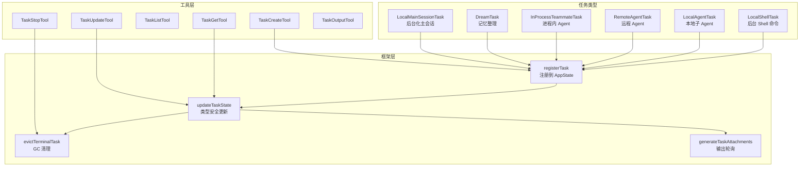
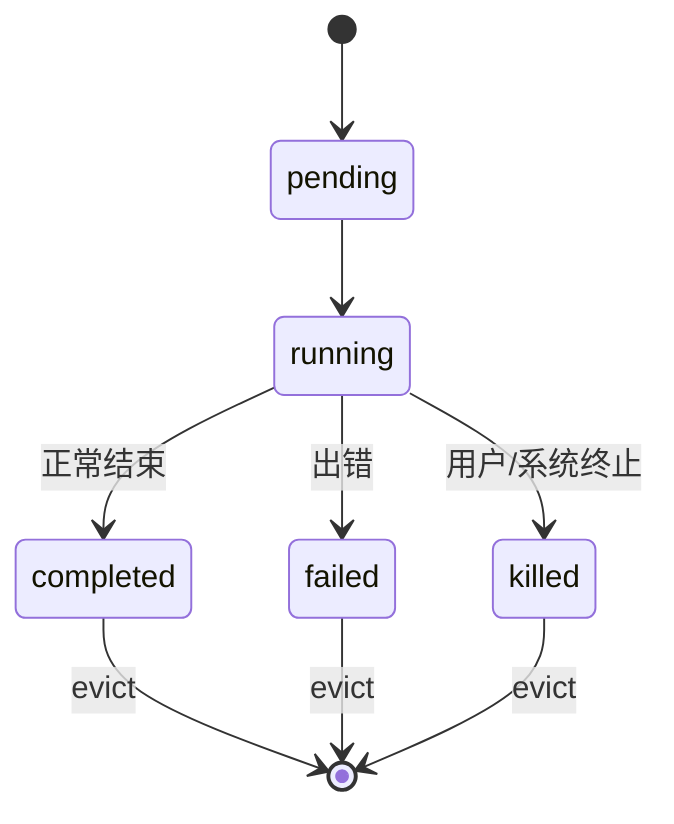

# 任务系统 — Task System

> 后台执行、Shell 任务、Agent 任务的管理框架。

## 概览

任务系统管理 Claude Code 中所有的后台工作 — 从简单的 shell 命令到复杂的子 Agent 到远程 Agent。



## 核心数据结构

### 任务状态基类

```typescript
type TaskStateBase = {
  id: string                 // 带前缀的 ID: 'b'(bash), 'a'(agent), 'r'(remote)...
  type: TaskType
  status: TaskStatus         // pending → running → completed|failed|killed
  description: string
  toolUseId?: string         // 关联的 tool_use block
  startTime: number
  endTime?: number
  outputFile: string         // 磁盘输出路径（streaming delta 轮询）
  outputOffset: number       // 上次读取位置
  notified: boolean          // 防止重复通知
}
```

### Task ID 生成

ID 带类型前缀，方便区分：

| 前缀 | 类型 |
|------|------|
| `b` | Shell 任务 |
| `a` | Agent 任务 |
| `r` | 远程 Agent |
| `t` | 进程内 Teammate |
| `w` | Workflow |
| `m` | Monitor |
| `d` | Dream |
| `s` | 后台化主会话 |

使用 36^8 组合（0-9 + a-z），抵抗输出文件的符号链接攻击。

### 状态生命周期



## 任务类型详解

### LocalShellTask — 后台 Shell 命令

**场景**：用户运行一个耗时的 shell 命令，如 `npm install`。

**核心流程**：
1. `spawnShellTask()` 注册任务
2. 后台执行 ShellCommand
3. 输出 streaming 写入磁盘文件
4. 完成后通过 `enqueueShellNotification()` 通知

**特色功能**：
- **Stall Watchdog** — 检测等待交互输入的命令（45 秒阈值）
- **输出 Delta 轮询** — 通过 `outputOffset` 追踪增量输出
- **折叠分组** — `BACKGROUND_BASH_SUMMARY_PREFIX` 让 UI 可以折叠显示

### LocalAgentTask — 本地子 Agent

**场景**：Coordinator 生成的 worker agent，或用户手动创建的 sub-agent。

**扩展状态**：
```typescript
type LocalAgentTaskState = TaskStateBase & {
  agentId: string
  prompt: string
  selectedAgent?: AgentDefinition
  agentType: string
  model?: string
  abortController?: AbortController
  error?: string
  result?: AgentToolResult
  progress?: AgentProgress       // 工具计数、token 计数、最近活动
  messages?: Message[]           // UI 展示的对话记录
  pendingMessages: string[]      // 等待投递的消息队列
  isBackgrounded: boolean
  retain: boolean                // UI 持有时阻止 eviction
  evictAfter?: number            // Panel 宽限期（30s after terminal）
}
```

**Progress 追踪**：
- `ProgressTracker` 累计工具调用数、token 数、最近活动
- `MAX_RECENT_ACTIVITIES = 5` 滚动窗口
- 分类工具使用（search/read），去重结构化输出

**消息管理**：
- `queuePendingMessage()` — Agent 执行中排队消息
- `drainPendingMessages()` — 在 tool round 边界刷新

### RemoteAgentTask — 远程 Agent (CCR)

**场景**：在 Claude Cloud Runtime 上运行的远程 Agent。

**扩展状态**：
```typescript
type RemoteAgentTaskState = TaskStateBase & {
  remoteTaskType: 'remote-agent' | 'ultraplan' | 'ultrareview' | 'autofix-pr' | 'background-pr'
  sessionId: string
  command: string
  title: string
  todoList: TodoList
  log: SDKMessage[]
  isLongRunning?: boolean         // 不会在第一个结果后标记完成
  pollStartedAt: number
  isRemoteReview?: boolean
  reviewProgress?: { stage, bugsFound, bugsVerified, bugsRefuted }
  isUltraplan?: boolean
  ultraplanPhase?: UltraplanPhase
}
```

**完成检查**：
每种远程任务类型注册一个 `RemoteTaskCompletionChecker`：
- 每次轮询 tick 调用
- 返回 string → 完成（成为通知内容）
- 返回 null → 继续轮询

### InProcessTeammateTask — 进程内 Agent

**场景**：轻量级 Teammate agent，与主进程共享资源。

详见 [Agent Team 系统](06-agent-team.md)。

### DreamTask — 记忆整理

**场景**：后台自动整理会话记忆。

**状态**：
```typescript
type DreamTaskState = TaskStateBase & {
  phase: 'starting' | 'updating'
  sessionsReviewing: number
  filesTouched: string[]
  turns: DreamTurn[]        // 最近 30 轮 {text, toolUseCount}
  abortController?: AbortController
}
```

UI 仅在 footer pill 中显示，不发送通知。

### LocalMainSessionTask — 后台化主会话

**场景**：用户按 Ctrl+B 两次将当前查询后台化。

本质是 `LocalAgentTaskState` 的特化版本，`agentType: 'main-session'`。

## 任务框架 (`src/utils/task/framework.ts`)

### registerTask — 注册

```typescript
function registerTask(task: TaskState, setAppState): void
  // 1. 插入到 AppState.tasks
  // 2. 发送 task_started SDK 事件
  // 3. 恢复场景下保留已有 UI 状态
```

### updateTaskState — 更新

```typescript
function updateTaskState<T>(taskId, setAppState, updater: (prev: T) => T): void
  // 类型安全的任务状态更新
  // 如果 updater 返回相同引用 → 跳过（避免不必要的 re-render）
```

### evictTerminalTask — 清理

```typescript
function evictTerminalTask(taskId, setAppState): void
  // 从 AppState 移除已完成+已通知的任务
  // 尊重 panel grace period（local_agent 有 30s 宽限）
```

### generateTaskAttachments — 输出轮询

```typescript
function generateTaskAttachments(state): {
  attachments: TaskAttachment[]
  updatedTaskOffsets: Record<string, number>
  evictedTaskIds: string[]
}
  // 轮询磁盘获取输出增量
  // 懒 GC：Terminal + notified 的任务在这里被清理
```

### 轮询常量

```typescript
POLL_INTERVAL_MS = 1000          // 每秒轮询一次
STOPPED_DISPLAY_MS = 3_000       // killed 任务可见 3 秒
PANEL_GRACE_MS = 30_000          // local_agent 在 coordinator panel 中的宽限期
```

## 任务通知

任务完成时通过 XML 标签格式的消息通知 LLM：

```xml
<task-notification>
  <task-id>b1234567890</task-id>
  <tool-use-id>tool_abc123</tool-use-id>
  <output-file>/path/to/task/output</output-file>
  <status>completed</status>
  <summary>Background command "install deps" completed (exit 0)</summary>
</task-notification>
```

## 关键洞察

1. **磁盘 Streaming** — 任务输出写入磁盘文件，通过 offset 增量读取，避免内存爆炸
2. **类型安全更新** — `updateTaskState<T>` 泛型确保类型安全
3. **宽限期 GC** — 终止的任务不会立即消失，给用户/coordinator 时间查看结果
4. **SDK 事件** — 任务生命周期通过 SDK events 暴露给外部消费者
5. **多种执行后端** — 从进程内到本地到远程，统一的任务接口
6. **Stall 检测** — Shell 任务能检测等待用户输入的卡住状态
