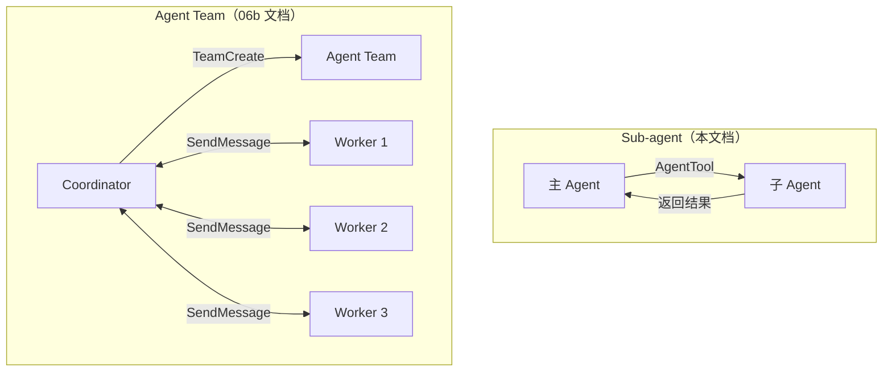
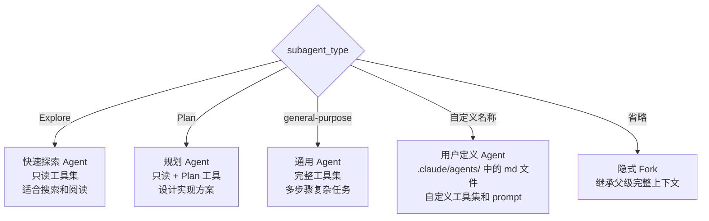
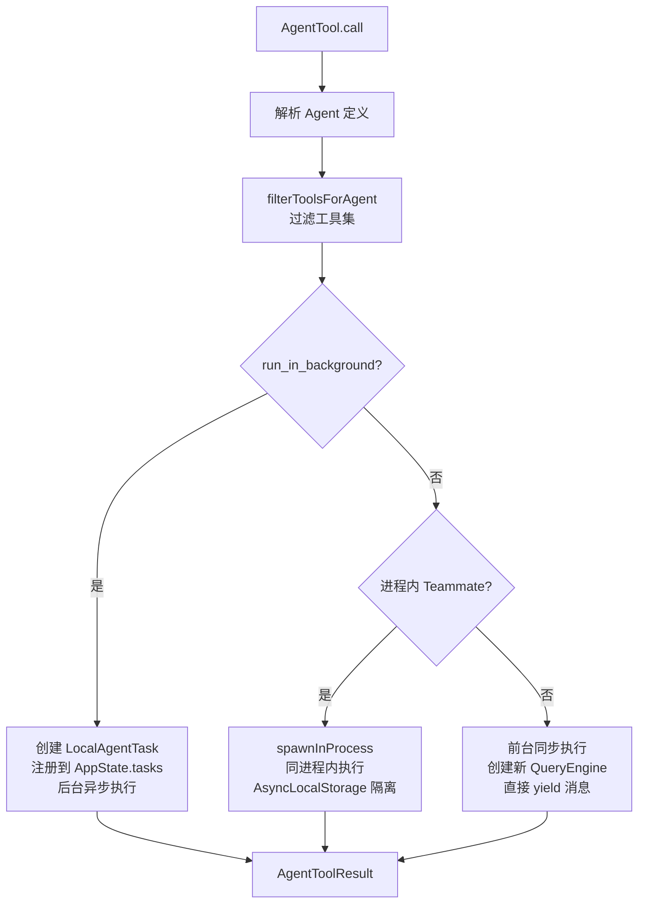
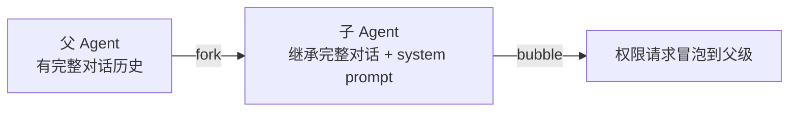
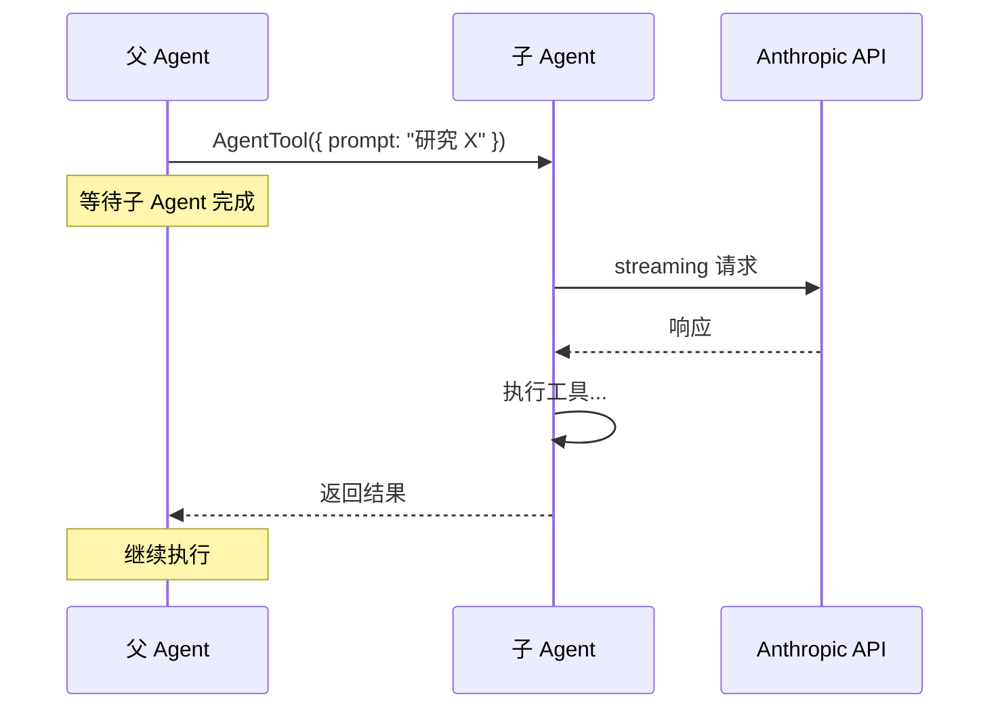
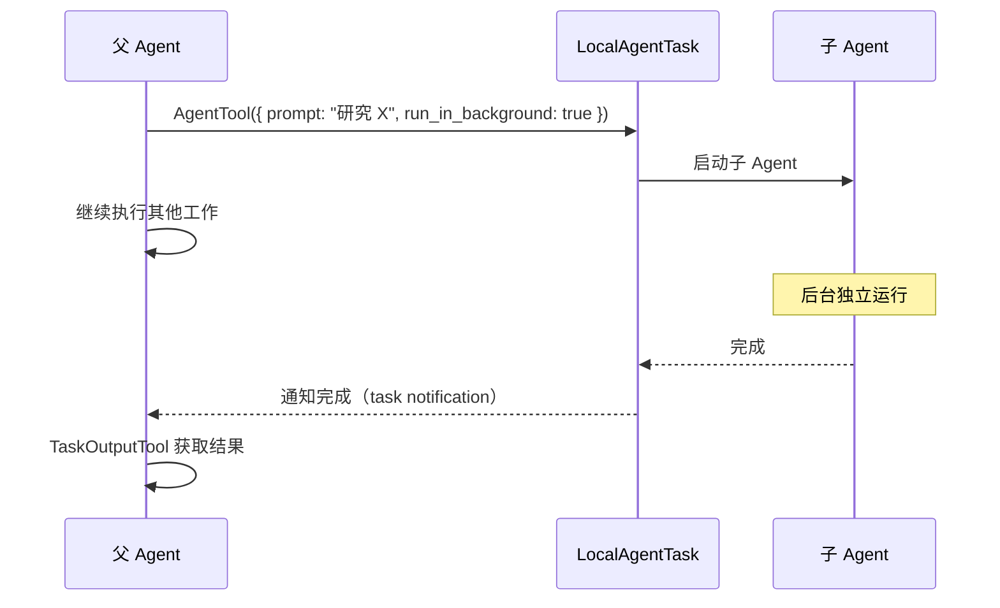
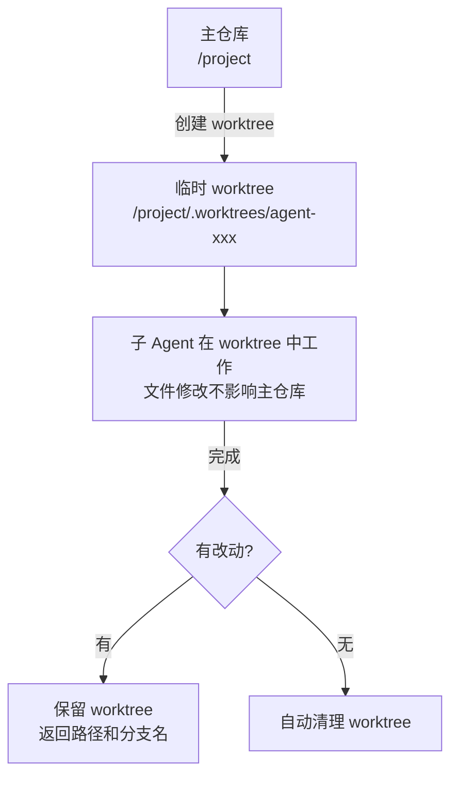

# Sub-agent 系统 — 单 Agent 派生

> AgentTool：派生一个子 Agent 来完成特定任务。

## 概览

Sub-agent 是 Claude Code 的**单 Agent 派生**机制。主 Agent 通过 `AgentTool` 生成一个子 Agent，子 Agent 独立完成任务后返回结果。

Sub-agent 和 Agent Team 的关系：



**核心区别**：
- Sub-agent 是 **1:1** 的父子关系，子 Agent 完成后返回结果
- Agent Team 是 **1:N** 的协调关系，Coordinator 持续与多个 Worker 交互

## AgentTool (`src/tools/AgentTool/`)

### 文件结构

```
src/tools/AgentTool/
├── AgentTool.ts          # 主逻辑
├── agentToolUtils.ts     # 工具过滤、Agent 定义解析
├── forkSubagent.ts       # 隐式 fork 检测
├── prompt.ts             # System prompt 贡献
├── UI.tsx                # 终端渲染
└── index.ts              # 导出
```

### 输入 Schema

```typescript
{
  subagent_type: string,       // Agent 类型："Explore", "Plan", "general-purpose", 自定义名称...
  name?: string,               // 显示名称（用于标识和 SendMessage 寻址）
  prompt: string,              // 任务指令
  model?: string,              // 模型覆盖（如 "sonnet", "opus", "haiku"）
  permissionMode?: string,     // 权限模式覆盖
  tools?: string[],            // 工具白名单/黑名单
  isolation?: "worktree",      // Git worktree 隔离
  run_in_background?: boolean, // 后台运行
  team_name?: string,          // 关联的团队
}
```

### Agent 类型



### 内置 Agent 定义

| 类型 | 工具集 | 适用场景 |
|------|--------|---------|
| `Explore` | Glob, Grep, Read, Bash(只读) | 快速代码搜索、文件查找 |
| `Plan` | Explore 工具 + EnterPlanMode | 设计实现方案 |
| `general-purpose` | 完整工具集 | 复杂多步骤任务 |

### 自定义 Agent

用户可以在 `.claude/agents/` 中创建 markdown 文件定义 Agent：

```markdown
---
name: code-reviewer
description: Reviews code for quality issues
model: sonnet
tools:
  - Read
  - Grep
  - Glob
---

You are a code reviewer. Review the given code for:
- Correctness
- Performance
- Security
- Style
```

## Agent 生成流程



### 工具过滤逻辑

`filterToolsForAgent()` 根据上下文过滤可用工具：

```typescript
function filterToolsForAgent({
  tools: Tools,
  isBuiltIn: boolean,        // 内置 vs 用户自定义
  isAsync?: boolean,          // 同步 vs 异步
  permissionMode?: string,
}): Tools
```

| 条件 | 过滤规则 |
|------|---------|
| 所有 Agent | 移除 `ALL_AGENT_DISALLOWED_TOOLS` |
| 用户自定义 Agent | 额外移除 `CUSTOM_AGENT_DISALLOWED_TOOLS` |
| 异步/后台 Agent | 只允许 `ASYNC_AGENT_ALLOWED_TOOLS` |
| 进程内 Teammate | 允许 AgentTool（可嵌套）+ `IN_PROCESS_TEAMMATE_ALLOWED_TOOLS` |
| MCP 工具 | 始终允许（所有 Agent） |

## Fork Subagent (`src/tools/AgentTool/forkSubagent.ts`)

当 `subagent_type` **省略**时，触发隐式 fork：



**Fork 特点**：
- 子 Agent **继承**父级的完整对话历史和 system prompt
- 权限模式：`bubble`（请求冒泡到父级）
- 模型：`inherit`（保持父级模型）
- 工具集：`['*']` + `useExactTools`（缓存一致性）
- 防递归：`FORK_BOILERPLATE_TAG` 检测防止无限 fork

**适用场景**：
- 需要在同一上下文中做另一件事（如"帮我也检查一下 error handling"）
- 不需要新鲜上下文的后续任务

## 前台 vs 后台执行

### 前台 Agent（同步）



父 Agent **阻塞等待**子 Agent 完成。适合需要结果才能继续的场景。

### 后台 Agent（异步）



父 Agent **不等待**，继续做其他事情。通过 task notification 得知完成。

## Git Worktree 隔离

当 `isolation: "worktree"` 时：



适用场景：
- 子 Agent 的修改可能与主 Agent 冲突
- 需要在干净的环境中实验
- 需要创建独立的 PR 分支

## Agent 结果

```typescript
type AgentToolResult = {
  success: boolean
  output: string           // Agent 的最终输出
  toolUseCount: number     // 使用了多少次工具
  tokenCount: number       // 消耗了多少 token
  duration_ms: number      // 耗时
  worktreePath?: string    // worktree 路径（如果有改动）
  worktreeBranch?: string  // worktree 分支名
}
```

## 与 Agent Team 的对比

| 特性 | Sub-agent | Agent Team |
|------|-----------|------------|
| 关系 | 1:1 父子 | 1:N 协调 |
| 通信 | 直接返回结果 | 文件邮箱异步通信 |
| 上下文 | 可继承（fork）或全新 | 每个 Worker 独立上下文 |
| 生命周期 | 单次任务 | 持续协作直到 TeamDelete |
| 并行 | 多个后台 Agent 可并行 | Worker 天然并行 |
| 适用 | 单一明确的任务 | 复杂的多方面任务 |
| 工具 | TeamCreate/SendMessage | 需要 Coordinator 模式 |

## 关键文件

| 文件 | 功能 |
|------|------|
| `src/tools/AgentTool/AgentTool.ts` | Agent 生成主逻辑 |
| `src/tools/AgentTool/agentToolUtils.ts` | 工具过滤、定义解析 |
| `src/tools/AgentTool/forkSubagent.ts` | Fork 检测和合成 |
| `src/tasks/LocalAgentTask/LocalAgentTask.tsx` | 后台 Agent 任务管理 |
| `src/utils/swarm/spawnInProcess.ts` | 进程内 spawn |
| `src/utils/swarm/inProcessRunner.ts` | 进程内执行循环 (53KB) |

## 关键洞察

1. **Sub-agent 是基础构建块** — Agent Team 底层也使用 AgentTool 来生成 worker
2. **Fork 是高效的** — 继承父级缓存，避免重新构建上下文
3. **工具过滤是安全层** — 不同类型的 Agent 获得不同的工具集，防止越权
4. **Worktree 隔离是可选的** — 只在需要时才创建，完成后自动清理
5. **后台 Agent 通过 task 系统管理** — 统一的进度追踪、输出轮询、GC
