# Agent Team 系统 — 多 Agent 协调

> Coordinator 模式：一个主 Agent 指挥多个 Worker Agent 并行协作。

## 概览

Agent Team 是 Claude Code 最复杂的子系统。它允许一个 **Coordinator (Leader)** 创建一个 **Team**，团队中的 **Worker (Teammate)** 可以并行执行不同的任务，通过**文件邮箱**异步通信。

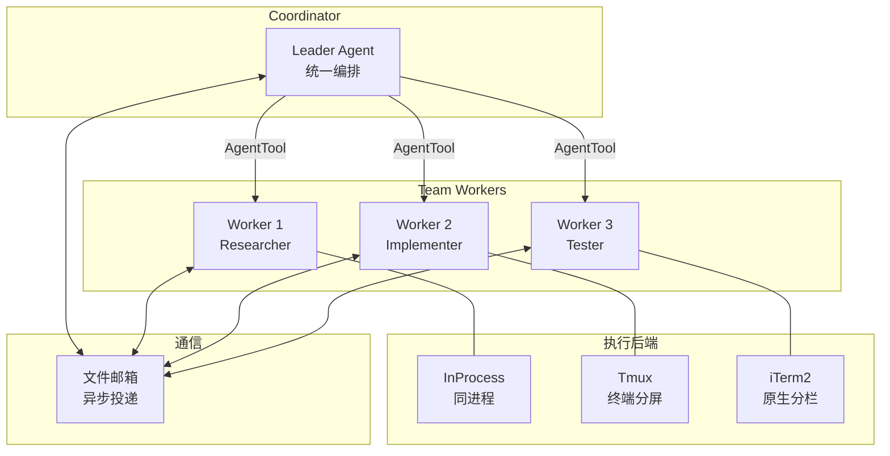

## 与 Sub-agent 的区别

| 特性 | Sub-agent (06a) | Agent Team (本文档) |
|------|-----------------|-------------------|
| 关系 | 1:1 父子 | 1:N Coordinator → Workers |
| 通信 | 直接返回结果 | 文件邮箱异步通信 |
| 生命周期 | 单次任务 | 持续协作直到 TeamDelete |
| Worker 间通信 | 不支持 | SendMessage 广播 |
| 关闭协议 | 直接终止 | 优雅关闭（请求→确认） |
| 执行后端 | InProcess 或后台 task | InProcess / Tmux / iTerm2 |
| Feature gate | 无（核心功能） | `COORDINATOR_MODE` + `isAgentSwarmsEnabled()` |

## Feature Gating

Agent Team 有**两层门控**：

### 层 1: Agent Swarms 启用 (`src/utils/agentSwarmsEnabled.ts`)

```typescript
function isAgentSwarmsEnabled(): boolean {
  // Anthropic 内部: 始终启用
  if (process.env.USER_TYPE === 'ant') return true

  // 外部: 需要显式 opt-in
  if (!isEnvTruthy(process.env.CLAUDE_CODE_EXPERIMENTAL_AGENT_TEAMS)
      && !isAgentTeamsFlagSet()) return false

  // GrowthBook killswitch
  if (!getFeatureValue('tengu_amber_flint', true)) return false

  return true
}
```

### 层 2: Coordinator 模式 (`src/coordinator/coordinatorMode.ts`)

```typescript
function isCoordinatorMode(): boolean {
  if (feature('COORDINATOR_MODE')) {
    return isEnvTruthy(process.env.CLAUDE_CODE_COORDINATOR_MODE)
  }
  return false
}
```

两者的关系：Agent Swarms 控制 team 工具是否可用，Coordinator Mode 控制是否使用专门的 Coordinator system prompt。

## 架构详解

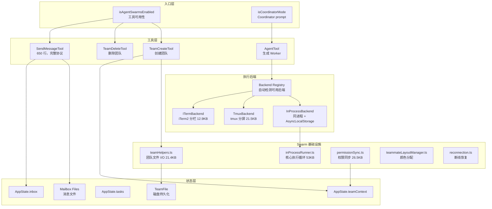

## 三种执行后端

### 后端检测 (`src/utils/swarm/backends/registry.ts`)

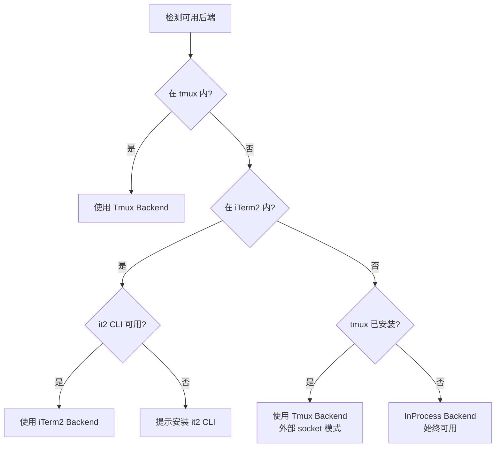

### InProcess Backend（同进程）

**位置**：`src/utils/swarm/backends/InProcessBackend.ts`（10.5KB）

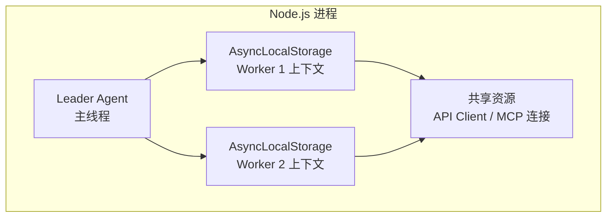

**特点**：
- 与 Leader **共享进程** — 零进程开销
- 通过 `AsyncLocalStorage` 实现上下文隔离
- 共享 API 客户端和 MCP 连接
- 通过 `AbortController` 终止
- 消息通过文件邮箱（与其他后端一致）
- **始终可用**，无系统依赖

### Tmux Backend（终端分屏）

**位置**：`src/utils/swarm/backends/TmuxBackend.ts`（21.5KB）

```
┌──────────────────┬──────────────────┐
│                  │  Worker 1        │
│                  │  (红色边框)       │
│  Leader          ├──────────────────┤
│  (30% 宽度)      │  Worker 2        │
│                  │  (蓝色边框)       │
│                  ├──────────────────┤
│                  │  Worker 3        │
│                  │  (绿色边框)       │
└──────────────────┴──────────────────┘
```

**特点**：
- Leader 占左侧 30%，Workers 占右侧 70%
- 每个 Worker 是独立的 tmux pane（独立进程）
- 彩色边框区分不同 Worker
- Pane 标题显示 Worker 名称
- 支持隐藏/显示 pane
- Pane 创建使用锁防止并行生成的竞争条件
- 可以在 tmux 外运行（使用外部 socket 创建新 session）

### iTerm2 Backend（原生分栏）

**位置**：`src/utils/swarm/backends/ITermBackend.ts`（12.9KB）

**特点**：
- 使用 `it2` CLI 进行原生分屏
- 第一个 Worker：从 Leader 垂直分割(-v)
- 后续 Worker：从上一个 Worker 水平分割
- 无法隐藏/显示 pane
- 有 dead pane 恢复机制（用户关闭 pane 后重试）

## 团队生命周期

### 创建团队 (TeamCreateTool)

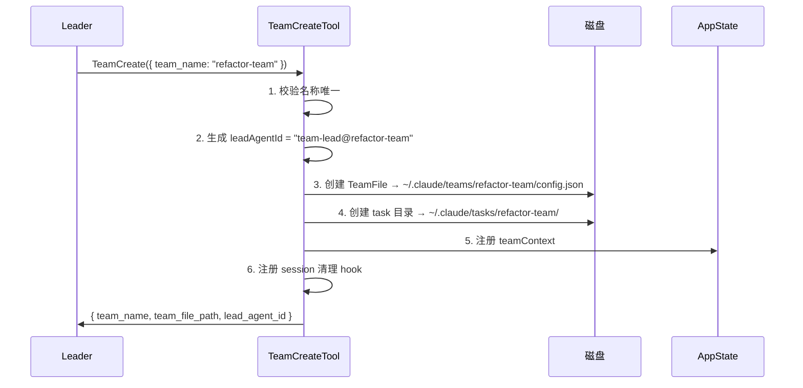

### TeamFile 结构（磁盘持久化）

```typescript
type TeamFile = {
  name: string
  description?: string
  createdAt: number
  leadAgentId: string
  leadSessionId?: string
  hiddenPaneIds?: string[]           // tmux/iTerm2 隐藏的 pane
  teamAllowedPaths?: TeamAllowedPath[]  // 跨团队编辑权限
  members: Array<{
    agentId: string                  // "researcher@refactor-team"
    name: string                     // "researcher"
    agentType?: string
    model?: string
    prompt?: string
    color?: string                   // 颜色：red/blue/green/yellow/purple/orange/pink/cyan
    planModeRequired?: boolean
    joinedAt: number
    tmuxPaneId: string
    cwd: string
    worktreePath?: string
    sessionId?: string
    subscriptions: string[]
    backendType?: 'tmux' | 'iterm2' | 'in-process'
    isActive?: boolean
    mode?: PermissionMode
  }>
}
```

### 生成 Worker

Leader 通过 AgentTool 生成 Worker：

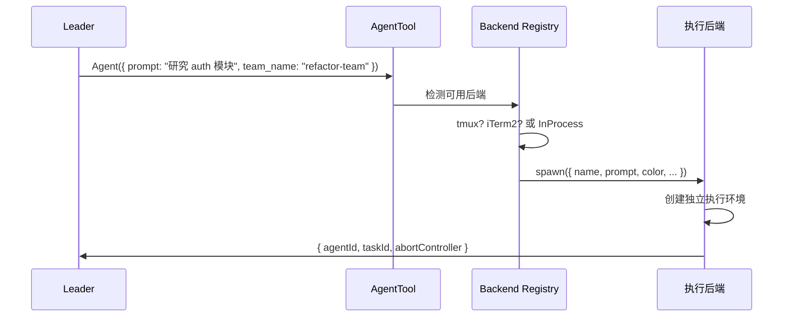

### 删除团队 (TeamDeleteTool)

**安全检查**：不能删除有活跃 Worker 的团队。

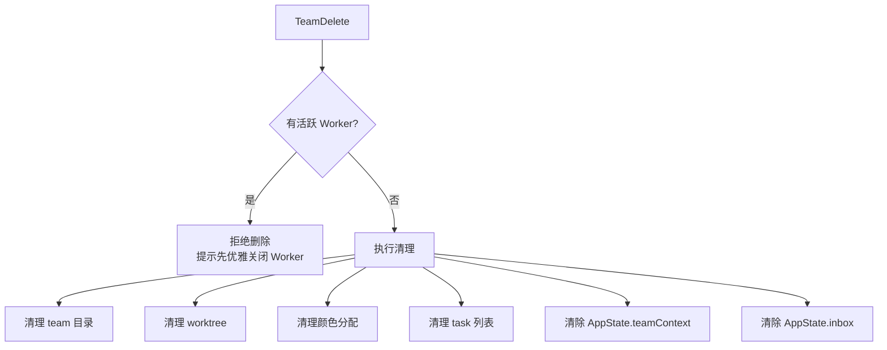

## 消息传递 — SendMessageTool

**位置**：`src/tools/SendMessageTool/SendMessageTool.ts`（650+ 行）

### 消息类型

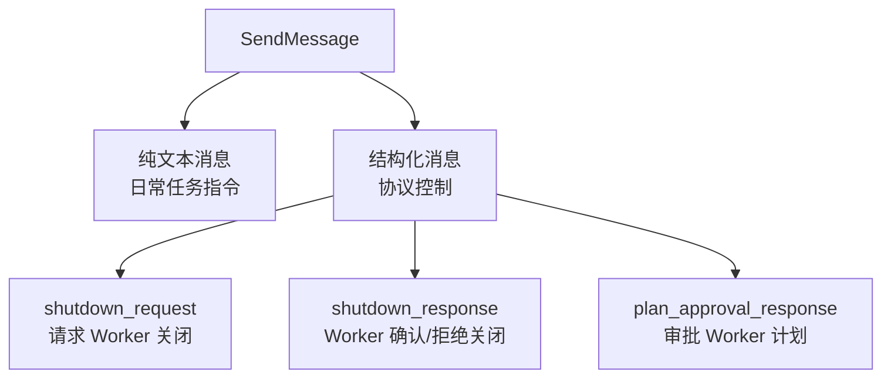

### 输入

```typescript
{
  to: string,       // Worker 名称 | "*"（广播）| "bridge:<session-id>"（跨机器）
  message: string | StructuredMessage,
  summary?: string  // 纯文本消息时必填
}
```

### 路由

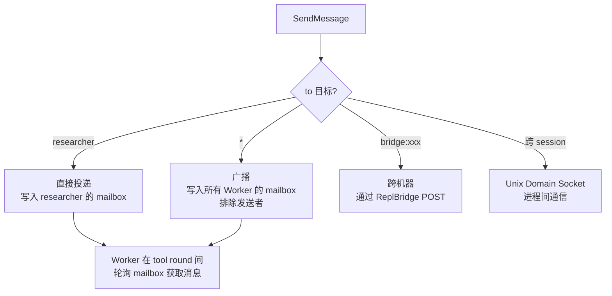

**核心机制**：所有消息都通过**文件邮箱**投递，不管使用哪种执行后端。这是一个**最终一致**的异步通信模型。

### 关闭协议

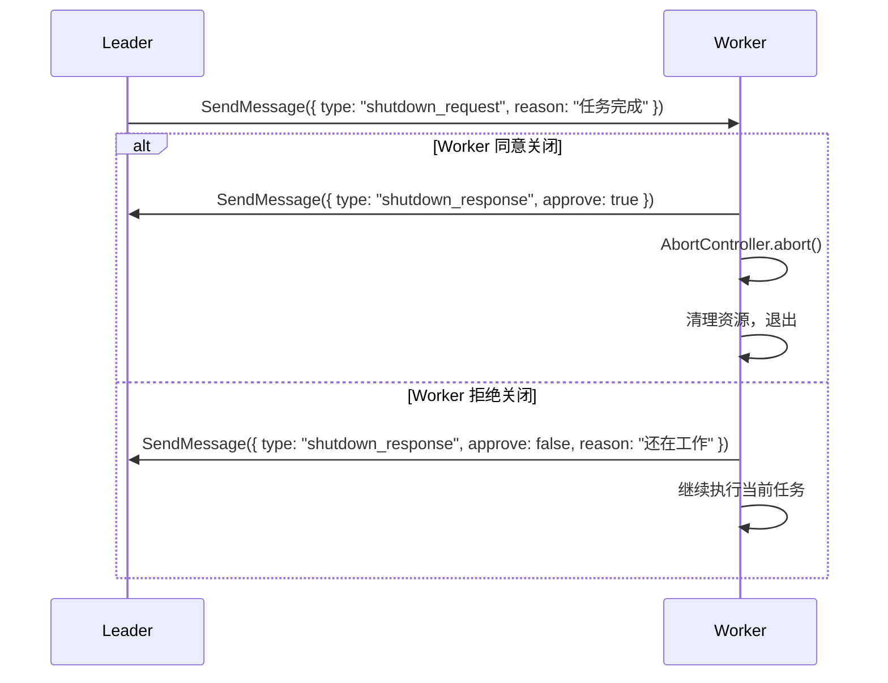

### 计划审批

当 Worker 处于 plan mode 时，需要 Leader 审批计划：

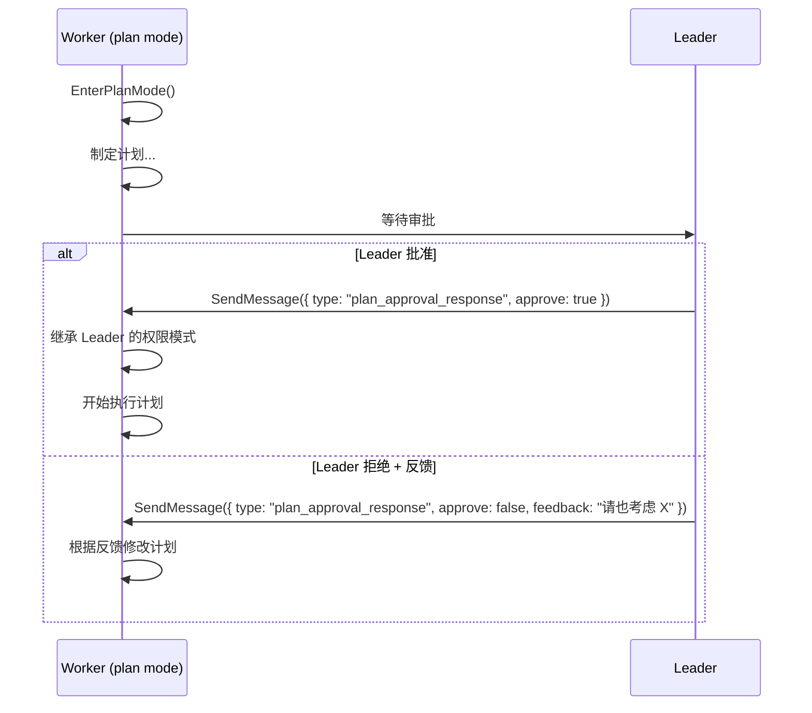

## InProcess Teammate Task

### TeammateIdentity

```typescript
type TeammateIdentity = {
  agentId: string,           // "researcher@refactor-team"
  agentName: string,         // "researcher"
  teamName: string,
  color?: string,            // "red" | "blue" | ...
  planModeRequired: boolean,
  parentSessionId: string
}
```

### 完整状态

```typescript
type InProcessTeammateTaskState = TaskStateBase & {
  identity: TeammateIdentity
  prompt: string
  model?: string
  selectedAgent?: AgentDefinition

  // 生命周期控制
  abortController: AbortController           // 终止整个 teammate
  currentWorkAbortController: AbortController // 终止当前 turn
  shutdownRequested: boolean

  // 执行状态
  awaitingPlanApproval: boolean
  permissionMode: PermissionMode             // 独立权限模式
  isIdle: boolean
  onIdleCallbacks: Function[]

  // 数据
  messages: Message[]                        // UI 展示用（上限 50）
  pendingUserMessages: string[]              // 待投递消息队列
  result?: AgentToolResult
}
```

### 内存管理

**`TEAMMATE_MESSAGES_UI_CAP = 50`**

来自生产经验：292 个 agents 的 swarm 会话消耗了 **36.8GB RAM**。UI 消息被严格限制为 50 条，完整历史持久化到磁盘。

### 执行循环 (`inProcessRunner.ts`, 53KB)

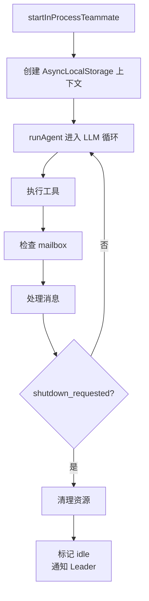

## 权限同步 (`src/utils/swarm/permissionSync.ts`, 26.5KB)

Leader 和 Worker 之间需要同步权限状态：

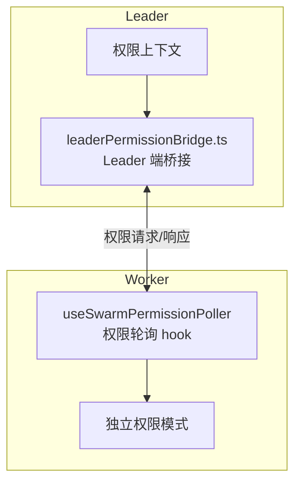

每个 Teammate 有**独立的权限模式**，可通过 Shift+Tab 切换。Leader 可以审批 Teammate 的计划，审批后 Teammate 继承 Leader 的权限级别。

## Coordinator System Prompt

当 Coordinator Mode 启用时，Leader 获得一个 **368 行**的专用 system prompt，核心原则：

### 工作流阶段

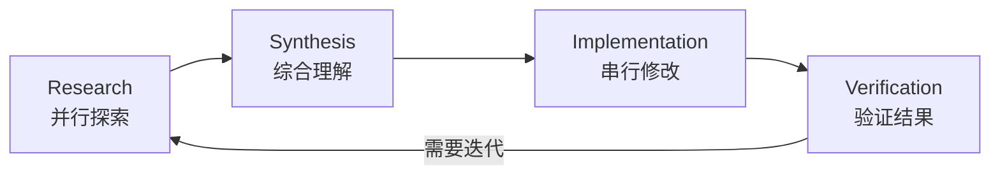

### 核心原则

1. **先综合再委派** — Leader 必须自己阅读和理解 Worker 的结果，然后才能指导下一步。**禁止**说 "based on your findings, fix the bug"
2. **并行即超能力** — 独立的研究任务必须并行启动
3. **写入必须串行** — 文件修改不能并行（会冲突）
4. **有效的 Worker prompt** — 必须包含具体的文件路径和行号，不能笼统地说"研究一下"

## 完整工作流示例

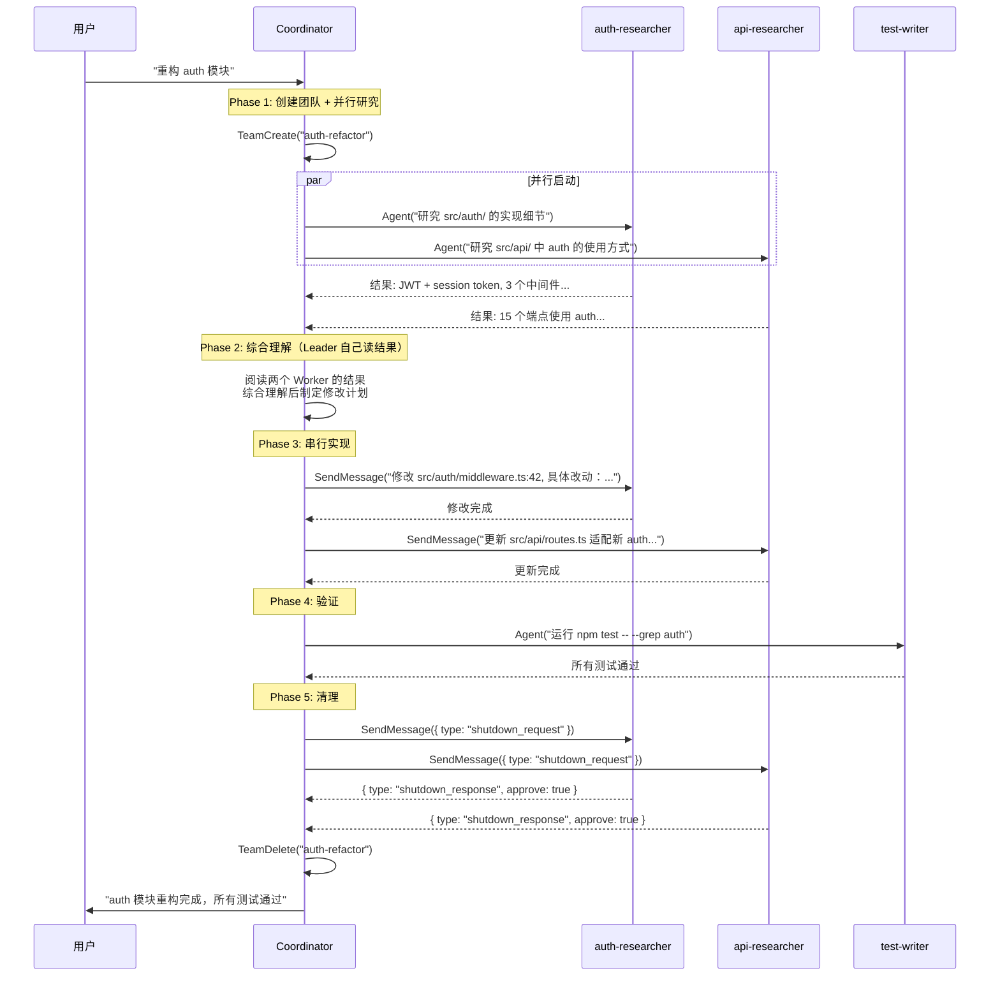

## 关键文件一览

### Swarm 基础设施 (`src/utils/swarm/`)

| 文件 | 大小 | 功能 |
|------|------|------|
| `inProcessRunner.ts` | 53KB | 核心进程内 Agent 执行循环 |
| `permissionSync.ts` | 26.5KB | Leader-Worker 权限同步 |
| `teamHelpers.ts` | 21.4KB | 团队文件 I/O、名称清理、发现 |
| `spawnInProcess.ts` | ~5KB | 进程内 spawn 逻辑 |
| `spawnUtils.ts` | ~5KB | 通用 spawn 工具 |
| `constants.ts` | ~1KB | Swarm 常量 |
| `leaderPermissionBridge.ts` | ~5KB | Leader 端权限桥接 |
| `reconnection.ts` | ~3KB | 断线恢复 |
| `teammateLayoutManager.ts` | ~3KB | 颜色分配 |

### 执行后端 (`src/utils/swarm/backends/`)

| 文件 | 大小 | 功能 |
|------|------|------|
| `TmuxBackend.ts` | 21.5KB | Tmux 分屏管理 |
| `ITermBackend.ts` | 12.9KB | iTerm2 原生分栏 |
| `InProcessBackend.ts` | 10.5KB | 进程内执行 |
| `PaneBackendExecutor.ts` | ~5KB | Pane 后端封装 |
| `registry.ts` | 14.8KB | 后端检测和注册 |
| `detection.ts` | ~3KB | 系统能力检测 |
| `types.ts` | ~2KB | 后端接口定义 |

### 工具

| 文件 | 功能 |
|------|------|
| `src/tools/TeamCreateTool/TeamCreateTool.ts` | 创建团队 |
| `src/tools/TeamDeleteTool/TeamDeleteTool.ts` | 删除团队 |
| `src/tools/SendMessageTool/SendMessageTool.ts` | 消息传递（650 行） |
| `src/coordinator/coordinatorMode.ts` | Coordinator 模式 + system prompt |

### 状态

| 文件 | 功能 |
|------|------|
| `src/tasks/InProcessTeammateTask/types.ts` | Teammate 状态定义 |
| `src/tasks/InProcessTeammateTask/InProcessTeammateTask.tsx` | 任务接口 |
| `src/state/AppStateStore.ts` | teamContext + inbox |
| `src/utils/agentSwarmsEnabled.ts` | Feature gating |

## 设计洞察

1. **三种后端，一种通信** — 不管用哪种后端（InProcess/Tmux/iTerm2），消息都通过文件邮箱。这简化了通信协议。

2. **InProcess 是默认最优** — 无外部依赖，共享资源，最低开销。Tmux/iTerm2 只在需要独立进程时使用。

3. **优雅关闭不可跳过** — Leader 不能直接 kill Worker，必须走 shutdown 协议。这防止 Worker 在中间状态被终止。

4. **AsyncLocalStorage 隔离** — InProcess Worker 共享进程但有独立的身份上下文。这是 Node.js 的"虚拟线程"模式。

5. **磁盘持久化** — TeamFile 持久化到磁盘（`~/.claude/teams/`），支持断线恢复和跨 session 恢复。

6. **颜色系统** — 8 种颜色（red/blue/green/yellow/purple/orange/pink/cyan），用于 tmux 边框和 UI 区分。

7. **内存管理** — 50 条消息上限 + 磁盘持久化，防止 292-agent 级别的内存爆炸。

8. **两层 Feature Gate** — `isAgentSwarmsEnabled()`（工具可用性）+ `isCoordinatorMode()`（专用 prompt），灵活控制发布。
