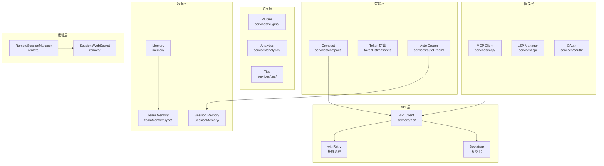
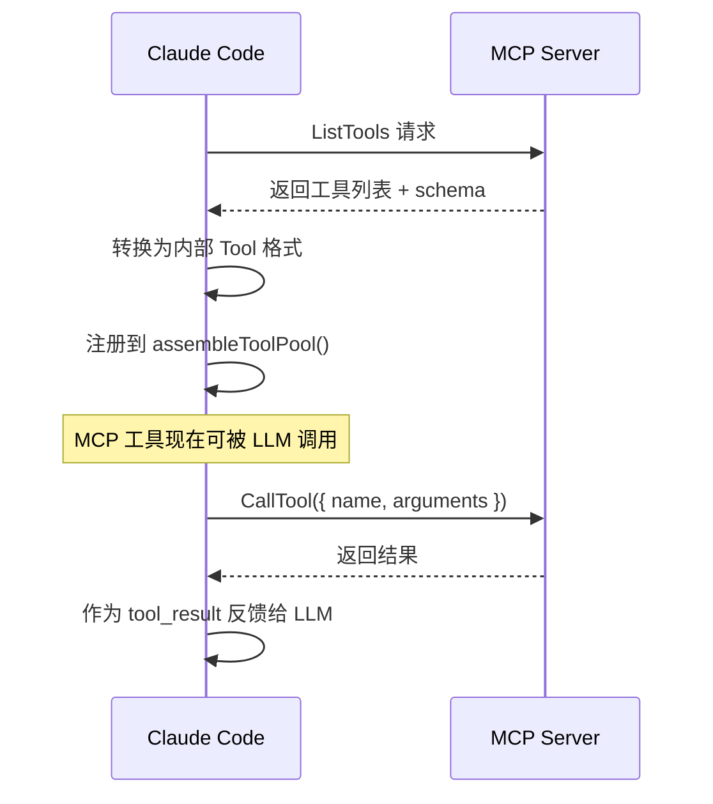
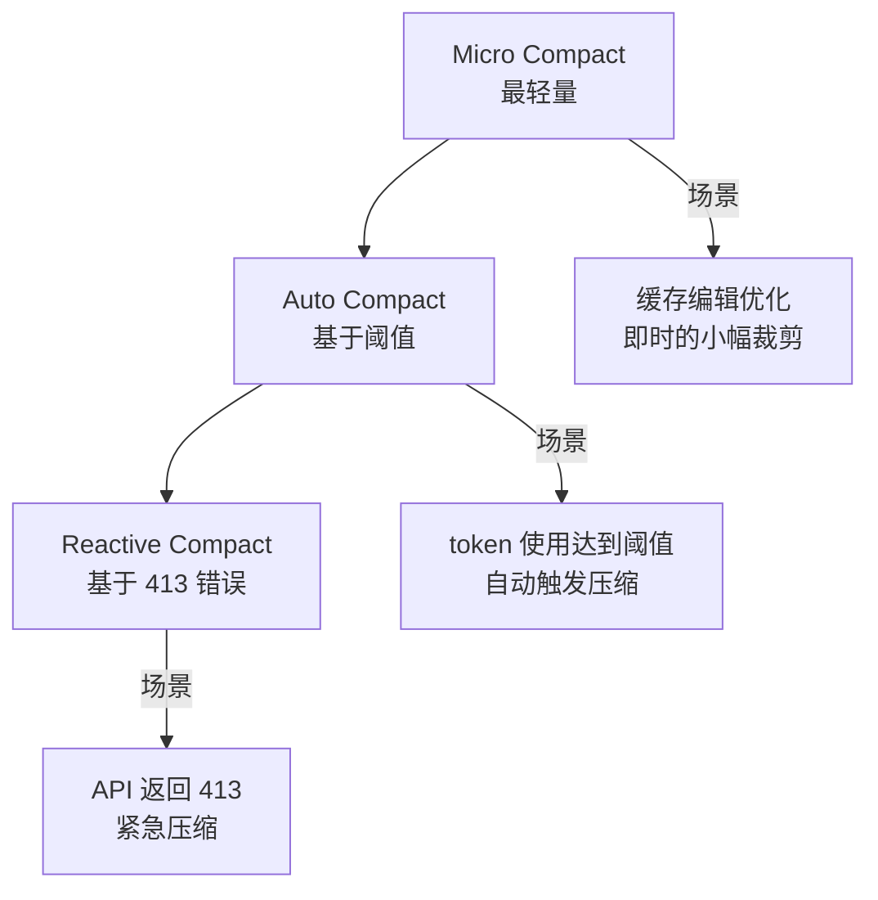
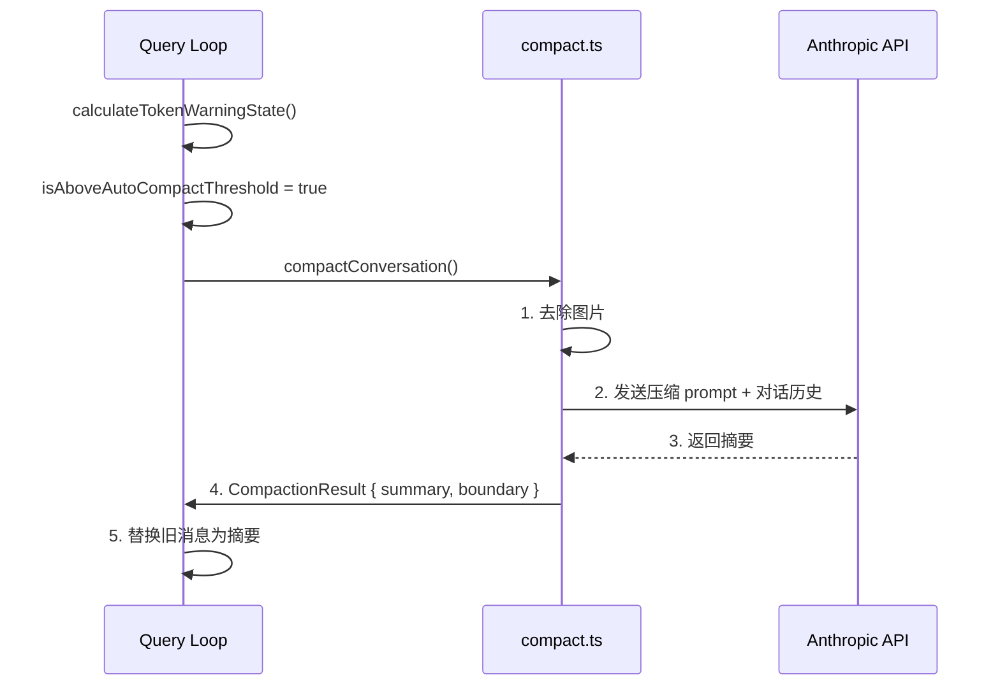
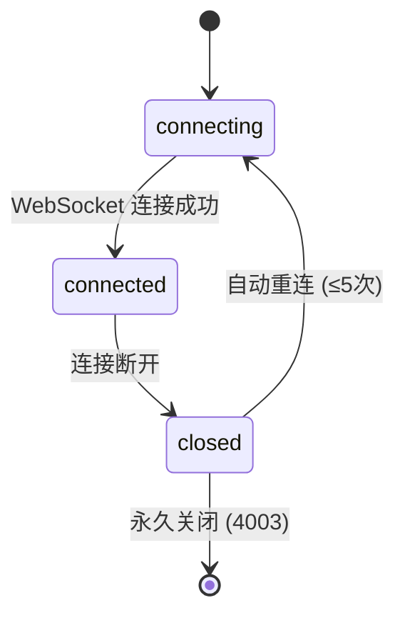
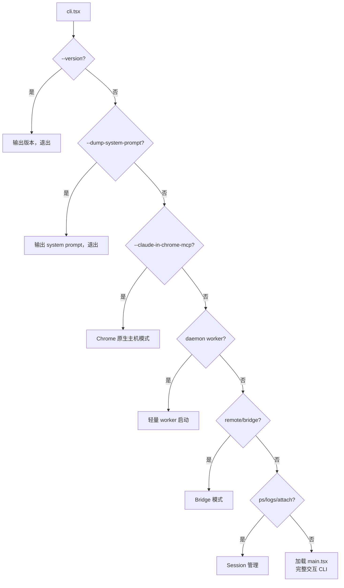

# 服务层和基础设施

> API 客户端、MCP、OAuth、插件、记忆、远程执行等支撑系统。

## 服务全景



## API 客户端 (`src/services/api/`)

### 文件结构

| 文件 | 功能 |
|------|------|
| `claude.ts` | Anthropic SDK 封装（streaming、tool calling、usage） |
| `client.ts` | HTTP/fetch 客户端（auth、retry、telemetry） |
| `bootstrap.ts` | 初始化客户端、URL 配置 |
| `withRetry.ts` | 指数退避重试逻辑 |
| `errors.ts` | 错误解析和规范化 |
| `logging.ts` | API 调用日志 |

### Beta Features

Claude Code 通过 beta headers 使用 API 的实验性功能：

| Beta | 功能 |
|------|------|
| `PROMPT_CACHING_SCOPE` | 全局 vs 临时缓存 |
| `CONTEXT_MANAGEMENT` | compact、snip、collapse |
| `STRUCTURED_OUTPUTS` | 结构化输出 |
| `THINKING` | Extended thinking |
| `EFFORT` | 推理力度控制 |
| `TASK_BUDGETS` | Token 预算 |
| `FAST_MODE` | 快速模式 |
| `AFK_MODE` | 后台 session |

## MCP 客户端 (`src/services/mcp/`)

Claude Code 同时是 MCP **客户端**（消费其他 MCP server 的工具）和 **服务器**（通过 `src/entrypoints/mcp.ts` 暴露自己的工具）。

### 客户端能力

| 文件 | 功能 |
|------|------|
| `client.ts` | MCP SDK 客户端（SSE/stdio/HTTP 传输） |
| `auth.ts` | MCP server OAuth 认证 |
| `config.ts` | 配置和发现 |
| `elicitationHandler.ts` | 处理 MCP elicit 请求 |
| `channelPermissions.ts` | 审批工作流 |

### 工具发现流程



## OAuth (`src/services/oauth/`)

| 文件 | 功能 |
|------|------|
| `client.ts` | OAuth token 交换 |
| `auth-code-listener.ts` | 本地回调服务器 |
| `crypto.ts` | PKCE flow helpers |
| `getOauthProfile.ts` | 用户 profile 获取 |

## 对话压缩 (`src/services/compact/`)

### 策略层次



### 关键常量

```typescript
AUTOCOMPACT_BUFFER_TOKENS = 13_000     // auto compact 阈值 buffer
WARNING_THRESHOLD_BUFFER_TOKENS = 20_000  // 警告阈值
MAX_CONSECUTIVE_AUTOCOMPACT_FAILURES = 3   // 连续失败熔断
```

### 压缩流程



## 记忆系统 (`src/memdir/`)

### 记忆层次

| 范围 | 位置 | 说明 |
|------|------|------|
| 项目记忆 | `CLAUDE.md` | 项目级的约定和信息 |
| 用户记忆 | `~/.claude/CLAUDE.md` | 跨项目的用户偏好 |
| 自动提取 | `services/extractMemories/` | 从对话中自动提取 |
| 团队记忆 | `services/teamMemorySync/` | 团队共享知识 |

### 关键常量

```typescript
ENTRYPOINT_NAME = 'MEMORY.md'     // 入口文件名
MAX_ENTRYPOINT_LINES = 200        // 最大行数
MAX_ENTRYPOINT_BYTES = 25_000     // 最大字节数
```

### 截断策略

双重截断：先按行数，再按字节数（在换行符边界截断）。超出后附加引导文字。

## LSP (`src/services/lsp/`)

| 文件 | 功能 |
|------|------|
| `LSPServerManager.ts` | 生命周期管理（启动、关闭） |
| `LSPClient.ts` | 请求/响应协议 |
| `LSPServerInstance.ts` | 单个 language server 状态 |
| `LSPDiagnosticRegistry.ts` | 跨 server 聚合诊断 |

## 插件系统 (`src/services/plugins/`)

| 文件 | 功能 |
|------|------|
| `pluginOperations.ts` | 安装/卸载 |
| `PluginInstallationManager.ts` | 生命周期 + 注册表 |
| `pluginCliCommands.ts` | Hook CLI 命令 |

### 插件在 AppState 中的状态

```typescript
plugins: {
  enabled: LoadedPlugin[]
  disabled: LoadedPlugin[]
  errors: PluginError[]
  installationStatus: {
    marketplaces: [{ name, status, error? }]
    plugins: [{ id, name, status, error? }]
  }
  needsRefresh: boolean  // 外部编辑检测到时设置
}
```

## Analytics (`src/services/analytics/`)

| 文件 | 功能 |
|------|------|
| `datadog.ts` | Datadog 导出器 |
| `firstPartyEventLogger.ts` | OpenTelemetry 1P SDK-logs |
| `growthbook.ts` | Feature flags 和 A/B 测试 |
| `sink.ts` | 遥测基础设施 |

## 远程执行 (`src/remote/`)

### RemoteSessionManager

管理与 Claude Cloud Runtime (CCR) 的会话：

```typescript
type RemoteSessionConfig = {
  sessionId: string
  getAccessToken: () => string
  orgUuid: string
  hasInitialPrompt?: boolean
  viewerOnly?: boolean  // 纯查看模式
}
```

**模式**：WebSocket（接收）+ HTTP POST（发送）

### SessionsWebSocket



**关键常量**：
- `RECONNECT_DELAY_MS = 2,000`
- `MAX_RECONNECT_ATTEMPTS = 5`
- `MAX_SESSION_NOT_FOUND_RETRIES = 3`（4001 code，compaction 期间瞬时错误）
- `PERMANENT_CLOSE_CODES = [4003]`（未授权，不重试）
- Ping 间隔：30 秒 keep-alive

## Auto Dream (`src/services/autoDream/`)

后台记忆整理服务：

| 文件 | 功能 |
|------|------|
| `autoDream.ts` | Fork 记忆整理 agent |
| `consolidationLock.ts` | mtime 锁防止并发 |
| `consolidationPrompt.ts` | 记忆审查 system prompt |

## 入口点 (`src/entrypoints/`)

### CLI Bootstrap (`cli.tsx`)

快速路由分发，按优先级：



### 初始化链 (`init.ts`)

顺序初始化：
1. `enableConfigs()` — 验证 settings.json
2. `applySafeConfigEnvironmentVariables()` — 安全环境变量
3. `applyExtraCACertsFromConfig()` — TLS 证书
4. `setupGracefulShutdown()` — 退出清理注册
5. **异步并行**：
   - OpenTelemetry + GrowthBook
   - OAuth account info
   - IDE 检测（JetBrains）
   - GitHub repo 检测
6. 远程设置 & 策略限制
7. mTLS & 代理配置
8. `preconnectAnthropicApi()` — 预连接 TCP+TLS
9. LSP 清理注册
10. Swarm 清理注册

### Agent SDK Types (`agentSdkTypes.ts`)

公开 API：
- `query(prompt, options)` — 单次查询
- `unstable_v2_createSession()` — 持久化 session（alpha）
- `tool()`, `createSdkMcpServer()` — MCP helpers
- 常量：`HOOK_EVENTS`, `EXIT_REASONS`

## 关键洞察

1. **预连接优化** — 在初始化链中 `preconnectAnthropicApi()` 与其他启动工作重叠 TCP+TLS 握手
2. **多层重试** — API 客户端有独立的重试逻辑，query loop 有错误恢复，两层保护
3. **Feature flag 系统** — GrowthBook 管理运行时 feature flags，bun:bundle 管理编译时 DCE
4. **MCP 双角色** — Claude Code 既是 MCP 客户端（消费工具）也是 MCP 服务器（暴露工具）
5. **记忆双截断** — 先行数后字节，确保不会因为超长单行而超出限制
6. **WebSocket 重连** — 分级重连策略，区分瞬时错误和永久错误
7. **插件热重载** — `needsRefresh` flag 检测外部编辑，`/reload-plugins` 触发重新加载
