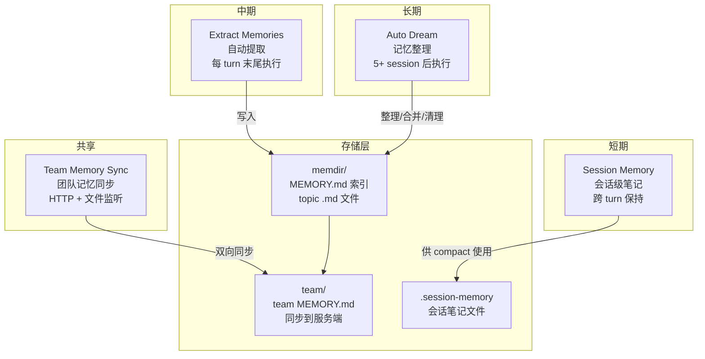
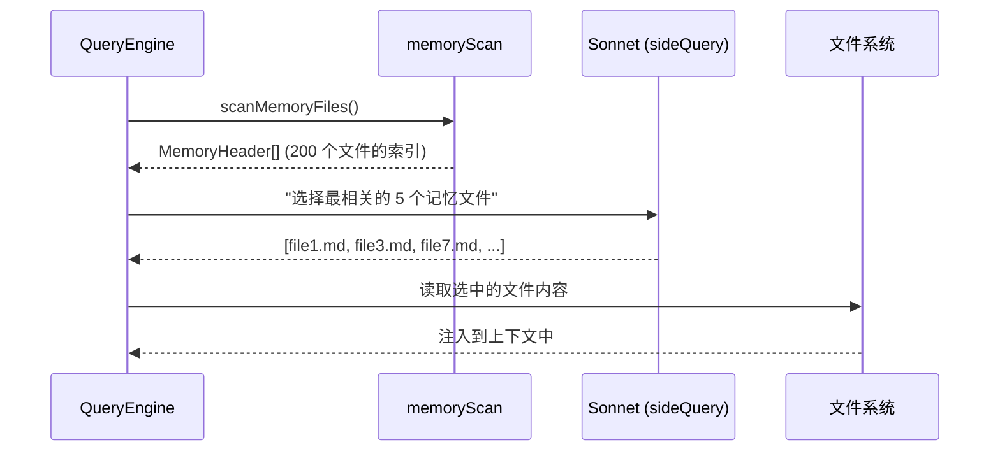
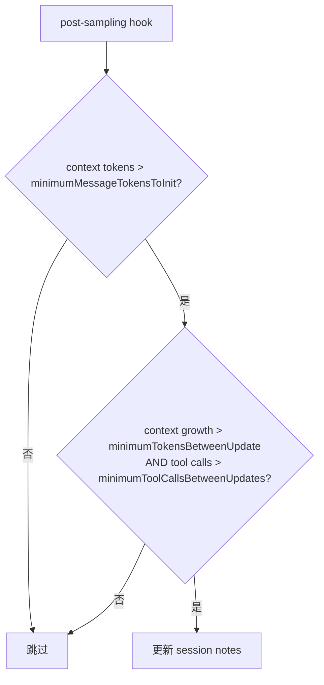
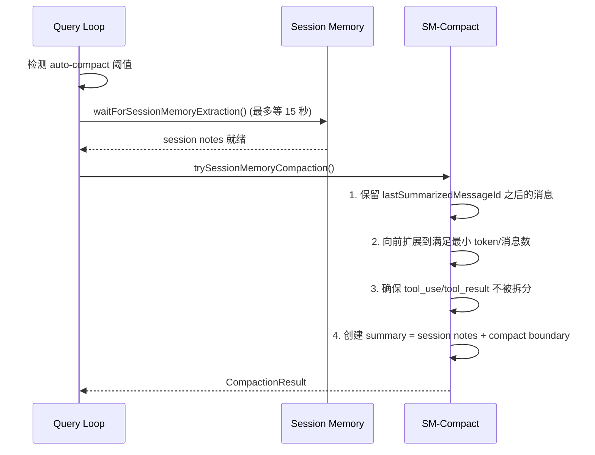
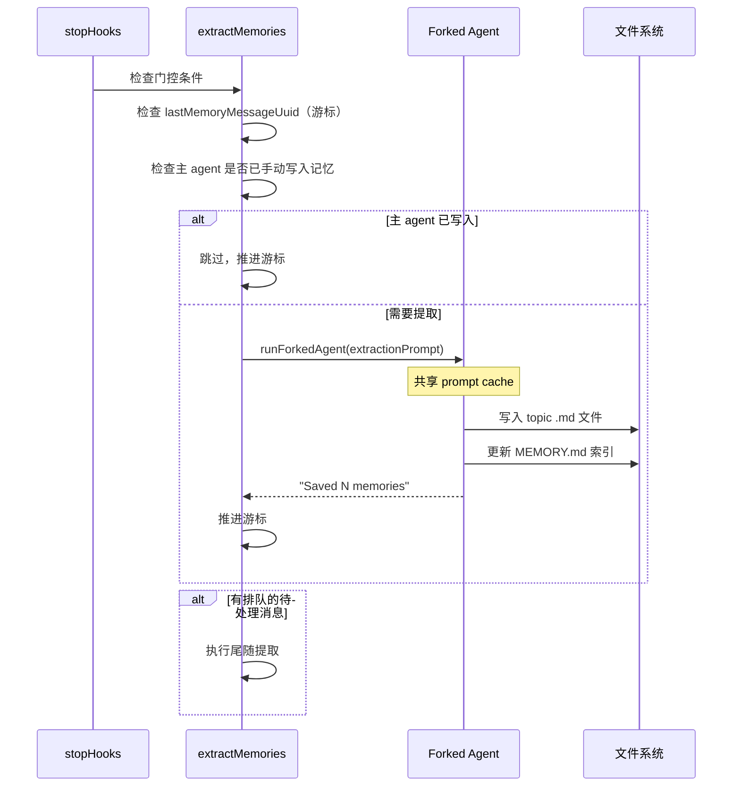
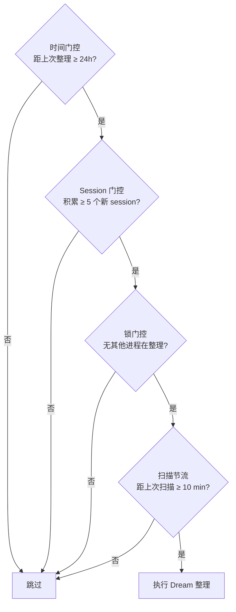
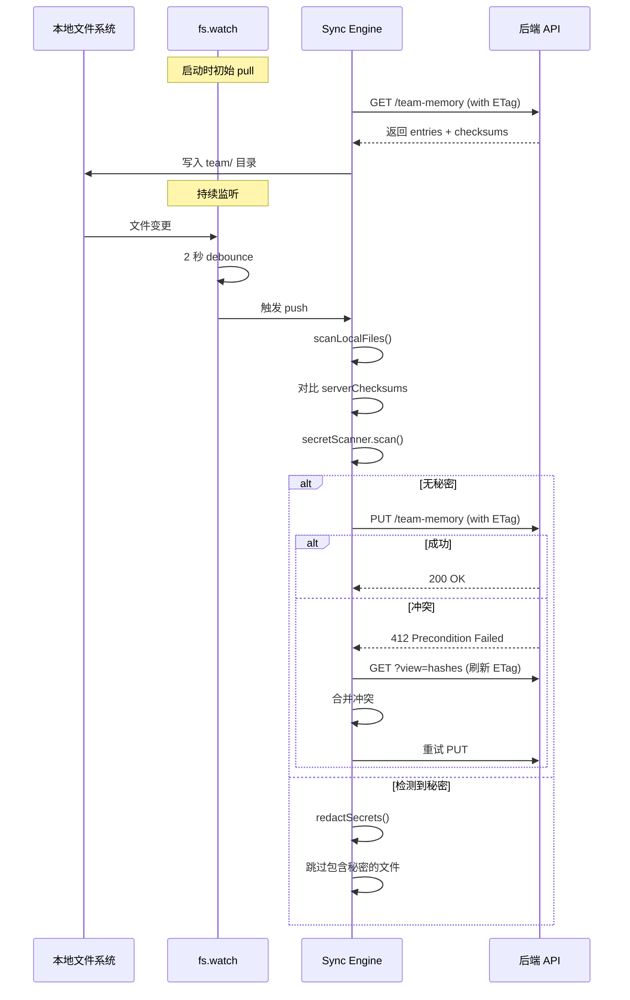
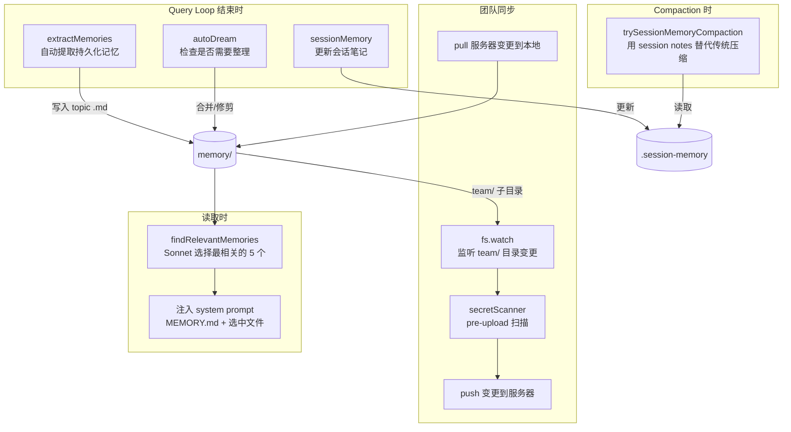

# 记忆系统全景

> Claude Code 的四层记忆架构：从短期会话记忆到长期自动提取到团队共享。

## 概览

Claude Code 有一个完整的记忆生态系统，四种记忆机制协同工作：



## 记忆类型分类

Claude Code 定义了四种记忆类型（`src/memdir/memoryTypes.ts`）：

| 类型 | 范围 | 用途 | 示例 |
|------|------|------|------|
| `user` | 私有 | 用户角色、偏好、知识 | "用户是高级 Go 开发者，React 新手" |
| `feedback` | 私有/团队 | 行为指导（做什么/不做什么） | "不要在测试中 mock 数据库" |
| `project` | 私有/团队 | 项目进展、目标、截止日期 | "3月5日后代码冻结" |
| `reference` | 通常团队 | 外部系统指针 | "pipeline bugs 在 Linear INGEST 项目" |

每个记忆文件有 frontmatter：
```yaml
---
name: 数据库测试规则
description: 集成测试必须使用真实数据库
type: feedback
---
不要在集成测试中 mock 数据库。
**Why:** 上季度 mock 测试通过但生产迁移失败。
**How to apply:** 所有 /tests/integration/ 下的测试文件。
```

## 1. Core memdir — 记忆目录系统 (`src/memdir/`)

### 存储结构

```
~/.claude/projects/<sanitized-git-root>/memory/
├── MEMORY.md           # 索引文件（max 200 行 / 25KB，注入 system prompt）
├── user_preferences.md
├── feedback_testing.md
├── project_auth.md
├── reference_linear.md
├── team/               # 团队记忆子目录
│   ├── MEMORY.md
│   └── ...
└── logs/               # assistant-mode 日志
```

### 关键常量

```typescript
ENTRYPOINT_NAME = 'MEMORY.md'
MAX_ENTRYPOINT_LINES = 200    // 超过截断
MAX_ENTRYPOINT_BYTES = 25_000  // 超过截断
```

### 截断策略

双重截断：先按行数，再按字节数（在换行符边界截断）。超出后附加引导文字告知被截断。

### 记忆发现 (`memoryScan.ts`)

```typescript
scanMemoryFiles(): MemoryHeader[] {
  // 递归读取 .md 文件（排除 MEMORY.md）
  // 提取 frontmatter headers
  // 按 mtime 排序，最新在前
  // 上限 200 个文件
}
```

### 相关性选择 (`findRelevantMemories.ts`)



### 新鲜度检测 (`memoryAge.ts`)

超过 1 天的记忆会附带警告：
> "This memory is 47 days old. Memories are point-in-time..."

### 路径安全 (`paths.ts`, `teamMemPaths.ts`)

严格的路径验证：
- 拒绝相对路径、路径遍历、URL 编码遍历、Unicode 归一化遍历
- 拒绝符号链接逃逸（通过 realpath 验证）
- 拒绝空字节、反斜杠、绝对路径

## 2. Session Memory — 会话级记忆 (`src/services/SessionMemory/`)

### 定位

Session Memory 是**短期的会话笔记**，不是持久化记忆。它的唯一用途是给 compaction 提供上下文，让压缩后的对话不丢失重要信息。

### 触发条件



**阈值**：
- `minimumMessageTokensToInit = 10000`（首次提取需 10K tokens）
- `minimumTokensBetweenUpdate = 5000`（增量更新需 5K 新 tokens）
- `minimumToolCallsBetweenUpdates = 3`（至少 3 次工具调用）

### 笔记结构（11 个 section）

```markdown
# Session Notes
## Session Title
## Current State
## Task specification
## Files and Functions
## Workflow
## Errors & Corrections
## Codebase and System Documentation
## Learnings
## Key results
## Worklog
```

每个 section 上限 ~2000 tokens，总计上限 12000 tokens。

### 与 Compact 的集成

`sessionMemoryCompact.ts` 使用 session notes 替代传统压缩：



## 3. Extract Memories — 自动提取 (`src/services/extractMemories/`)

### 定位

在每个 query loop 结束时（模型产生最终响应，无 tool call），自动从对话中提取持久化记忆。

### 触发条件

- Feature gate: `EXTRACT_MEMORIES`
- 每 N turn 执行一次（由 `tengu_bramble_lintel` 控制，默认每 1 turn）
- 不在远程模式、只在主 agent、auto-memory 已启用

### 执行流程



### 工具权限

Forked agent 的权限被严格限制：

| 工具 | 权限 |
|------|------|
| Read, Grep, Glob | 无限制 |
| Bash | 只读命令（ls/find/grep/cat/stat/wc/head/tail） |
| Edit, Write | **仅限记忆目录内的路径** |
| 其他（MCP, Agent 等） | 禁止 |

### 互斥机制

- 如果提取正在进行中，新消息被 stash 到 `pendingContext`
- 当前提取完成后，自动执行一次尾随提取处理 stash 的消息
- 如果主 agent 已手动写入记忆，提取自动跳过（通过 `hasMemoryWritesSince` 检查）

## 4. Auto Dream — 记忆整理 (`src/services/autoDream/`)

### 定位

长期记忆整理。在积累足够 session 后，后台运行 `/dream` 命令合并、修剪、优化记忆文件。

### 触发条件（最廉价检查优先）



### 整理流程

`consolidationPrompt.ts` 定义了四阶段流程：

| 阶段 | 动作 |
|------|------|
| 1. Orient | 读取 MEMORY.md 和现有记忆文件 |
| 2. Gather signal | 扫描积累的 session transcripts |
| 3. Consolidate | 合并相关记忆、更新过时信息、创建新记忆 |
| 4. Prune | 删除冗余/过时的记忆，保持 MEMORY.md < 200 行 |

### 锁机制 (`consolidationLock.ts`)

- 锁文件：`<memdir>/.consolidate-lock`
- 锁的 mtime = 上次整理时间
- 包含 PID，用于回收死锁/过期锁
- 整理完成后更新 mtime

### UI 集成

通过 `DreamTask` 在 footer pill 中显示进度：
```
🌙 Dreaming... (reviewing 7 sessions)
```

## 5. Team Memory Sync — 团队记忆同步 (`src/services/teamMemorySync/`)

### 定位

在团队成员之间同步记忆文件。通过 HTTP API 推拉，本地用文件监听检测变更。

### 同步流程



### 密钥扫描 (`secretScanner.ts`)

**30+ gitleaks 规则**，覆盖：
- AWS (access key, secret key)
- GCP (service account)
- Anthropic (API key)
- GitHub (token, fine-grained token)
- Slack (token, webhook)
- Stripe (key)
- 通用（private key, JWT）

**安全原则**：
- 永远不记录秘密值，只记录规则 ID 和标签
- `redactSecrets()` 将匹配内容替换为 `[REDACTED]`

### 写入保护 (`teamMemSecretGuard.ts`)

在 FileWriteTool/FileEditTool 的 `validateInput` 中调用：
- 如果要写入 team/ 路径的内容包含秘密 → 返回错误，阻止写入

### 同步状态

```typescript
type TeamMemoryData = {
  organizationId: string
  repo: string
  version: number
  lastModified: string                     // ISO 8601
  checksum: string                         // SHA256
  content: {
    entries: Record<string, string>        // path → content
    entryChecksums?: Record<string, string> // per-file SHA256
  }
}
```

## 记忆系统集成全景



## 关键设计

1. **Prompt Cache 共享** — 所有 fork agent（extractMemories, autoDream, sessionMemory）使用 `runForkedAgent()` 共享父级的 prompt cache，避免重复计算
2. **游标管理** — `lastMemoryMessageUuid` 只在成功提取后推进，失败可重试
3. **互斥** — 主 agent 手动写入记忆时，自动提取自动跳过
4. **渐进式更新** — Session Memory 增量更新（不是每次从头），减少 token 消耗
5. **安全第一** — 团队记忆有密钥扫描 + 路径验证 + 写入保护三层防御
6. **最终一致** — 团队同步是异步的，冲突通过 ETag + 重试解决
