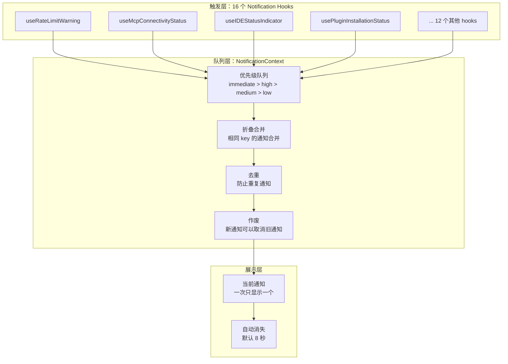
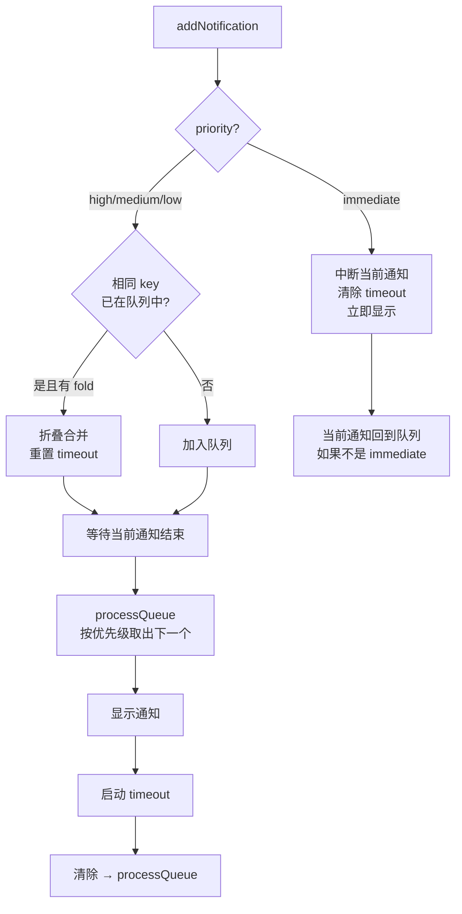

# 通知与提示系统

> 16 个专用通知 Hook + 65 个旋转提示 + 优先级队列。

## 概览

Claude Code 的通知系统由三层组成：



## Notification Context (`src/context/notifications.tsx`)

### 核心数据结构

```typescript
type Priority = 'low' | 'medium' | 'high' | 'immediate'

type Notification = {
  key: string                   // 唯一标识（用于去重和折叠）
  priority: Priority
  timeoutMs?: number            // 自动消失时间（默认 8000ms）
  invalidates?: string[]        // 添加时取消这些 key 的通知
  fold?: (acc, incoming) => Notification  // 合并函数
  // + text, jsx, color 等展示字段
}
```

### 队列管理



### 折叠模式（Fold Pattern）

用于批量事件：

```typescript
// 3 个快速连续的 agent 生成事件
addNotification({ key: 'agent-spawn', text: '1 agent spawned', fold: (acc, incoming) => ({
  ...acc,
  text: `${count + 1} agents spawned`  // 合并为 "3 agents spawned"
}) })
```

## 16 个 Notification Hooks

### 按优先级分类

#### immediate 优先级

| Hook | 触发条件 | 通知内容 |
|------|---------|---------|
| `useRateLimitWarningNotification` | `isUsingOverage` 变为 true | "Using Claude AI credits from overage" |

#### high 优先级

| Hook | 触发条件 | 通知内容 |
|------|---------|---------|
| `useRateLimitWarningNotification` | 接近速率限制 | "Approaching rate limit on model X" |
| `useDeprecationWarningNotification` | 模型有废弃警告 | 动态废弃消息 |
| `useIDEStatusIndicator` | IDE 断开/错误 | IDE 连接状态 + 路径 |
| `useModelMigrationNotifications` | 启动时检测到模型迁移 | "Model updated to Sonnet 4.6" |
| `useNpmDeprecationNotification` | npm 安装方式已废弃 | "Run `claude install`..." |
| `useSettingsErrors` | 设置验证出错 | "Found X settings issue(s)" |
| `useInstallMessages` | 安装检查发现错误 | 安装错误详情 |

#### medium 优先级

| Hook | 触发条件 | 通知内容 |
|------|---------|---------|
| `useAutoModeUnavailableNotification` | Shift+Tab 切换时 auto 不可用 | 为什么 auto mode 不可用 |
| `useFastModeNotification` | Shift+Tab 切换到 fast mode | Fast mode 说明 |
| `useLspInitializationNotification` | LSP 初始化状态变化 | "LSP initializing/initialized" |
| `useMcpConnectivityStatus` | MCP server 连接状态变化 | "MCP disconnected/reconnected" |
| `usePluginInstallationStatus` | 插件安装失败 | "X plugins failed to install" |

#### low 优先级

| Hook | 触发条件 | 通知内容 |
|------|---------|---------|
| `useCanSwitchToExistingSubscription` | 启动时有未使用的订阅 | "/login to activate Pro/Max plan" |
| `usePluginAutoupdateNotification` | 插件自动更新 | "Plugin updated: X · /reload-plugins" |
| `useTeammateShutdownNotification` | Teammate 生成/关闭 | "N agents spawned/shut down" |

### 关键 Hook 详解

#### useIDEStatusIndicator（21KB，最大的 hook）

监控 IDE 连接状态（VS Code / JetBrains），显示：
- 连接成功 → 绿色 success 指标
- 断开/错误 → warning/error 指标
- 包含 IDE 名称和文件路径上下文
- 5 秒自动消失

#### useRateLimitWarningNotification

两种模式：
- **Overage 警报**（immediate）：使用了超额信用
- **接近限制**（high）：即将触及速率限制
- 区分 team/enterprise 用户（不同规则）
- 有 `hasShownOverageNotification` 防止重复

#### useTeammateShutdownNotification

**折叠模式典型用例**：
- 3 个 agent 快速生成 → "3 agents spawned"（而不是 3 条通知）
- 使用 `fold()` 函数合并计数

### 公共工具 Hook：useStartupNotification

被约 10 个 hook 使用的元 hook：
```typescript
useStartupNotification(() => {
  // 在 mount 时只执行一次
  // 自动处理：remote mode 门控、单次执行、async/Promise、错误路由
  return notification | null
})
```

## Tips 系统 (`src/services/tips/`)

### 概览

65+ 个注册提示，在 spinner 等待时轮换展示。

### 提示定义 (`tipRegistry.ts`)

```typescript
type Tip = {
  id: string
  content: (ctx?: TipContext) => Promise<string>  // 动态内容
  cooldownSessions: number                         // 最小间隔 session 数
  isRelevant: (ctx?: TipContext) => Promise<boolean>  // 相关性检查
}
```

### 提示分类

| 类别 | 示例 |
|------|------|
| 新手引导 | plan-mode, permissions, new-user-warmup |
| 键盘快捷键 | shift-tab, shift-enter, double-esc |
| 生产力 | memory-command, /resume, todo-list |
| 扩展 | plugins, IDE integration, terminal-setup |
| 推广 | desktop-app, mobile-app, web-app, /passes |
| 模型功能 | effort, opus-plan-mode, subagents |

### 相关性检查

每个 tip 有独立的相关性函数：

```typescript
// 示例：只在 VS Code 终端 + 命令未安装时显示
{
  id: 'vscode-command-install',
  isRelevant: () => isInVSCodeTerminal() && !isCommandInstalled(),
  cooldownSessions: 0  // 每次都显示
}

// 示例：7 天没用 plan mode 时提醒
{
  id: 'plan-mode-for-complex-tasks',
  isRelevant: () => daysSinceLastUsed('plan-mode') >= 7,
  cooldownSessions: 3  // 至少间隔 3 个 session
}
```

### 选择算法 (`tipScheduler.ts`)

```mermaid
flowchart TB
    START[getTipToShowOnSpinner] --> DISABLED{tips 被禁用?}
    DISABLED -->|是| NONE[不显示]
    DISABLED -->|否| CUSTOM{有自定义 tips?}

    CUSTOM -->|是且 excludeDefault| SHOW_CUSTOM[显示自定义 tip]
    CUSTOM -->|否| RELEVANT[获取所有相关的 tips]

    RELEVANT --> COOLDOWN[过滤 cooldown<br/>sessions since last shown >= cooldownSessions]
    COOLDOWN --> SORT[按"最久没显示"排序<br/>从未显示的优先]
    SORT --> SELECT[选择排名第一的]
    SELECT --> RECORD[记录到 tipHistory]
    RECORD --> SHOW[展示在 spinner]
```

**核心原则**：始终显示最久没显示的相关 tip，实现轮换效果。

### 历史追踪 (`tipHistory.ts`)

```typescript
// 存储在 config 中
config.tipsHistory = {
  'plan-mode-for-complex-tasks': 42,  // 在第 42 次启动时最后显示
  'shift-tab-tip': 38,                // 在第 38 次启动时最后显示
}

getSessionsSinceLastShown('plan-mode-for-complex-tasks')
// → currentStartups - 42 = 当前第 50 次启动 → 返回 8
```

### 防刷机制

| 机制 | 说明 |
|------|------|
| cooldown | 每个 tip 有最小 session 间隔（0-30） |
| 轮换 | 总是选最久没显示的 |
| 自定义覆盖 | 用户可完全替换 tips |
| 禁用开关 | `spinnerTipsEnabled: false` |
| Feature gate | 部分 tips 有 GrowthBook gate |

## 关键设计

1. **一个通知一个 Hook** — 每种通知类型有独立的 Hook，职责单一
2. **优先级队列** — immediate 可打断一切，low 永远不打断
3. **折叠合并** — 批量事件合并为单条通知（"3 agents spawned"）
4. **去重** — 相同 key 不会重复入队
5. **作废机制** — 新通知可以主动取消过时的通知
6. **Tips 轮换** — 最久没显示的优先，确保用户逐步了解所有功能
7. **相关性过滤** — Tips 只在相关时才显示（环境、使用频率、功能状态）
