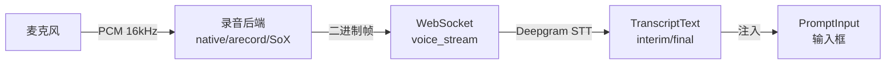
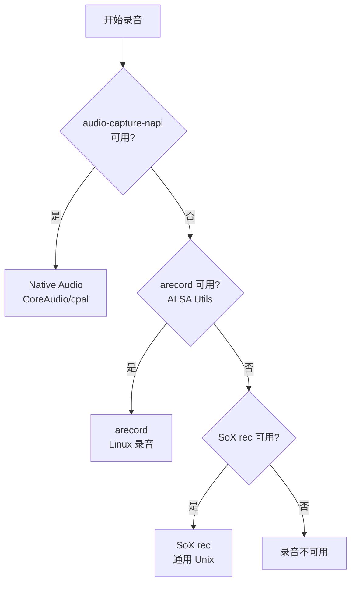
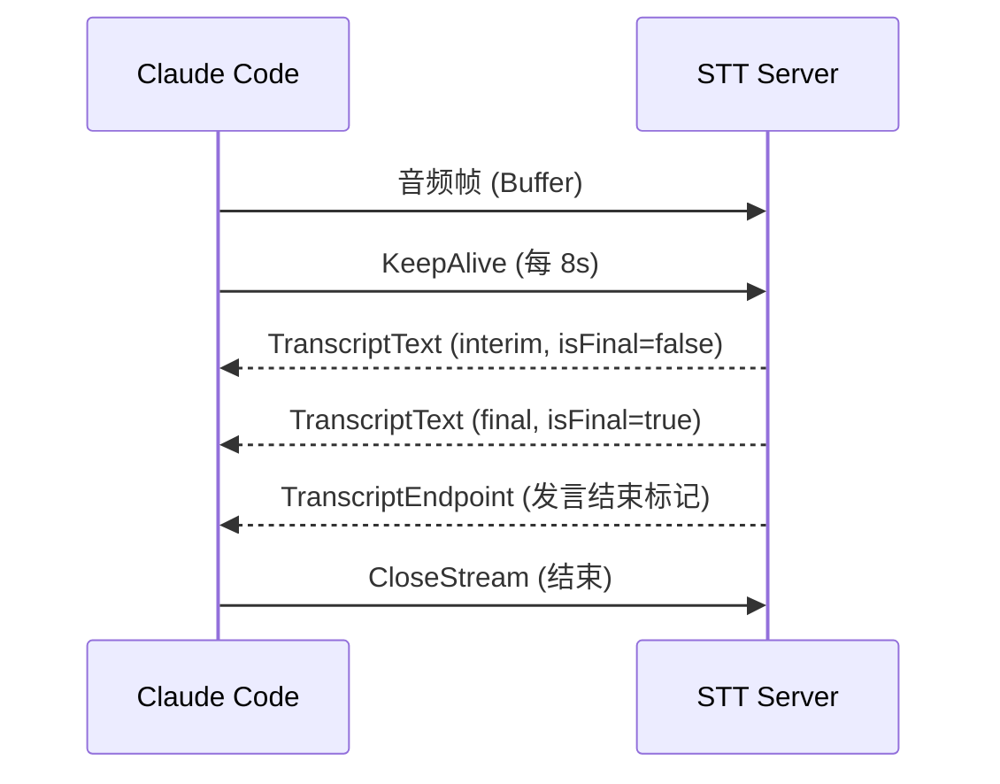
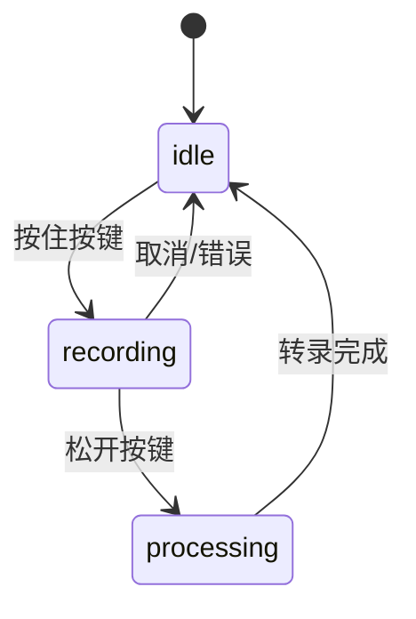
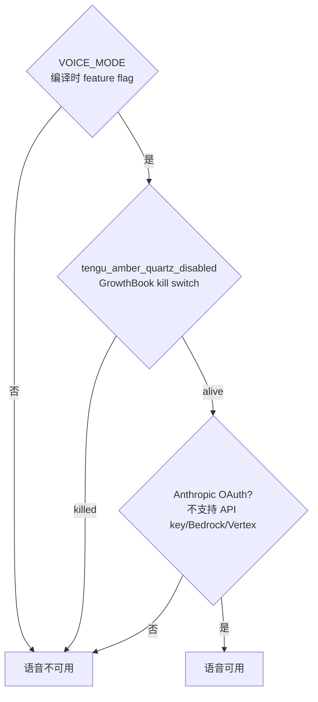
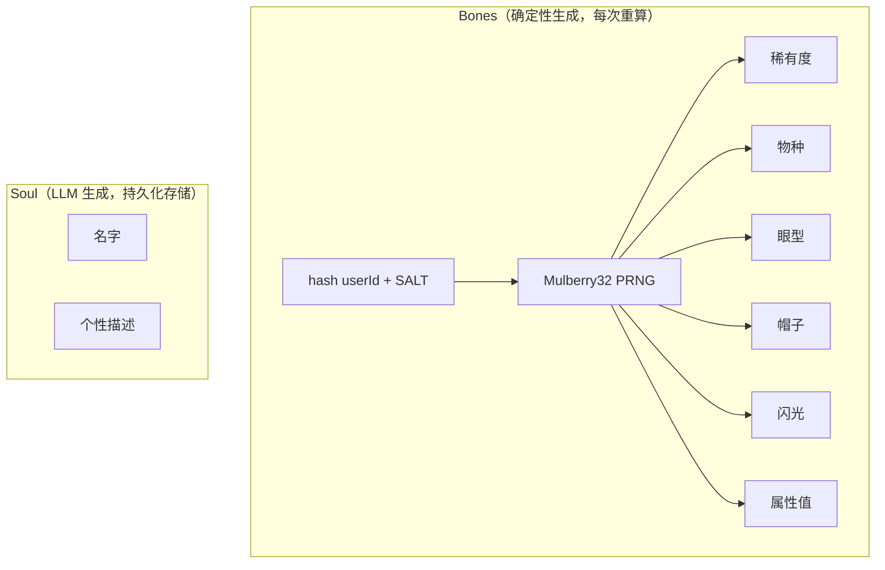

# Voice 语音系统 & Buddy 伴侣精灵

> 两个用户交互增强功能：免手操作语音输入和动画伴侣精灵。

## Part 1: Voice 语音系统

### 概览

Hold-to-talk（按住说话）语音输入系统。本地录音 → WebSocket STT → 文本注入输入框。



**Feature gate**: `VOICE_MODE` + Anthropic OAuth 认证

### 录音管道：三种后端



| 后端 | 平台 | 特点 |
|------|------|------|
| `audio-capture-napi` | macOS/Linux/Windows | 原生模块，延迟最低，按需加载避免首次 TCC 弹窗 |
| `arecord` | Linux | ALSA，150ms probe timeout 检测可用性 |
| `SoX rec` | 通用 Unix | 内建静音检测（3% 阈值，2s 持续） |

录音规格：16-bit signed PCM, 16kHz, mono。

### STT WebSocket (`src/services/voiceStreamSTT.ts`)

连接到 Anthropic 私有 API：

```
wss://api.anthropic.com/api/ws/speech_to_text/voice_stream
Auth: Bearer <OAuth token>
```

**查询参数**：
```
encoding=linear16, sample_rate=16000, channels=1
endpointing_ms=300       // 句子边界检测
utterance_end_ms=1000     // 发言结束检测
language=en               // BCP-47 语言代码
use_conversation_engine=true  // Nova 3（如果启用）
keyterms=[...]            // 领域词汇提示
```

**消息类型**：



### 领域词汇提示 (`src/services/voiceKeyterms.ts`)

提升 STT 准确度：

| 来源 | 示例 |
|------|------|
| 全局关键词 | MCP, symlink, grep, regex, TypeScript, OAuth, gRPC, worktree |
| 项目名 | `basename(getProjectRoot())` |
| Git 分支 | feat/voice-keyterms → feat, voice, keyterms |
| 最近文件 | 文件名词干（上限 50 个） |

词汇分割处理 camelCase、PascalCase、kebab-case、snake_case。

### React Hook: useVoice (`src/hooks/useVoice.ts`, 412 行)

**状态机**：



**关键时间常量**：

| 常量 | 值 | 用途 |
|------|----|----|
| `RELEASE_TIMEOUT_MS` | 200ms | 按键重复间隙 → 判定松开 |
| `REPEAT_FALLBACK_MS` | 600ms | 无重复信号时的松开判定 |
| `FIRST_PRESS_FALLBACK_MS` | 2000ms | 修饰组合键首次延迟 |
| `FOCUS_SILENCE_TIMEOUT_MS` | 5000ms | Focus 模式静音后断开 |
| `AUDIO_LEVEL_BARS` | 16 | 波形可视化条数 |

### 静默掉包重放

~1% 的 session 遇到 STT 服务端静默（接收音频但不返回转录）：
- 检测条件：`no_data_timeout` + 有音频信号 + WebSocket 连接中 + 累积为空
- 处理：250ms 退避后在新 WebSocket 上重放完整音频缓冲

### Finalize 四种路径

| 路径 | 延迟 | 触发 |
|------|------|------|
| `post_closestream_endpoint` | ~300ms | CloseStream 后收到 TranscriptEndpoint |
| `no_data_timeout` | 1.5s | CloseStream 后无数据 |
| `safety_timeout` | 5s | 最后安全上限 |
| `ws_close` | ~3-5s | WebSocket 关闭事件 |

### 三层门控



---

## Part 2: Buddy 伴侣精灵

### 概览

**Nuzzle** — 输入框旁边的 ASCII 动画伴侣精灵。外观由 `hash(userId)` 确定性生成，个性由 LLM 生成。

**Feature gate**: `BUDDY`

### 数据模型：Bones + Soul



**存储设计**：只有 Soul（name + personality）持久化到 config。Bones 每次从 `hash(userId)` 重新生成。这意味着：
- **无法通过修改 config 伪造稀有度** — Bones 是确定性的
- **物种重命名不会破坏已有伴侣** — 只看 hash 不看存储

### 物种系统

**18 种物种**：
duck, goose, blob, cat, dragon, octopus, owl, penguin, turtle, snail, ghost, axolotl, capybara, cactus, robot, rabbit, mushroom, chonk

### 稀有度分布

```
★       common     60%   灰色
★★      uncommon   25%   绿色
★★★     rare       10%   蓝色
★★★★    epic        4%   紫色
★★★★★   legendary   1%   黄色
```

### 装饰系统

**6 种眼型**：`·` `✦` `×` `◉` `@` `°`

**8 种帽子**：

| 帽子 | 可用稀有度 |
|------|-----------|
| none | 所有 |
| crown | rare+ |
| tophat | rare+ |
| propeller | rare+ |
| halo | rare+ |
| wizard | rare+ |
| beanie | rare+ |
| tinyduck | rare+ |

Common 伴侣只有 `none`，Rare+ 可以有帽子。

### 属性系统

**5 种属性**：DEBUGGING, PATIENCE, CHAOS, WISDOM, SNARK

属性基于稀有度有底线值：

| 稀有度 | 底线 | 峰值属性 | 低谷属性 |
|--------|------|---------|---------|
| common | 5 | 55-85 | 0-20 |
| uncommon | 15 | 65-95 | 5-30 |
| rare | 25 | 75-100 | 15-40 |
| epic | 35 | 85-100 | 25-50 |
| legendary | 50 | 100 | 40-65 |

每个伴侣有一个峰值属性和一个低谷属性，其余三个散布。

### Sprite 渲染 (`src/buddy/sprites.ts`)

**格式**：5 行高 × 12 字符宽，3 帧动画。

```
Duck 示例（3 帧）：

帧 0:            帧 1:            帧 2:
     __               __               __
   <(· )___        <(· )___        <(· )___
    (  ._>          (  ._>          (  .__>
     `--´            `--´~           `--´
```

- 第 0 行保留给帽子（无帽时为空）
- `{E}` 占位符 → 实际眼型字符
- 窄终端（< 100 列）降级为单行 face emoji：`(·>` (duck), `=·ω·=` (cat), `[··]` (robot)

### 动画系统 (`CompanionSprite.tsx`, 290 行)

**Tick 间隔**：500ms

**Idle 动画序列**（15 帧循环）：
```
[0, 0, 0, 0, 1, 0, 0, 0, -1, 0, 0, 2, 0, 0, 0]
// 0 = 静止, 1 = fidget, 2 = fidget2, -1 = 眨眼(·→-)
```

**Pet 动画**（2.5 秒心形爆发）：
```
帧 0: "   ♥    ♥   "
帧 1: "  ♥  ♥   ♥  "
帧 2: " ♥   ♥  ♥   "
帧 3: "♥  ♥      ♥ "
帧 4: "·    ·   ·  "
```

**Speech Bubble**：
- 显示时长：~10 秒（20 ticks）
- 最后 ~3 秒渐隐
- 最大宽度 36 列
- 文字换行 30 字符

### LLM 集成 (`src/buddy/prompt.ts`)

伴侣的介绍被注入到第一条消息中：

```
# Companion

A small duck named Nuzzle sits beside the user's input box
and occasionally comments in a speech bubble. You're not Nuzzle —
it's a separate watcher.

When the user addresses Nuzzle directly (by name), its bubble will
answer. Your job in that moment is to stay out of the way: respond
in ONE line or less.
```

### 占用空间

```typescript
companionReservedColumns(terminalColumns, speaking) {
  if (terminalColumns < 100) return 0    // 窄终端：折叠
  if (muted || !companion) return 0       // 静音或无伴侣
  
  spriteWidth = max(12, nameWidth + 2)
  bubbleWidth = speaking && !fullscreen ? 36 : 0
  return spriteWidth + 2 + bubbleWidth   // padding + bubble
}
```

### 发现机制

- **Teaser 窗口**：2026 年 4 月 1-7 日（本地时间）
- Teaser 期间显示彩虹文字通知（immediate 优先级，15 秒超时）
- 4 月 7 日后 `/buddy` 命令仍然可用，但不主动展示

## 关键设计

### Voice

1. **三种后端降级** — Native → arecord → SoX，总有一个能用
2. **按需加载录音** — 避免启动时触发 macOS TCC 权限弹窗
3. **静默掉包重放** — 1% 的 edge case 用完整音频重放解决
4. **领域词汇增强** — 项目名、分支名、文件名提升 STT 准确度
5. **Focus 模式** — 终端获得焦点自动录音，失焦停止

### Buddy

1. **确定性生成** — `hash(userId)` 保证同一用户始终同一伴侣
2. **防伪造** — Bones 不持久化，无法通过修改 config 获得 legendary
3. **渐进式降级** — 宽终端：完整 sprite + bubble；窄终端：单行 face
4. **Pet 动画** — 2.5 秒心形爆发，增加情感连接
5. **独立于主 Agent** — Buddy 是独立的 watcher，主 Agent 不模拟它
