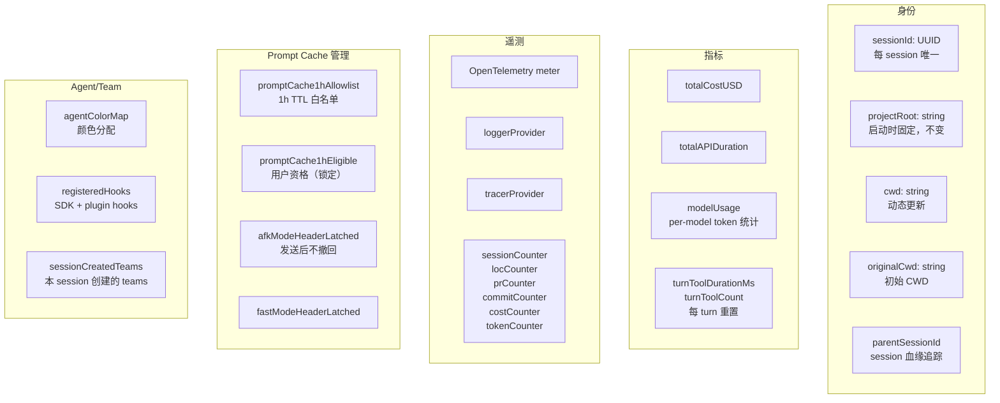
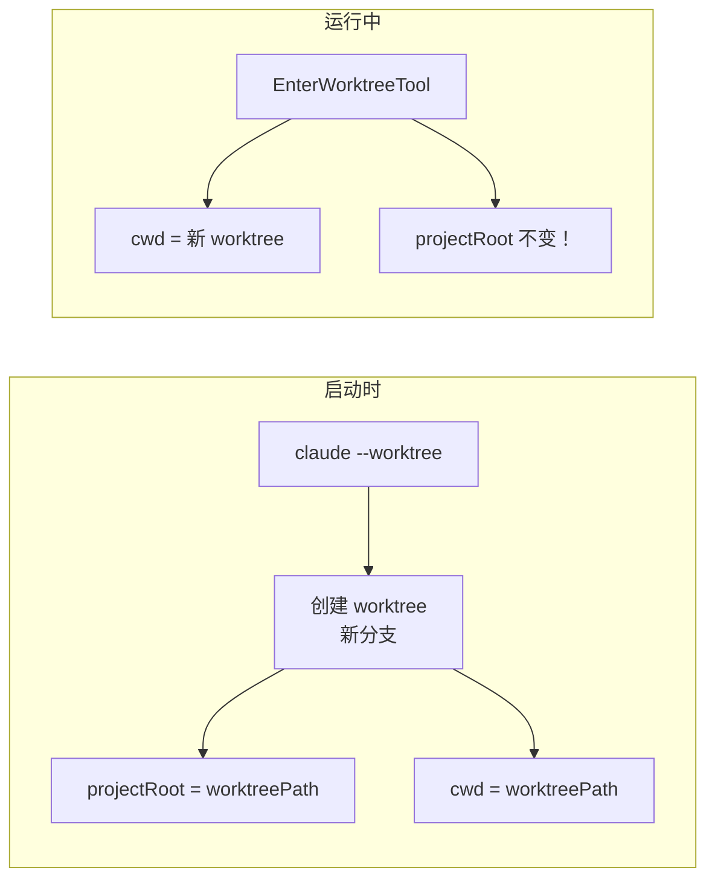
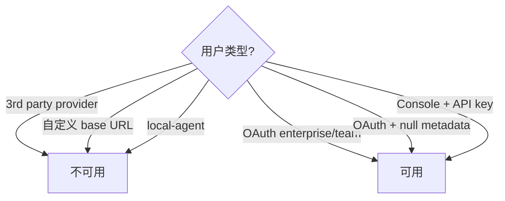
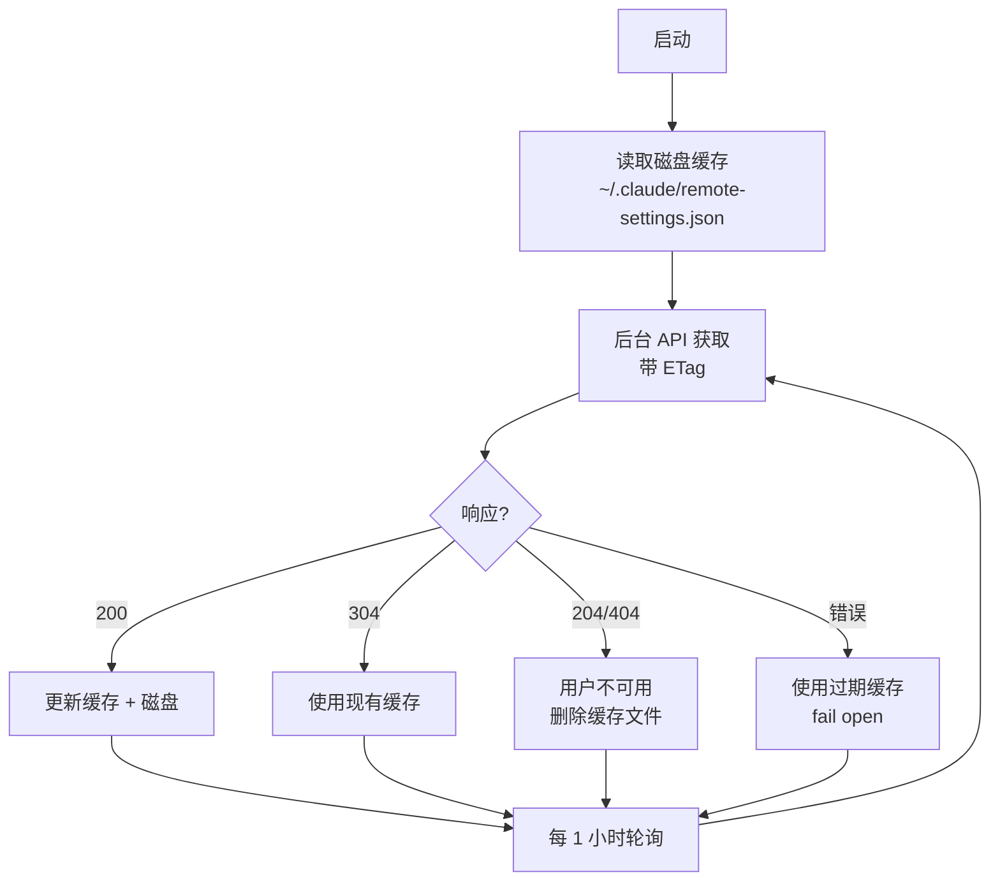
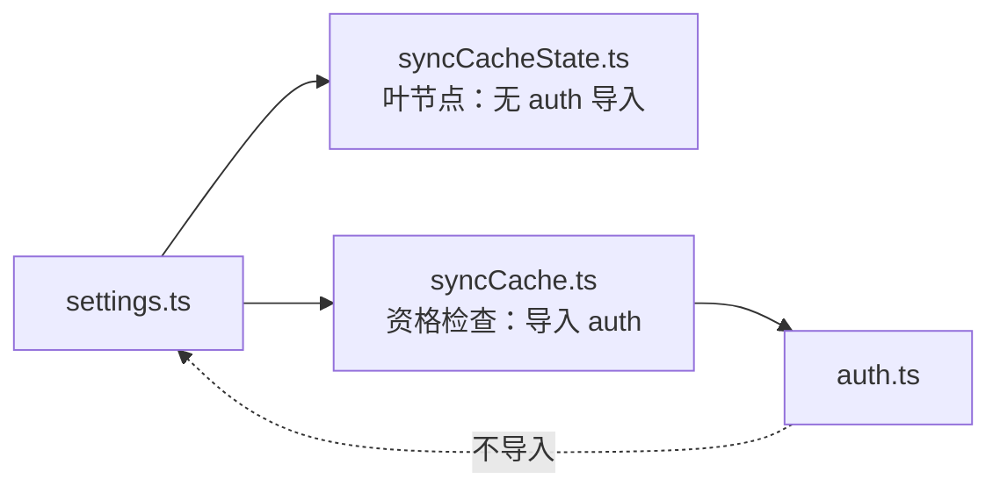
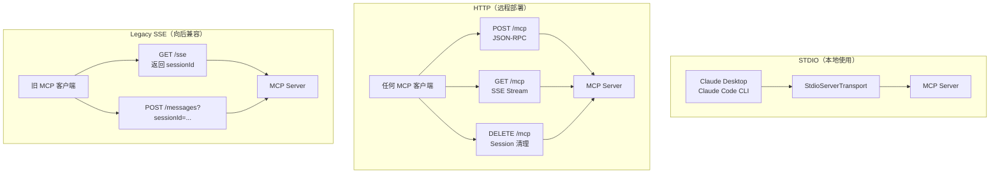
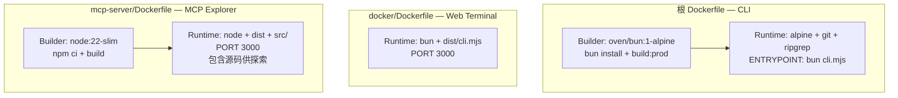

# 基础设施 — Bootstrap、远程配置、MCP Server、Docker

> 启动流程、配置同步、MCP 探索服务器、容器化部署。

## 1. Bootstrap 状态 (`src/bootstrap/state.ts`, 1760 行)

### 概览

全局单例状态管理器，是 Claude Code 的"内核"。管理 session 身份、指标追踪、遥测、prompt cache 等。

### 核心状态字段



### 关键设计：projectRoot vs cwd



**`projectRoot`**：启动时设置，之后**永不改变**。Skills、history、sessions 都锚定到它。
**`cwd`**：动态更新。`EnterWorktreeTool` 会改 cwd 但不改 projectRoot。

### Prompt Cache Latching

Beta headers 一旦发送就**锁定**，不在 session 中途撤回：
- `afkModeHeaderLatched` — AFK 模式 header
- `fastModeHeaderLatched` — Fast 模式 header
- `cacheEditingHeaderLatched` — Cache 编辑 header
- `thinkingClearLatched` — Thinking 清除 header
- `promptCache1hEligible` — 1h 缓存资格

**原因**：防止 mid-session 变更导致缓存失效。

### 交互时间优化

```typescript
flushInteractionTime() {
  // 在 Ink render 周期中调用（而不是每次按键）
  // 批量 Date.now() 调用，避免性能抖动
}
```

## 2. Setup 流程 (`src/setup.ts`, 478 行)

### 启动编排

```mermaid
flowchart TB
    START[setup] --> NODE{Node.js ≥ 18?}
    NODE -->|否| FAIL[退出]
    NODE -->|是| SESSION[设置 sessionId]
    
    SESSION --> REMOTE[initRemoteManagedSettings<br/>后台加载]
    REMOTE --> UDS[startUdsMessaging<br/>Unix Domain Socket]
    UDS --> TERMINAL[恢复终端备份<br/>iTerm2/Apple Terminal]
    TERMINAL --> CWD_SET[setCwd<br/>必须在 hooks 之前！]
    CWD_SET --> HOOKS_SNAP[captureHooksConfigSnapshot]
    HOOKS_SNAP --> WATCHER[initializeFileChangedWatcher]
    
    WATCHER --> WT{--worktree?}
    WT -->|是| WT_CREATE[createWorktreeForSession<br/>→ 新分支<br/>→ setCwd(worktreePath)<br/>→ setProjectRoot(worktreePath)]
    WT -->|否| BG[后台任务]
    WT_CREATE --> BG
    
    BG --> BG1[initSessionMemory]
    BG --> BG2[initContextCollapse]
    BG --> BG3[lockCurrentVersion]
    
    BG --> PREFETCH[预取]
    PREFETCH --> P1[getCommands]
    PREFETCH --> P2[loadPluginHooks]
    PREFETCH --> P3[registerAttributionHooks]
    PREFETCH --> P4[startTeamMemoryWatcher]
    
    PREFETCH --> ANALYTICS[initSinks + logEvent]
    ANALYTICS --> RELEASE[checkForReleaseNotes]
    RELEASE --> PERM_CHECK[权限校验<br/>如果 --dangerously-skip-permissions]
```

### 关键约束

- `setCwd()` **必须在** hooks 加载之前（hooks 读取当前目录的配置）
- `--worktree` 在启动时创建分支 + 切换 CWD + 设置 projectRoot
- Remote managed settings 后台加载，通过 `waitForRemoteManagedSettingsToLoad()` 阻塞
- `--bare` 模式跳过 UI 相关初始化（attribution、session files、team memory）

## 3. Remote Managed Settings (`src/services/remoteManagedSettings/`)

### 概览

从服务器同步组织/企业级配置。支持离线缓存、后台轮询、安全检查。

### 资格检查



### 获取策略



### 缓存层次

```
1. 内存 session 缓存（syncCacheState.ts）   ← 最高优先
   ↓ 未命中
2. 磁盘文件（~/.claude/remote-settings.json）
   ↓ 未命中
3. API 获取 + 重试
   ↓ 全部失败
4. Fail open（空设置）
```

### Checksum 验证

```typescript
// 与服务端 Python 一致：json.dumps(settings, sort_keys=True, separators=(",", ":"))
sortKeysDeep(settings) → JSON.stringify → SHA256 → "sha256:${hex}"
```

### 安全门控

```typescript
checkManagedSettingsSecurity(cachedSettings, newSettings)
// 检测危险的设置变更
// 需要用户确认才能应用
```

### 依赖循环打破



`syncCacheState.ts` 是叶节点（不导入 auth），打破 `settings → auth → settings` 循环。

## 4. MCP Server (`mcp-server/src/`)

### 概览

独立的 MCP 服务器，让 AI 助手（如 Claude Desktop）可以通过 MCP 协议探索 Claude Code 源码。

### 双传输模式



### 暴露的资源（只读）

| 资源 URI | 内容 |
|----------|------|
| `claude-code://architecture` | README.md |
| `claude-code://tools` | 所有工具的 JSON 注册表 |
| `claude-code://commands` | 所有命令的 JSON 注册表 |
| `claude-code://source/{path}` | 任意 src/ 文件 |

### 暴露的工具（8 个）

| 工具 | 功能 |
|------|------|
| `list_tools` | 列出所有工具 |
| `list_commands` | 列出所有命令 |
| `get_tool_source` | 获取工具源码 |
| `get_command_source` | 获取命令源码 |
| `read_source_file` | 读取文件（支持行范围） |
| `search_source` | 正则搜索 .ts/.tsx 文件 |
| `list_directory` | 目录列表 |
| `get_architecture` | 架构概览 |

### 暴露的 Prompt（5 个引导探索）

| Prompt | 用途 |
|--------|------|
| `explain_tool` | 分析工具实现 + 权限 |
| `explain_command` | 分析命令实现 |
| `architecture_overview` | 引导式架构导览 |
| `how_does_it_work` | 按功能搜索（如 "permission system"） |
| `compare_tools` | 并排对比两个工具 |

### 路径安全

```typescript
safePath(relPath) {
  const resolved = path.resolve(SRC_ROOT, relPath)
  // 验证解析后的路径没有逃出 SRC_ROOT
  return resolved.startsWith(SRC_ROOT) ? resolved : null
}
```

### 认证

可选 bearer token（通过 `MCP_API_KEY` 环境变量）。Health check 端点 `/health` 不需要认证。

## 5. Docker 容器化

### 三种 Dockerfile



### docker-compose.yml

```yaml
services:
  claude-web:
    build: ../Dockerfile
    ports: 3000
    environment:
      - ANTHROPIC_API_KEY    # 必填
      - AUTH_TOKEN            # 可选：Web UI 认证
      - MAX_SESSIONS=5        # 最大连接数
      - ALLOWED_ORIGINS       # CORS 白名单
    volumes:
      - claude-data:/home/claude/.claude  # 持久化 config/sessions
    tmpfs:
      - /tmp                  # PTY 文件不需要持久化
    healthcheck:
      test: GET /health (每 30s)
    restart: unless-stopped
```

### Web Terminal 入口 (`docker/entrypoint.sh`)

```bash
# 验证 API key
[ -z "$ANTHROPIC_API_KEY" ] && exit 1

# 启动 WebSocket PTY 服务器
bun /app/src/server/web/pty-server.ts
# 将 ANTHROPIC_API_KEY 转发给子进程
```

### 使用方式

```bash
# CLI 模式
docker build -t claude-code .
docker run -e ANTHROPIC_API_KEY=sk-... claude-code -p "hello"

# Web Terminal 模式
cd docker && docker-compose up
# 访问 http://localhost:3000

# MCP Explorer 模式
cd mcp-server && docker build -t claude-mcp .
docker run -p 3000:3000 claude-mcp
```

## 关键设计

1. **Session 稳定性** — `projectRoot` 启动后锁定；worktree 切换只改 `cwd`
2. **Prompt Cache Latching** — Beta headers 发送后不撤回，防止缓存失效
3. **Graceful Degradation** — Remote settings 三层缓存（内存 → 磁盘 → API），全部失败时 fail open
4. **安全多层** — MCP Server `safePath()` 防路径遍历；Remote settings 安全门控检测危险变更
5. **依赖循环打破** — `syncCacheState.ts` 作为叶节点打破 settings ↔ auth 循环
6. **Docker 三形态** — CLI（最小包）、Web Terminal（PTY 服务器）、MCP Explorer（包含源码）
