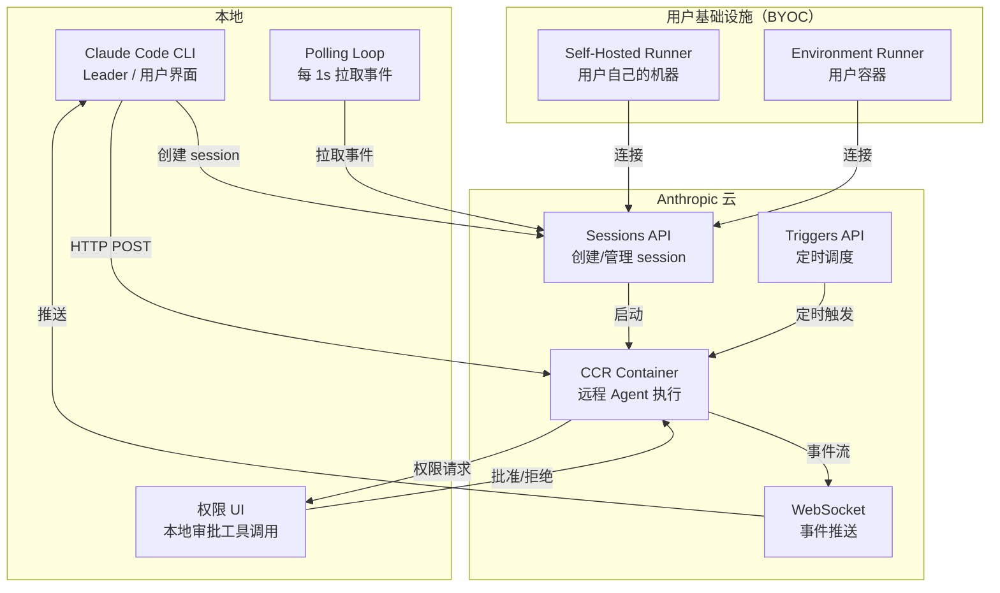
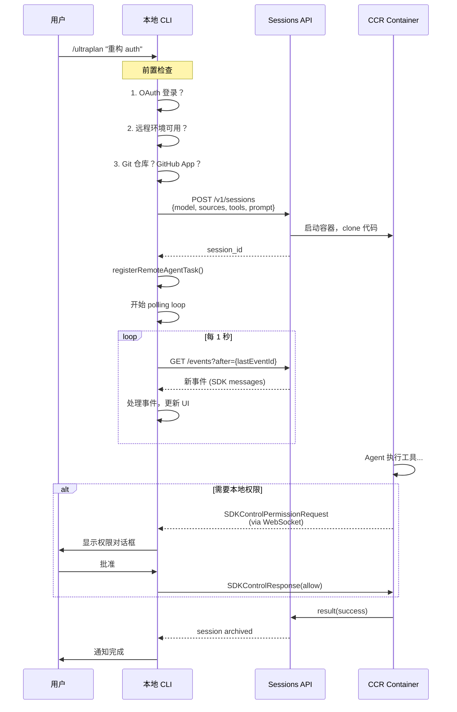
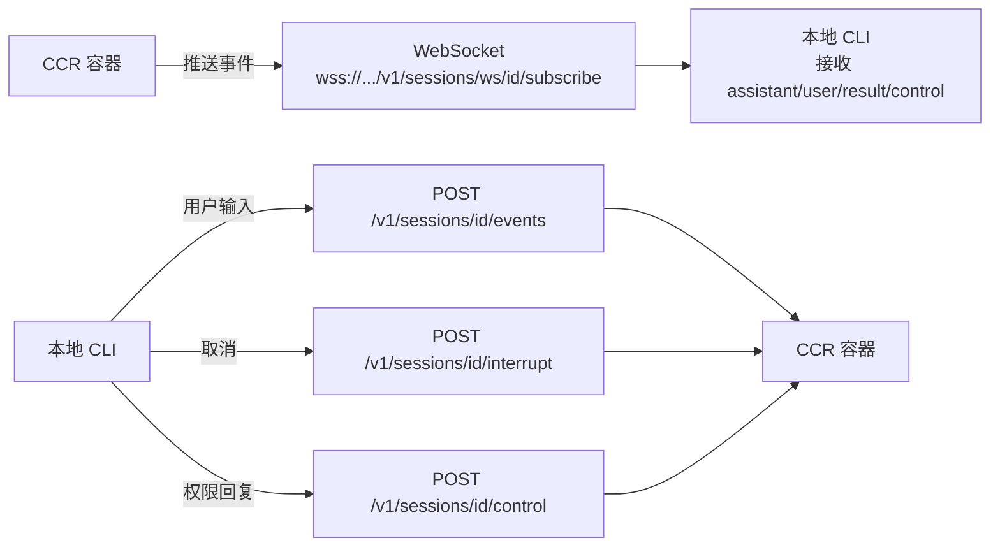
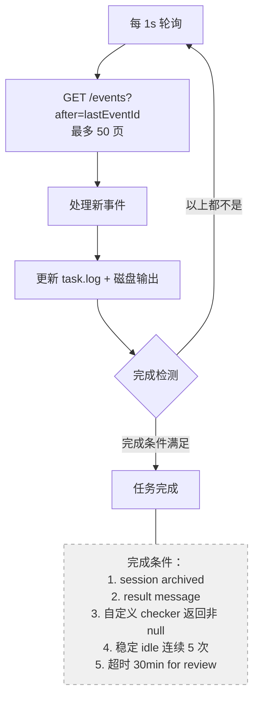
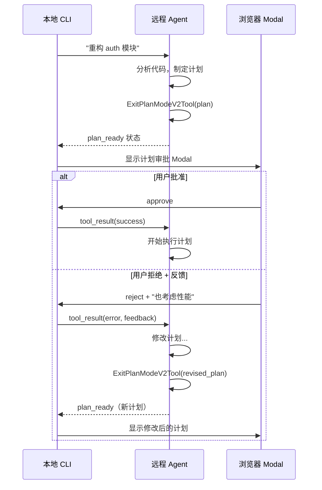
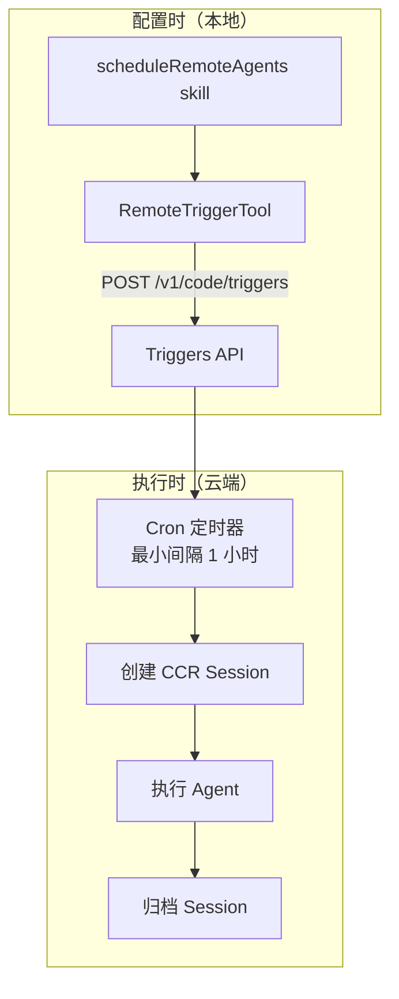
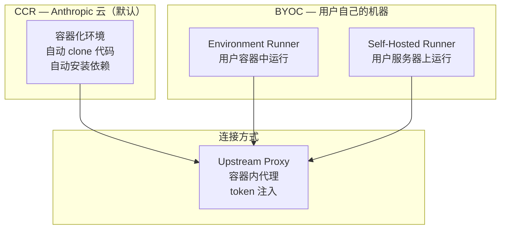
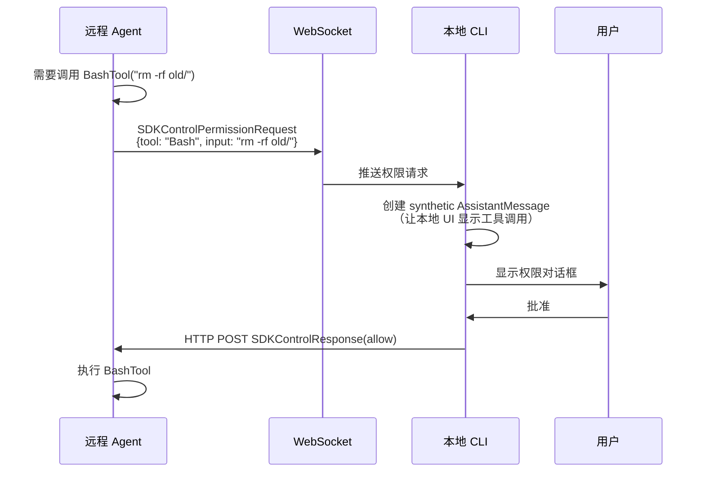

# 远程 Agent 执行 — CCR、Triggers、Ultraplan

> Claude Code 的分布式 Agent 系统：云端执行、定时调度、远程规划与代码审查。

## 概览

Claude Code 可以把 Agent 的执行从本地"传送"到云端（CCR），实现本地笔记本指挥、云端容器执行的模式。



## 五种远程任务类型

| 类型 | 触发方式 | 用途 |
|------|---------|------|
| `remote-agent` | 通用 | 泛用远程 Agent |
| `ultraplan` | `/ultraplan` 命令 | 远程规划，浏览器审批 |
| `ultrareview` | `/ultrareview` 命令 | 远程代码审查（bughunter） |
| `autofix-pr` | 自动触发 | PR 自动修复 |
| `background-pr` | 长运行 | PR 持续监控 |

## 远程 Session 生命周期



## RemoteSessionManager — 远程连接管理

### 双通道通信



**为什么用两个通道？** WebSocket 是服务端 → 客户端的推送（事件流），HTTP 是客户端 → 服务端的请求（用户输入、权限回复）。

### WebSocket 重连策略

| 关闭码 | 行为 | 原因 |
|--------|------|------|
| 4001 | 重试 3 次 | Session not found（compaction 期间瞬时错误） |
| 4003 | 立即停止 | Unauthorized（永久） |
| 其他 | 重试 5 次，2s 间隔 | 瞬时网络问题 |

Ping/Pong 每 30 秒保活。

## Polling 与完成检测

### Polling Loop



### 稳定 Idle 防误判

远程 session 在 tool turns 之间会短暂变为 idle。需要 **连续 5 次** polling 都是 idle 且 log 没增长，才认为真的完成。

### 自定义完成检查器

每种任务类型可以注册自己的完成检查器：

```typescript
type RemoteTaskCompletionChecker = 
  (metadata?: RemoteTaskMetadata) => Promise<string | null>
  // 返回 string → 完成（string 成为通知文本）
  // 返回 null → 继续 polling
```

例如 `autofix-pr` 可以查询 GitHub API 检查 PR 状态。

## Ultraplan — 远程规划

### 独特之处：浏览器审批

Ultraplan 不是简单的"远程执行然后返回结果"。它有一个**浏览器审批循环**：



### Ultraplan 阶段

| 阶段 | 含义 |
|------|------|
| `running` | 远程 Agent 在思考/执行 |
| `needs_input` | Agent 问了一个问题，等待用户回复 |
| `plan_ready` | ExitPlanMode 被调用，计划显示在浏览器 |

### ExitPlanModeScanner

一个状态机，从 polling 事件流中检测计划提交：

```typescript
class ExitPlanModeScanner {
  ingest(newEvents: SDKMessage[]): ScanResult
  // 返回:
  // { kind: 'approved', plan: string }     — 用户批准
  // { kind: 'rejected', id: string }       — 用户拒绝（可迭代）
  // { kind: 'teleport', plan: string }     — 拒绝 + 转移到本地执行
  // { kind: 'pending' }                    — 等待中
  // { kind: 'terminated', subtype: string } — session 终止
}
```

## Ultrareview — 远程代码审查

### 两种模式

**Bughunter 模式**（生产路径）：
```
远程 session 启动 → SessionStart hook 运行 run_hunt.sh → 
hook 在后台执行（session 保持 idle）→ 
hook 输出 <remote-review-progress> 标签 → 
hook 输出 <remote-review> 最终结果
```

**Prompt 模式**：
```
远程 session 启动 → 正常 assistant turns → 
assistant 输出 <remote-review> 标签
```

### 审查进度追踪

Hook 输出 JSON 格式的进度：
```json
{
  "stage": "finding",        // finding → verifying → synthesizing
  "bugs_found": 5,
  "bugs_verified": 3,
  "bugs_refuted": 1
}
```

本地 UI 实时显示进度。

## 定时触发 — Scheduled Triggers

### 架构



### Trigger 配置

```json
{
  "name": "daily-test-runner",
  "cron_expression": "0 9 * * 1-5",
  "enabled": true,
  "job_config": {
    "ccr": {
      "environment_id": "env_xxx",
      "session_context": {
        "model": "claude-sonnet-4-6",
        "sources": [
          {"git_repository": {"url": "https://github.com/org/repo"}}
        ],
        "allowed_tools": ["Bash", "Read", "Write", "Edit", "Glob", "Grep"]
      },
      "events": [
        {
          "data": {
            "type": "user",
            "message": {"content": "运行所有测试，如果有失败自动修复并提 PR", "role": "user"}
          }
        }
      ]
    }
  },
  "mcp_connections": [
    {"connector_uuid": "uuid", "name": "github", "url": "https://..."}
  ]
}
```

### 管理接口

| 操作 | API | 说明 |
|------|-----|------|
| 创建 | `POST /v1/code/triggers` | 设置定时 Agent |
| 列表 | `GET /v1/code/triggers` | 查看所有 triggers |
| 查看 | `GET /v1/code/triggers/{id}` | 查看详情 |
| 更新 | `POST /v1/code/triggers/{id}` | 修改配置 |
| 手动运行 | `POST /v1/code/triggers/{id}/run` | 立即触发一次 |

## 三种执行环境



### CCR（默认）

- Anthropic 托管的容器环境
- 自动从 GitHub clone 代码（需要安装 Claude GitHub App）
- 如果没有 GitHub App → fallback 到 git bundle 上传
- 支持 outcome branch（PR 场景）
- Session TTL 自动清理

### BYOC Environment Runner

- **Feature flag**: `BYOC_ENVIRONMENT_RUNNER`
- 在用户自己的基础设施上运行
- 通过 `upstreamproxy` 连接回 CCR API
- 入口：`claude environment-runner`

### Self-Hosted Runner

- **Feature flag**: `SELF_HOSTED_RUNNER`
- 另一种用户自托管模式
- 入口：`claude self-hosted-runner`

### Upstream Proxy（容器内安全）

容器内的代理层，处理认证和网络：

```mermaid
flowchart TB
    TOKEN[/run/ccr/session_token] --> READ[读取 token]
    READ --> PRCTL["prctl(PR_SET_DUMPABLE, 0)<br/>阻止 ptrace"]
    PRCTL --> UNLINK[删除 token 文件<br/>只存在于进程堆中]
    UNLINK --> CA[下载 CA 证书<br/>拼接系统 CA bundle]
    CA --> RELAY[启动 CONNECT→WebSocket relay<br/>127.0.0.1:port]
    RELAY --> ENV["设置环境变量<br/>HTTPS_PROXY=http://127.0.0.1:port<br/>SSL_CERT_FILE=ca-bundle.crt"]
```

**NO_PROXY 排除**（不走代理的域名）：
- `anthropic.com`（不 MITM API 调用）
- `github.com`、`*.githubusercontent.com`
- npm、PyPI、crates.io、Go proxy（包管理器）
- localhost、RFC1918、IMDS

**Fail-Open**：任何代理错误都会禁用代理（而不是阻塞 session）。

## 远程权限处理



对于本地没有的工具（如远程 MCP 工具），`remotePermissionBridge.ts` 会创建 **stub Tool 对象** 供 UI 渲染。

## Session 恢复（`--resume`）

```mermaid
flowchart TB
    RESUME[claude --resume] --> SCAN[扫描 sidecar 元数据]
    SCAN --> FETCH[对每个 session 调用 fetchSession()]
    FETCH --> CHECK{session 还存在？}
    CHECK -->|404| DROP[丢弃元数据]
    CHECK -->|200| RESTORE[重建 RemoteAgentTaskState]
    RESTORE --> POLL[重启 polling loop]
```

## 关键文件

| 文件 | 大小 | 功能 |
|------|------|------|
| `src/remote/RemoteSessionManager.ts` | 9.3KB | WebSocket + HTTP 会话管理 |
| `src/remote/SessionsWebSocket.ts` | 12.5KB | WebSocket 重连逻辑 |
| `src/remote/sdkMessageAdapter.ts` | 9KB | SDK 消息格式转换 |
| `src/remote/remotePermissionBridge.ts` | 2.4KB | 远程权限桥接 |
| `src/tasks/RemoteAgentTask/RemoteAgentTask.tsx` | ~800 行 | 远程任务生命周期 |
| `src/tools/RemoteTriggerTool/RemoteTriggerTool.ts` | ~200 行 | Triggers CRUD |
| `src/skills/bundled/scheduleRemoteAgents.ts` | 19KB | 调度 Skill |
| `src/utils/ultraplan/ccrSession.ts` | ~500 行 | Ultraplan 浏览器审批 |
| `src/upstreamproxy/upstreamproxy.ts` | 15KB | 容器内代理 |
| `src/upstreamproxy/relay.ts` | 10KB | CONNECT→WebSocket relay |

## 设计洞察

1. **本地是 UI，云端是算力** — 本地 CLI 只负责展示和权限审批，实际计算在 CCR 容器中。这让笔记本可以指挥长时间运行的任务。

2. **Polling 而非 Push** — 虽然有 WebSocket，主要的事件获取仍然用 polling（1s 间隔）。WebSocket 用于低延迟的权限请求。这保证了即使 WebSocket 断开，polling 仍能工作。

3. **稳定 Idle 防误判** — 5 次连续 idle 才认为完成。这是从实践中学到的：远程 Agent 在 tool turns 之间会短暂 idle。

4. **Fail-Open 设计** — 代理错误 → 禁用代理；CA 证书下载失败 → 跳过；token 刷新失败 → 用旧 token 重试。永远不阻塞用户。

5. **三种部署形态** — CCR（最简单，Anthropic 管理）、BYOC（用户机器，需要自己维护）、Self-Hosted（独立进程）。同一套 API，不同的执行环境。

6. **Ultraplan 的迭代循环** — 用户可以拒绝计划并给反馈，远程 Agent 修改后重新提交。这比"一次性规划"灵活得多。

7. **Session 持久化** — Metadata 写入 sidecar 文件，`--resume` 可以恢复正在运行的远程任务。不会因为关闭终端就丢失远程 session。
