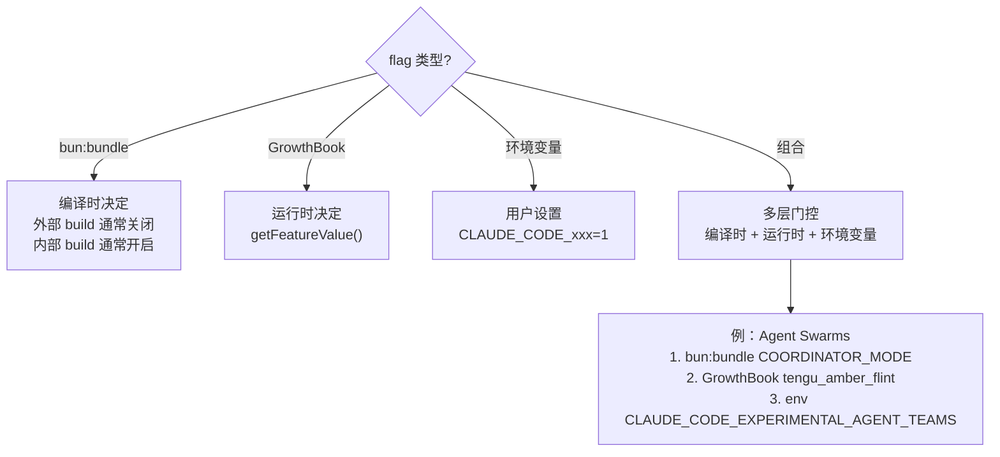

# Feature Flags 专题

> 87 个 feature flags 的分类解读：哪些已上线，哪些在实验，哪些是内部功能。

## Feature Flag 机制

Claude Code 使用**两层** feature flag 系统：

### 编译时：`bun:bundle` 死代码消除

```typescript
import { feature } from 'bun:bundle'

if (feature('VOICE_MODE')) {
  // 编译时被完全消除（不是运行时跳过，是代码本身被删掉）
  const voiceCommand = require('./commands/voice/index.js').default
}
```

未启用的 flag 对应的代码在 build 产物中**完全不存在**，减少包体积。

### 运行时：GrowthBook

```typescript
getFeatureValue('tengu_amber_flint', true)  // 默认值 true
```

通过 GrowthBook 服务端控制，可以随时开关，支持 A/B 测试、灰度发布。

## 按功能域分类

### Agent & 协调 (10 个)

| Flag | 状态 | 说明 |
|------|------|------|
| `COORDINATOR_MODE` | 实验 | 多 Agent Coordinator 模式 |
| `FORK_SUBAGENT` | 实验 | 子 Agent fork（继承父级上下文） |
| `BUILTIN_EXPLORE_PLAN_AGENTS` | 已上线 | 内置的 Explore/Plan agent 类型 |
| `AGENT_TRIGGERS` | 实验 | 本地 Agent 定时触发 |
| `AGENT_TRIGGERS_REMOTE` | 实验 | 远程 Agent 定时触发（CCR） |
| `AGENT_MEMORY_SNAPSHOT` | 实验 | Agent 记忆快照 |
| `VERIFICATION_AGENT` | 实验 | 验证子 Agent |
| `ULTRAPLAN` | 实验 | 远程规划（浏览器审批） |
| `ULTRATHINK` | 实验 | 扩展思考模式 |
| `PROACTIVE` | 实验 | 主动建议 / 推测执行 |

### 远程执行 (7 个)

| Flag | 状态 | 说明 |
|------|------|------|
| `BYOC_ENVIRONMENT_RUNNER` | 实验 | 用户自托管运行器 |
| `SELF_HOSTED_RUNNER` | 实验 | 自托管 Runner 模式 |
| `SSH_REMOTE` | 实验 | SSH 远程执行 |
| `BG_SESSIONS` | 实验 | 后台 session 支持 |
| `DAEMON` | 实验 | 守护进程模式 |
| `KAIROS` | 实验 | 后台自主 Agent 系统 |
| `UNATTENDED_RETRY` | 实验 | 无人值守时无限重试 |

### Kairos 子系统 (6 个)

| Flag | 状态 | 说明 |
|------|------|------|
| `KAIROS` | 实验 | Kairos 基础功能 |
| `KAIROS_DREAM` | 实验 | 后台记忆整理（Dream） |
| `KAIROS_BRIEF` | 实验 | 简报生成 |
| `KAIROS_CHANNELS` | 实验 | 频道系统 |
| `KAIROS_GITHUB_WEBHOOKS` | 实验 | GitHub webhook 集成 |
| `KAIROS_PUSH_NOTIFICATION` | 实验 | 推送通知 |

**Kairos 解读**：这是一个完整的"后台自主 Agent"系统。包含定时触发、记忆整理、简报、webhook 响应、推送通知。目前全部在 feature flag 后面。

### 上下文管理 (7 个)

| Flag | 状态 | 说明 |
|------|------|------|
| `HISTORY_SNIP` | 实验 | 消息历史裁剪 |
| `REACTIVE_COMPACT` | 已上线 | API 413 错误时自动压缩 |
| `CONTEXT_COLLAPSE` | 实验 | 高级上下文折叠 |
| `CACHED_MICROCOMPACT` | 实验 | 缓存感知的微压缩 |
| `TOKEN_BUDGET` | 实验 | Per-turn token 预算 |
| `COMPACTION_REMINDERS` | 实验 | 压缩提醒 |
| `PROMPT_CACHE_BREAK_DETECTION` | 实验 | 缓存破坏检测 |

### IDE Bridge (5 个)

| Flag | 状态 | 说明 |
|------|------|------|
| `BRIDGE_MODE` | 已上线 | VS Code / JetBrains 集成 |
| `DIRECT_CONNECT` | 实验 | IDE 直连（不经 claude.ai） |
| `CCR_MIRROR` | 实验 | CCR 会话镜像 |
| `CCR_REMOTE_SETUP` | 实验 | CCR 远程设置 |
| `CCR_AUTO_CONNECT` | 实验 | CCR 自动连接 |

### 用户交互 (7 个)

| Flag | 状态 | 说明 |
|------|------|------|
| `VOICE_MODE` | 实验 | 语音输入/输出 |
| `BUDDY` | 实验 | 伴侣精灵 Nuzzle |
| `QUICK_SEARCH` | 实验 | 快速搜索 UI |
| `MESSAGE_ACTIONS` | 实验 | 消息操作菜单 |
| `TERMINAL_PANEL` | 实验 | 终端面板 |
| `HISTORY_PICKER` | 实验 | 对话历史选择器 |
| `AUTO_THEME` | 实验 | 自动主题切换 |

### 记忆 & 知识 (4 个)

| Flag | 状态 | 说明 |
|------|------|------|
| `EXTRACT_MEMORIES` | 实验 | 自动提取持久化记忆 |
| `TEAMMEM` | 实验 | 团队记忆共享与同步 |
| `MEMORY_SHAPE_TELEMETRY` | 内部 | 记忆形态遥测 |
| `AWAY_SUMMARY` | 实验 | 离开时的摘要 |

### 安全 & 权限 (5 个)

| Flag | 状态 | 说明 |
|------|------|------|
| `BASH_CLASSIFIER` | 实验 | Bash 命令安全分类器 |
| `TRANSCRIPT_CLASSIFIER` | 实验 | Transcript 自动分类 |
| `POWERSHELL_AUTO_MODE` | 实验 | PowerShell 自动模式 |
| `ANTI_DISTILLATION_CC` | 内部 | 反蒸馏（注入假工具） |
| `NATIVE_CLIENT_ATTESTATION` | 实验 | 原生客户端认证 |

### Bash 解析 (3 个)

| Flag | 状态 | 说明 |
|------|------|------|
| `TREE_SITTER_BASH` | 实验 | Tree-sitter Bash 解析器 |
| `TREE_SITTER_BASH_SHADOW` | 实验 | Shadow 模式（并行运行对比） |
| `BREAK_CACHE_COMMAND` | 实验 | 缓存破坏命令 |

### 工具 & 技能 (6 个)

| Flag | 状态 | 说明 |
|------|------|------|
| `MONITOR_TOOL` | 实验 | 监控工具 |
| `WEB_BROWSER_TOOL` | 实验 | Web 浏览器工具 |
| `WORKFLOW_SCRIPTS` | 实验 | 工作流脚本 |
| `EXPERIMENTAL_SKILL_SEARCH` | 实验 | 实验性 Skill 搜索 |
| `SKILL_IMPROVEMENT` | 实验 | Skill 自动改进 |
| `RUN_SKILL_GENERATOR` | 实验 | Skill 生成器 |

### MCP & 输出 (4 个)

| Flag | 状态 | 说明 |
|------|------|------|
| `MCP_RICH_OUTPUT` | 实验 | MCP 富文本输出 |
| `MCP_SKILLS` | 实验 | MCP 驱动的 Skills |
| `STREAMLINED_OUTPUT` | 实验 | 精简输出格式 |
| `CONNECTOR_TEXT` | 实验 | 文本连接器 |

### 设置同步 (3 个)

| Flag | 状态 | 说明 |
|------|------|------|
| `DOWNLOAD_USER_SETTINGS` | 实验 | 从服务器下载设置 |
| `UPLOAD_USER_SETTINGS` | 实验 | 上传设置到服务器 |
| `HOOK_PROMPTS` | 实验 | Hook 驱动的 prompt |

### 模型 & 版本 (2 个)

| Flag | 状态 | 说明 |
|------|------|------|
| `ALLOW_TEST_VERSIONS` | 内部 | 允许测试模型版本 |
| `BUILDING_CLAUDE_APPS` | 实验 | Claude Apps 构建模式 |

### 遥测 & 调试 (7 个)

| Flag | 状态 | 说明 |
|------|------|------|
| `ENHANCED_TELEMETRY_BETA` | 实验 | 增强分析 |
| `COWORKER_TYPE_TELEMETRY` | 内部 | 协作者类型遥测 |
| `SLOW_OPERATION_LOGGING` | 实验 | 慢操作日志 |
| `PERFETTO_TRACING` | 实验 | 性能追踪 |
| `SHOT_STATS` | 内部 | 截图统计 |
| `DUMP_SYSTEM_PROMPT` | 调试 | 导出 system prompt |
| `HARD_FAIL` | 调试 | 硬失败模式 |

### 基础设施 (6 个)

| Flag | 状态 | 说明 |
|------|------|------|
| `FILE_PERSISTENCE` | 已上线 | 文件状态持久化 |
| `UDS_INBOX` | 实验 | Unix Domain Socket 消息 |
| `NEW_INIT` | 实验 | 新初始化流程 |
| `TEMPLATES` | 实验 | 模板系统 |
| `COMMIT_ATTRIBUTION` | 实验 | Commit 归属追踪 |
| `REVIEW_ARTIFACT` | 实验 | Artifact 审查 |

### 平台检测 (3 个)

| Flag | 状态 | 说明 |
|------|------|------|
| `IS_LIBC_GLIBC` | 编译时 | glibc 检测 |
| `IS_LIBC_MUSL` | 编译时 | musl libc 检测 |
| `NATIVE_CLIPBOARD_IMAGE` | 实验 | 原生剪贴板图片 |

### 内部/特殊 (4 个)

| Flag | 状态 | 说明 |
|------|------|------|
| `ABLATION_BASELINE` | 内部 | A/B 测试基线 |
| `LODESTONE` | 内部 | Lodestone 功能 |
| `TORCH` | 内部 | Torch 功能 |
| `OVERFLOW_TEST_TOOL` | 测试 | 溢出测试工具 |
| `CHICAGO_MCP` | 实验 | Chicago MCP server |

## 值得关注的 Feature 组合

### "后台自主 Agent" 全栈

启用这些 flag 可以让 Claude Code 变成一个后台自主运行的系统：

```
KAIROS              — 基础后台 Agent 模式
KAIROS_DREAM        — 自动整理记忆
KAIROS_CHANNELS     — 频道通信
KAIROS_GITHUB_WEBHOOKS — 响应 GitHub 事件
KAIROS_PUSH_NOTIFICATION — 推送通知
AGENT_TRIGGERS      — 定时触发
AGENT_TRIGGERS_REMOTE — 远程定时触发
BG_SESSIONS         — 后台 session
DAEMON              — 守护进程
UNATTENDED_RETRY    — 无人值守重试
```

### "智能上下文管理" 全栈

```
HISTORY_SNIP        — 裁剪历史
REACTIVE_COMPACT    — 413 时自动压缩
CONTEXT_COLLAPSE    — 高级折叠
CACHED_MICROCOMPACT — 缓存感知微压缩
TOKEN_BUDGET        — token 预算
EXTRACT_MEMORIES    — 自动提取记忆（缩小上下文需求）
```

### "远程分布式执行" 全栈

```
COORDINATOR_MODE    — 本地多 Agent 协调
AGENT_TRIGGERS_REMOTE — 远程定时 Agent
BYOC_ENVIRONMENT_RUNNER — 用户自托管
SELF_HOSTED_RUNNER  — 自托管 Runner
ULTRAPLAN           — 远程规划
SSH_REMOTE          — SSH 远程执行
```

### "安全增强" 全栈

```
BASH_CLASSIFIER     — Bash 命令自动分类
TRANSCRIPT_CLASSIFIER — Transcript 自动分类
TREE_SITTER_BASH    — AST 级 Bash 解析
NATIVE_CLIENT_ATTESTATION — 客户端认证
ANTI_DISTILLATION_CC — 反蒸馏保护
```

## 如何判断一个 flag 是否可用



大部分实验性功能需要**多层门控都通过**才能启用。这让 Anthropic 可以：
- 编译时消除不需要的代码（减小包体积）
- 运行时灰度发布（GrowthBook 百分比控制）
- 用户显式 opt-in（环境变量）
- 紧急 kill switch（GrowthBook 关闭）
