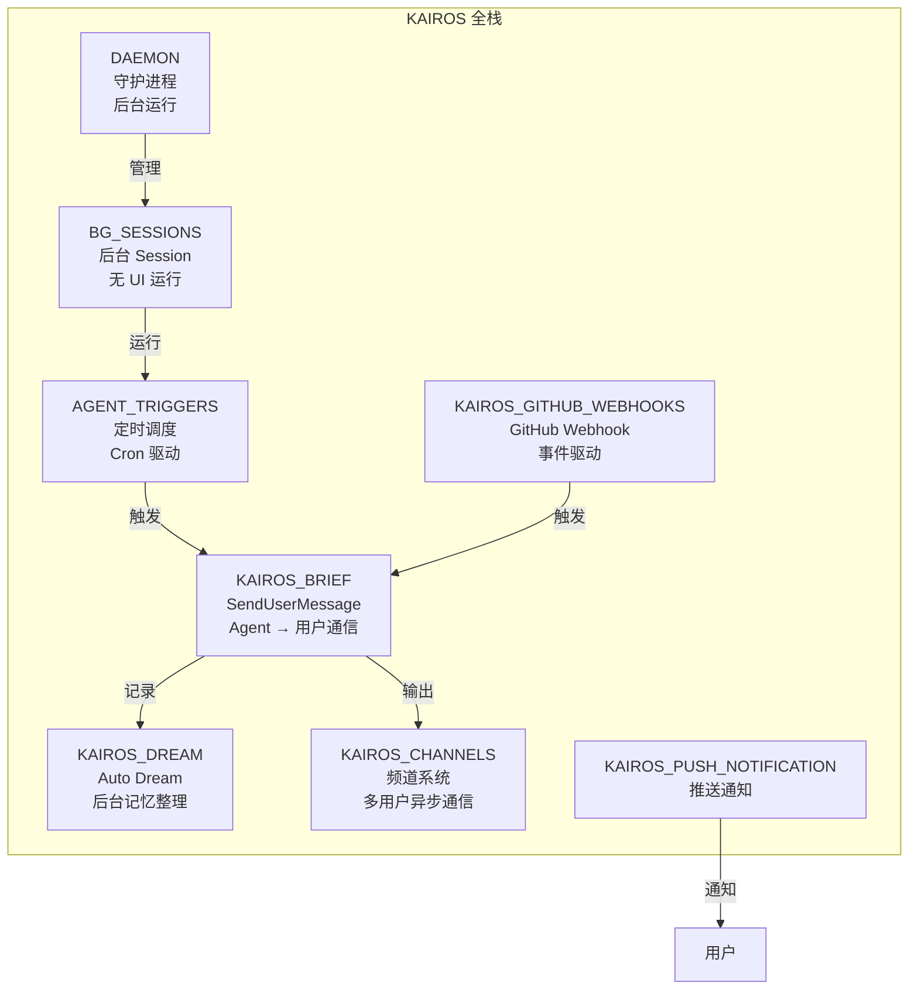
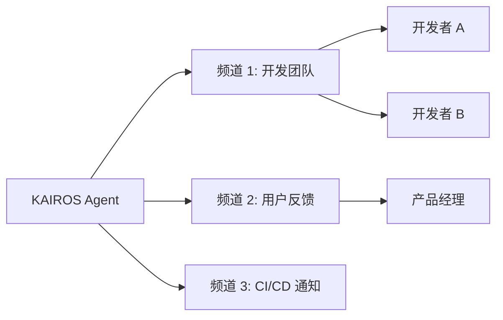
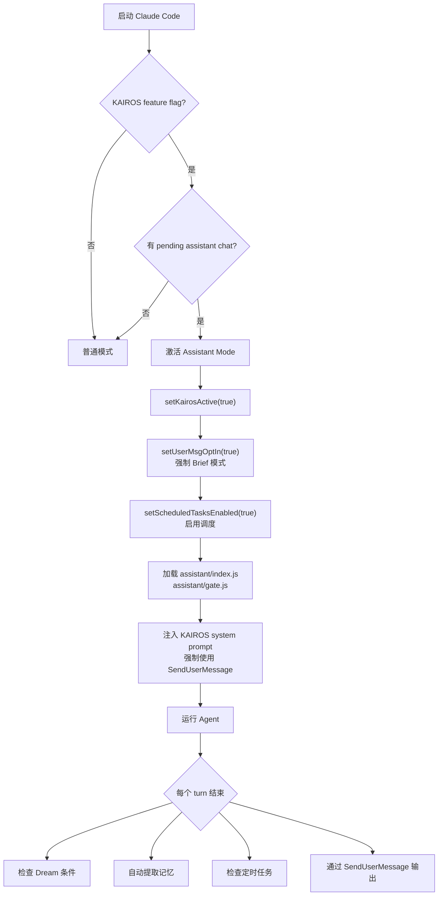
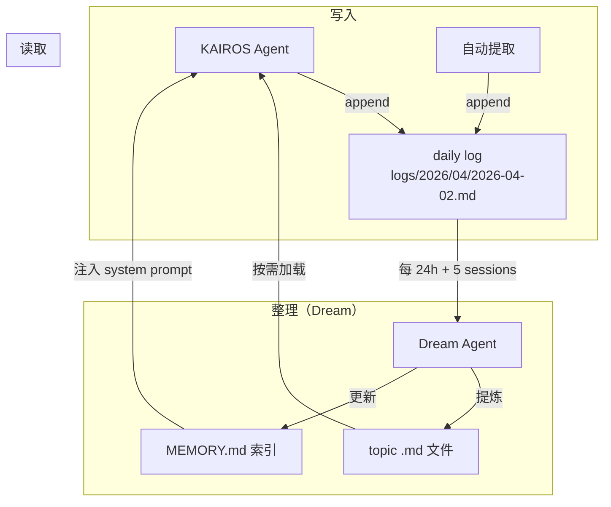

# KAIROS — 后台自主 Agent 系统

> Claude Code 的"Assistant Mode"：一个长驻后台、自主调度、主动通信的 Agent 系统。

## 这是什么

KAIROS 是 Claude Code 内部的一个完整子系统，目标是让 Claude 从"你问我答"的交互模式变成一个**后台自主运行的 Agent** — 它可以自己记日志、定时执行任务、整理记忆、主动通知用户，甚至响应 GitHub webhook。



**当前状态**：全部在 feature flag 后面，部分模块已实现（Dream、Brief、Cron），部分还是 stub（Daemon、Webhooks）。

## 核心概念：Assistant Mode

当 KAIROS 激活时，Claude Code 进入"Assistant Mode"，行为发生根本变化：

| 特性 | 普通模式 | Assistant Mode |
|------|---------|---------------|
| 通信方式 | 直接文字输出 | **必须**用 SendUserMessage 工具 |
| 记忆存储 | MEMORY.md 直接编辑 | Append-only 日志 + 夜间整理 |
| 调度 | 无 | Cron 定时任务 |
| 运行方式 | 前台交互 | 可后台守护进程 |
| Session 生命周期 | 用户关闭就结束 | 持久化后台 session |

激活代码：
```typescript
if (feature('KAIROS') && _pendingAssistantChat) {
  setKairosActive(true)
  setUserMsgOptIn(true)  // Brief 模式强制开启
}
```

## 六大子系统

### 1. Brief — Agent-to-User 通信 (`KAIROS_BRIEF`)

**位置**：`src/tools/BriefTool/`

在 Assistant Mode 下，Agent **不能**直接输出文字给用户。必须通过 `SendUserMessage` 工具：

```typescript
// Agent 必须这样通信
SendUserMessage({
  content: "测试全部通过了。发现 2 个 deprecation warning 需要注意。",
  status: "normal",          // normal = 回应用户, proactive = 主动汇报
  attachments: [
    { type: "file", path: "test-results.log" }
  ]
})
```

**为什么这么设计？**
- 结构化输出（不是随意的文字流）
- 支持附件（文件、截图、diff）
- 区分"回应"和"主动汇报"（proactive）
- 可以路由到不同的频道

**门控链**：
```
编译时: feature('KAIROS') || feature('KAIROS_BRIEF')
     ↓
运行时: GrowthBook tengu_kairos_brief (5分钟 TTL 刷新)
     ↓
用户 opt-in: /brief 命令 或 --brief flag
     ↓（或）
KAIROS 模式: 自动启用，跳过 opt-in
```

### 2. Dream — 后台记忆整理 (`KAIROS_DREAM`)

**位置**：`src/services/autoDream/`

已在 [09-memory-systems.md](09-memory-systems.md) 详细介绍。在 KAIROS 模式下有一个关键区别：

**普通模式**：记忆直接写入 topic .md 文件 + 更新 MEMORY.md 索引

**KAIROS 模式**：使用 **append-only 日志**

```
~/.claude/projects/<path>/memory/
├── MEMORY.md                    ← 只读索引（由 Dream 生成）
├── logs/
│   └── 2026/
│       └── 04/
│           ├── 2026-04-01.md    ← 当天日志（append-only）
│           └── 2026-04-02.md
├── user_preferences.md          ← 由 Dream 从日志中提炼
└── project_auth.md
```

**为什么用日志而不是直接编辑？**
- 长期运行的 Agent 会产生大量记忆 → append-only 避免频繁重写
- 日志是永久记录；MEMORY.md 是由 Dream 提炼的活索引
- 午夜自动切换日志文件（保持 prompt cache 不因日期变化而失效）

### 3. Channels — 频道系统 (`KAIROS_CHANNELS`)

**位置**：分散在多个文件中

频道系统让 KAIROS Agent 可以在**多个通信频道**上工作：



- `AskUserQuestionTool` 可以路由问题到特定频道
- Allowlist 控制哪些频道可以访问
- 通知系统在 UI 中显示频道消息

### 4. Cron 调度 (`AGENT_TRIGGERS`)

**位置**：`src/utils/cronScheduler.ts`（532 行）

让 KAIROS Agent 可以定时执行任务：

```typescript
// 配置示例：每天早上 9 点运行测试
{
  id: "daily-tests",
  cron: "0 9 * * 1-5",
  command: "运行所有测试，失败的自动修复",
  permanent: true,      // daemon 重启后保留
  recurring: true,
  maxAge: 7 * 24 * 60   // 7 天自动过期
}
```

**关键特性**：
- **Daemon 感知**：接受 `dir` 参数，可以在 daemon 模式下无 bootstrap state 运行
- **单 owner 锁**：每个 cwd 同时只有一个 session 可以持有调度器
- **错过的任务**：一次性任务错过执行时间后，下次启动会被 surface
- **Jitter**：GrowthBook 控制的 load-shedding jitter，防止所有用户同时触发
- **Kill switch**：`tengu_kairos_cron` GrowthBook gate，可随时关闭

### 5. Daemon — 守护进程 (`DAEMON`)

**位置**：`src/entrypoints/cli.tsx`（入口点），daemon 实现目前是 stub

```bash
# CLI 入口
claude daemon [subcommand]        # 启动/管理守护进程
claude --daemon-worker=<kind>     # 运行特定 worker
claude ps                         # 查看后台 session
claude logs <session-id>          # 查看 session 日志
claude attach <session-id>        # 附加到后台 session
claude kill <session-id>          # 终止后台 session
```

Daemon 模式让 Claude Code 可以作为**长驻后台进程**运行，管理多个 worker。worker 通过文件状态通信（不依赖 bootstrap state）。

**当前状态**：CLI 入口已定义，但 `src/daemon/workerRegistry.js` 等核心实现还未在代码中出现（可能在另一个分支或尚未完成）。

### 6. GitHub Webhooks & Push Notifications

这两个子系统目前代码中的实现最少，主要是 feature flag 定义和少量集成点。

**KAIROS_GITHUB_WEBHOOKS**：设想是 Agent 可以响应 GitHub 事件（PR opened、review requested、CI failed），自动执行对应操作。

**KAIROS_PUSH_NOTIFICATION**：设想是 Agent 可以发送系统推送通知（macOS notification center），而不仅仅是终端内的通知。

## KAIROS 激活流程



## KAIROS 模式下的记忆架构



**与普通模式的对比**：

| 操作 | 普通模式 | KAIROS 模式 |
|------|---------|------------|
| 新记忆 | 直接写 topic .md + 更新 MEMORY.md | Append 到 daily log |
| 整理 | Dream 合并/修剪 topic 文件 | Dream 从日志提炼 topic + 更新索引 |
| MEMORY.md | Agent 可读写 | **只读**（由 Dream 管理） |
| 日志 | 无 | 永久 append-only 记录 |

## GrowthBook 配置

| Gate | 控制什么 | 刷新频率 |
|------|---------|---------|
| `tengu_onyx_plover` | Dream 的 minHours + minSessions | 启动时 |
| `tengu_kairos_brief` | Brief 工具可用性 | 5 分钟 |
| `tengu_kairos_brief_config` | Brief 的 UI 配置（如 /brief 命令是否可见） | 启动时 |
| `tengu_kairos_cron` | Cron 调度器 kill switch | 每个 tick |
| `tengu_coral_fern` | 记忆 prompt 中的 "Searching past context" 段 | 启动时 |
| `tengu_moth_copse` | KAIROS 模式下跳过 MEMORY.md 索引 | 启动时 |

## 关键文件

| 文件 | 大小 | 功能 |
|------|------|------|
| `src/services/autoDream/autoDream.ts` | 11KB | Dream 记忆整理引擎 |
| `src/services/autoDream/consolidationPrompt.ts` | 3.2KB | Dream prompt 模板 |
| `src/services/autoDream/consolidationLock.ts` | 4.5KB | 文件锁 |
| `src/tools/BriefTool/BriefTool.ts` | ~200 行 | SendUserMessage 工具 |
| `src/utils/cronScheduler.ts` | 532 行 | Cron 调度核心 |
| `src/utils/cronTasks.ts` | ~200 行 | 任务存储 |
| `src/memdir/memdir.ts` | ~400 行 | 日志模式记忆管理 |
| `src/bootstrap/state.ts` | 1760 行 | kairosActive 状态 |

## 设计洞察

### 1. 从交互到自主的转变

KAIROS 最核心的设计思想是：Claude 不再是"用户问一句答一句"的工具，而是一个**持续运行的同事** — 它有自己的记忆（daily logs）、自己的日程（cron）、自己的通信方式（SendUserMessage + channels），甚至可以主动找你（proactive status + push notification）。

### 2. SendUserMessage 是刻意的约束

强制 Agent 通过工具通信而不是直接输出文字，看似是限制，实际是让输出**可追踪、可路由、可结构化**。proactive vs normal 的区分让系统知道哪些是"回应用户"哪些是"Agent 主动汇报"。

### 3. Append-Only 日志是长期运行的最佳选择

普通模式下 Agent 活几分钟到几小时。KAIROS Agent 可能活几天到几周。频繁重写 MEMORY.md 不可行 → 所以用 append-only 日志 + 定期提炼的模式。

### 4. 多层 Kill Switch

KAIROS 的每个子系统都有独立的 GrowthBook kill switch。Dream 出问题 → 只关 `tengu_onyx_plover`。Cron 出问题 → 只关 `tengu_kairos_cron`。不需要关掉整个 KAIROS。

### 5. 还在演进中

从代码来看，KAIROS 是一个正在积极开发的系统。Dream 和 Brief 已经相当成熟，Channels 有基础框架，而 Daemon 和 Webhooks 还在早期阶段。这是 Claude Code 未来最有想象力的方向之一。
